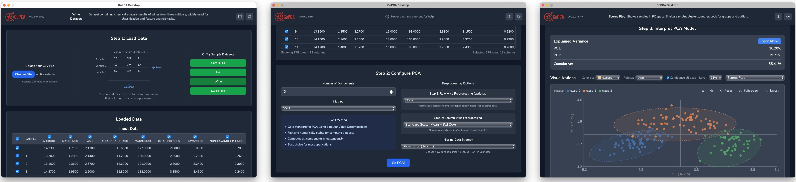
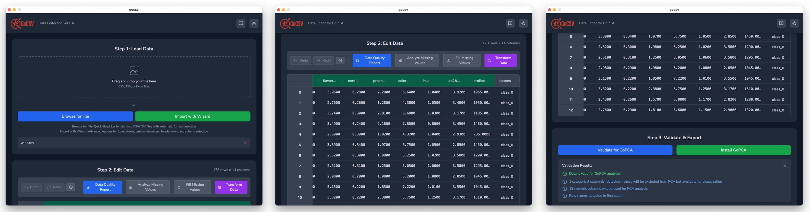
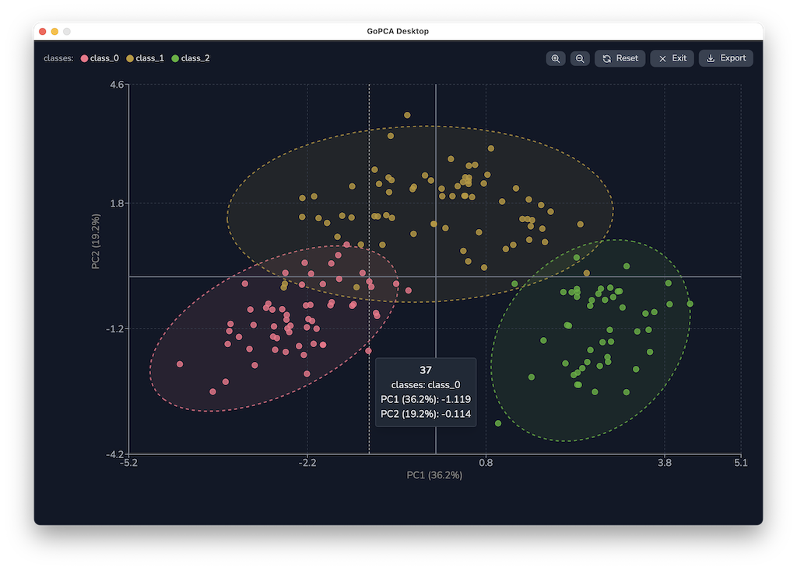

# GoPCA - The Definitive Principal Component Analysis Application

Professional-grade PCA analysis made simple. Available as both a powerful command-line tool and an intuitive desktop application.



## What is GoPCA?

GoPCA is **the** go-to application for Principal Component Analysis - a fundamental technique for understanding complex, multivariate data. Whether you're analyzing spectroscopic data, exploring gene expression patterns, or reducing dimensionality in machine learning pipelines, GoPCA provides the tools you need.

### Includes GoCSV Data Preparation Tool

GoPCA comes with **GoCSV**, a companion application for preparing your data. With its Excel-like interface, GoCSV makes it easy to clean, edit, and format your CSV files before PCA analysis - ensuring your data is analysis-ready.



## Three Powerful Tools

### Desktop Application
Perfect for interactive data exploration, method development, and teaching.



**Key Desktop Features:**
- Interactive visualizations with zoom, pan, and export
- Real-time plot updates as you adjust parameters
- Confidence ellipses for group visualization
- Customizable color palettes for different data types
- Light and dark themes for comfortable viewing

### Command-Line Interface
Ideal for automation, batch processing, and integration into data pipelines.

```bash
# Analyze your data with a single command
gopca-cli analyze data.csv --components 3 --scale standard --output results/

# Validate data before analysis
gopca-cli validate spectra.csv

# Apply a saved PCA model to new data
gopca-cli transform model.json new_data.csv
```

### GoCSV Data Editor
Clean and prepare your data with an intuitive spreadsheet-like interface.

**GoCSV Features:**
- Edit cells directly like in Excel
- Add, remove, or reorder columns
- Multi-step undo/redo functionality
- Column type detection (numeric, categorical, target)
- Real-time validation against GoPCA requirements
- Missing value detection and handling
- Export clean CSV files ready for PCA analysis

## Key Features

### Comprehensive Analysis
- **Multiple algorithms**: 
  - SVD (default) - Fast and accurate for complete data
  - NIPALS - Handles missing data gracefully
  - Kernel PCA - For non-linear relationships
- **Flexible preprocessing**: 
  - Mean centering and scaling
  - Robust scaling for outlier resistance
  - SNV (Standard Normal Variate) for spectroscopy
  - Vector normalization
- **Missing data strategies**: Drop, mean imputation, or iterative methods

### Professional Visualizations

<!--  -->
*[Screenshot placeholder: Grid showing different plot types available in GoPCA]*

**Available Visualizations:**
- **Scores plots** - View samples in PC space with group coloring and confidence ellipses
- **Loadings plots** - Understand variable contributions to each component
- **Scree plots** - Determine optimal number of components
- **Biplots** - See samples and variables together
- **Circle of Correlations** - Visualize variable relationships on unit circle
- **Diagnostic plots** - Detect outliers with T² vs Q residuals
- **Eigencorrelation plots** - Explore correlations between PCs and original variables

All visualizations feature:
- Export to PNG for publications
- Interactive tooltips with detailed information
- Customizable color palettes (qualitative and sequential)
- Full-screen mode for presentations

### Built for Real Work
- **Example datasets included**: Wine and Iris datasets for immediate exploration
- **Handles real-world data**: Robust to missing values, mixed scales, and outliers
- **Smart defaults**: Automatic parameter selection based on your data
- **Cross-platform**: Native performance on Windows, macOS, and Linux
- **Fast**: Optimized implementations handle large datasets efficiently
- **Themeable**: Light and dark modes for comfortable extended use

## Getting Started

### Desktop Application

1. **Download** the latest release for your platform from [GitHub Releases](https://github.com/bitjungle/gopca/releases)
2. **Launch** GoPCA Desktop
3. **Try an example** - Select "Wine" or "Iris" from the example datasets
4. **Or load your data** - Click "Open CSV" to load your own file
5. **Configure preprocessing** - Choose centering, scaling, and other options
6. **Click "Go PCA!"** - Explore results interactively

<!--  -->
*[Screenshot placeholder: Step-by-step workflow visualization]*

### Data Preparation with GoCSV

1. **Launch** GoCSV from the GoPCA installation folder
2. **Open** your raw CSV file or paste data from clipboard
3. **Clean** your data:
   - Remove empty rows/columns
   - Fix inconsistent headers
   - Handle missing values
   - Validate column types
4. **Save** the cleaned file
5. **Open in GoPCA** with one click

### Command-Line Interface

```bash
# Download the latest release
wget https://github.com/bitjungle/gopca/releases/latest/download/gopca-cli
chmod +x gopca-cli

# Basic analysis with automatic settings
./gopca-cli analyze mydata.csv

# Advanced analysis with custom parameters
./gopca-cli analyze mydata.csv \
  --components 4 \
  --scale standard \
  --preprocessing snv \
  --format json \
  --output results/

# Validate your data first
./gopca-cli validate mydata.csv
```

## Use Cases

### Chemometrics & Spectroscopy
Analyze NIR, FTIR, Raman, or UV-Vis spectroscopic data to identify chemical patterns, detect adulterants, or monitor reactions. The SNV preprocessing option is specifically designed for spectroscopic data.

### Bioinformatics
Explore gene expression, proteomics, or metabolomics data to find biological patterns, identify biomarkers, or understand disease mechanisms. Handle high-dimensional data with thousands of variables.

### Quality Control & Process Monitoring
Monitor industrial processes in real-time, detect anomalies before they become problems, and understand the relationships between process variables. Use diagnostic plots to identify out-of-specification samples.

### Data Science & Machine Learning
Reduce dimensionality before classification or regression, explore feature relationships, visualize high-dimensional clusters, or compress data while preserving variance. Export transformed data for use in other ML pipelines.

### Education & Research
Teach multivariate statistics with interactive visualizations, explore research data with publication-ready plots, or demonstrate the power of dimensionality reduction with real examples.

## Example: Analyzing Wine Data

<!--  -->
*[Screenshot placeholder: Split view showing CLI output and GUI visualization of wine dataset analysis]*

The included wine dataset demonstrates PCA's power in distinguishing wine types based on chemical composition. With just two principal components, you can clearly separate three wine varieties - showing how PCA reveals hidden patterns in complex data.

## Documentation

- [Introduction to PCA](docs/intro_to_pca.md) - Learn the fundamentals of Principal Component Analysis
- [Data Preparation Guide](docs/intro_to_data_prep.md) - Best practices for preparing your data
- [Data Format Specification](docs/data-format.md) - Detailed CSV format requirements
- Built-in help system - Hover over any control in the desktop app for instant help

## System Requirements

- **Operating Systems**: 
  - Windows 10 or later
  - macOS 10.15 (Catalina) or later
  - Linux: Ubuntu 20.04+, Fedora 34+, or equivalent
- **Memory**: 2GB RAM minimum, 8GB+ recommended for large datasets
- **Disk Space**: 100MB for application, additional space for your data
- **Display**: 1280×720 minimum resolution

## Support & Community

- **Report Issues**: [GitHub Issues](https://github.com/bitjungle/gopca/issues)
- **Ask Questions**: [GitHub Discussions](https://github.com/bitjungle/gopca/discussions)
- **Documentation**: See the docs folder for detailed guides

## Contributing

We welcome contributions! Whether it's bug reports, feature suggestions, documentation improvements, or code contributions, please see our [Contributing Guide](CONTRIBUTING.md) to get started.

## License

GoPCA is open-source software licensed under the MIT License. However, the author espectfully requests that it **not be used for military, warfare, or surveillance applications**.