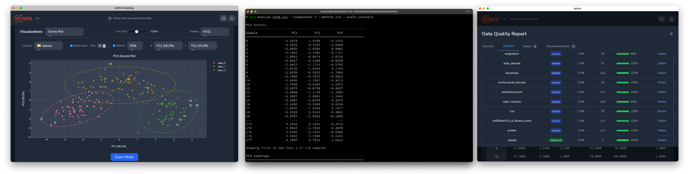
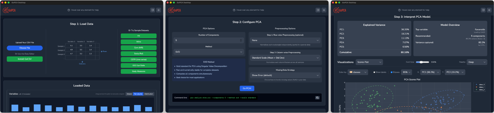
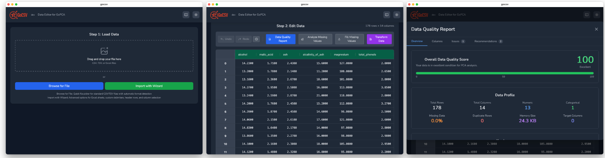
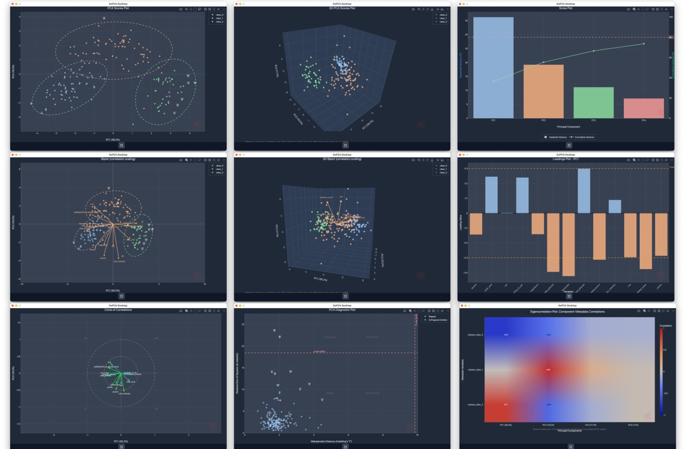
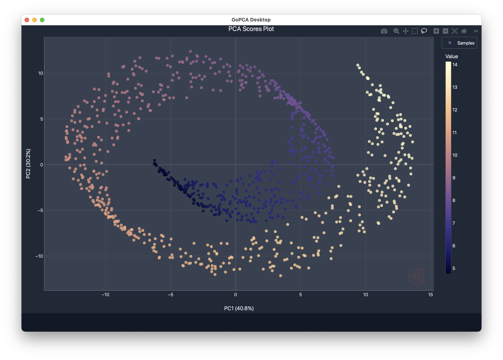

# GoPCA Suite - The Definitive Principal Component Analysis Toolset

Professional-grade PCA analysis made simple. A comprehensive suite of tools for linear, non-linear, and temporal data analysis through powerful command-line and intuitive desktop applications.

## What is GoPCA Suite?

GoPCA Suite makes **Principal Component Analysis (PCA) accessible to everyone** through professional-grade, user-friendly tools that are completely free. PCA is one of the most versatile and interpretable machine learning methods for understanding complex data, and GoPCA Suite removes the barriers to using it effectively. As an added benefit, all processing happens locally on your machine, ensuring your data never leaves your computer.

The suite provides three powerful tools that work together seamlessly:
- **GoPCA Desktop** - Interactive visual analysis and exploration
- **pca CLI** - Scriptable command-line interface for automation
- **GoCSV Desktop** - Data preparation with an Excel-like interface

Whether you're analyzing spectroscopic data, exploring gene expression patterns, or reducing dimensionality in machine learning pipelines, GoPCA Suite delivers enterprise-grade analysis while maintaining complete data sovereignty.



## Three Powerful Tools in the Suite

### GoPCA Desktop

Perfect for interactive data exploration, method development, and teaching.



**Key GoPCA Desktop Features:**
- Interactive visualizations with zoom, pan, and export
- Real-time plot updates as you adjust parameters
- Confidence ellipses for group visualization
- Customizable color palettes for different data types
- Light and dark themes for comfortable viewing

### The pca CLI

Ideal for automation, batch processing, and integration into data pipelines.

```bash
# Analyze your data with a single command
pca analyze --components 3 --scale standard --output-dir results/ data.csv

# Validate data before analysis
pca validate spectra.csv

# Apply a saved PCA model to new data
pca transform model.json new_data.csv

# Transform with output options
pca transform -f json -o results/ model.json new_samples.csv
```

### GoCSV Desktop

Clean and prepare your data with an intuitive spreadsheet-like interface.



**GoCSV Desktop Features:**
- Edit cells directly in spreadsheet interface
- Add, remove, or reorder columns
- Multi-step undo/redo functionality
- Column type detection (numeric, categorical, target)
- Real-time validation against pca CLI requirements
- Missing value detection and handling
- Export clean CSV files ready for PCA analysis

## Key Features

### Comprehensive Analysis
- **Multiple algorithms**: 
  - SVD (default) - Fast and accurate for complete data
  - NIPALS - Handles missing data gracefully
  - Kernel PCA - For non-linear relationships
  - SSA - For time series and temporal pattern analysis
- **Flexible preprocessing**: 
  - Mean centering and scaling
  - Robust scaling for outlier resistance
  - SNV (Standard Normal Variate) for spectroscopy
  - Vector normalization
- **Missing data strategies**: Drop, mean imputation, or iterative methods

### Professional Visualizations



**Interactive Visualizations:**
- **Scores & Loadings plots** - Explore samples and variable contributions
- **Biplots** - Combined view with confidence ellipses
- **Scree plots** - Determine optimal components
- **Circle of Correlations** - Variable relationships on unit circle
- **Diagnostic plots** - Detect outliers with T² vs Q residuals
- **Eigencorrelation plots** - PC-variable correlations

All plots support PNG export, interactive tooltips, full-screen mode, and optional labels.



### Built for Real Work
- **Example datasets included**: Six datasets with guided tutorials for immediate exploration
- **Handles real-world data**: Robust to missing values, mixed scales, and outliers
- **Smart defaults**: Automatic parameter selection based on your data
- **Cross-platform**: Native performance on Windows, macOS, and Linux
- **Fast**: Optimized implementations handle large datasets efficiently
- **Themeable**: Light and dark modes for comfortable extended use

## Privacy & Security

GoPCA Suite prioritizes your data privacy:

- **100% Local Processing** - All computations happen on your machine only
- **Zero Telemetry** - No analytics, tracking, or data collection
- **No Network Dependencies** - Works completely offline
- **Source Available** - Entire codebase viewable on GitHub
- **Compliance Ready** - Perfect for GDPR, HIPAA, and strict corporate policies

Your data **never** leaves your computer. No cloud services, no external servers, no hidden connections.

Verify our privacy claims:
```bash
./scripts/verify-privacy.sh  # Audit code and dependencies
```
See [PRIVACY.md](PRIVACY.md) for detailed privacy documentation and verification.

## Getting Started

### GoPCA Desktop Application

1. **Download** the latest release for your platform from [GitHub Releases](https://github.com/bitjungle/gopca/releases)
2. **Launch** GoPCA Desktop
3. **Try an example** - Select one of the six example datasets (Iris, Wine, Corn NIR, Swiss Roll, Eye State EEG, or CSTR)
4. **Or load your data** - Click "Open CSV" to load your own file
5. **Configure preprocessing** - Choose centering, scaling, and other options
6. **Click "Go PCA!"** - Explore results interactively


### Data Preparation with GoCSV Desktop

1. **Launch** GoCSV Desktop from the GoPCA Suite installation folder
2. **Open** your raw CSV file or paste data from clipboard
3. **Clean** your data:
   - Remove empty rows/columns
   - Fix inconsistent headers
   - Handle missing values
   - Validate column types
   - Transform features (e.g., log, sqrt)
4. **Save** the cleaned file
5. **Open in GoPCA Desktop** with one click

### Platform Security Notes

**macOS**: Downloaded apps may be blocked by Gatekeeper. Solution: Move both GoPCA.app and GoCSV.app to Applications folder before launching, or right-click and choose "Open".

**Windows**: Multiple installation options available:
- **Microsoft Store** (Coming Soon - Recommended): Zero security warnings, automatic updates. [Learn more](docs/windows-installation.md)
- **Windows Installer**: Download from [Releases](https://github.com/bitjungle/gopca/releases). If SmartScreen appears, click "More info" then "Run anyway".
- **Portable ZIP**: Extract and run without installation. See [Windows Installation Guide](docs/windows-installation.md)

Both macOS and Windows warnings are standard OS security features for new software. Verify authenticity by:
- Downloading only from our official [GitHub Releases](https://github.com/bitjungle/gopca/releases)
- Checking SHA-256 checksums provided with each release
- See platform-specific guides: [macOS](docs/macos-installation.md) | [Windows](docs/windows-installation.md) | [Linux](docs/linux-installation.md)

### Command-Line Interface

```bash
# Download the latest release
wget https://github.com/bitjungle/gopca/releases/latest/download/pca
chmod +x pca

# Basic analysis with automatic settings
./pca analyze mydata.csv

# Advanced analysis with custom parameters
./pca analyze \
  --components 4 \
  --scale standard \
  --preprocessing snv \
  --format json \
  --output-dir results/ \
  mydata.csv

# Validate your data first
./pca validate mydata.csv

# Apply a trained model to new samples
./pca transform trained_model.json new_samples.csv

# Transform with custom output and metrics
./pca transform \
  --format json \
  --output-dir predictions/ \
  --include-metrics \
  model.json test_data.csv
```

## Use Cases

### Chemometrics & Spectroscopy
Analyze NIR, FTIR, Raman, or UV-Vis spectroscopic data to identify chemical patterns, detect adulterants, or monitor reactions. The SNV preprocessing option is specifically designed for spectroscopic data.

### Bioinformatics
Explore gene expression, proteomics, or metabolomics data to find biological patterns, identify biomarkers, or understand disease mechanisms. Handle high-dimensional data with thousands of variables.

### Quality Control & Process Monitoring
Monitor industrial processes in real-time, detect anomalies before they become problems, and understand the relationships between process variables. Use diagnostic plots to identify out-of-specification samples.

### Data Science & Machine Learning
Reduce dimensionality before classification or regression, explore feature relationships, visualize high-dimensional clusters, or compress data while preserving variance. Export transformed data for use in other ML pipelines.

### Education & Research
Teach multivariate statistics with interactive visualizations, explore research data with publication-ready plots, or demonstrate the power of dimensionality reduction with real examples.

## Documentation

- [Privacy Policy & Verification](PRIVACY.md) - Our privacy commitment and how to verify it
- [Introduction to PCA](docs/intro_to_pca.md) - Learn the fundamentals of Principal Component Analysis
- [Data Preparation Guide](docs/intro_to_data_prep.md) - Best practices for preparing your data
- [Data Format Specification](docs/data-format.md) - Detailed CSV format requirements
- Built-in help system - Hover over any control in GoPCA Desktop for instant help

## System Requirements

### Supported Platforms
- **Windows**: 64-bit Windows (where Go and Wails are supported)
- **macOS**: Intel and Apple Silicon Macs (where Go and Wails are supported)  
- **Linux**: 64-bit distributions (where Go and Wails are supported)

### Desktop Applications (GoPCA Desktop & GoCSV Desktop)
- Require a graphical environment
- Modern web browser engine (uses system WebView)
- Screen resolution that can display the application window

### Command-Line Interface
- Works on any platform where Go binaries can run
- No graphical environment required

*Note: Memory and disk requirements depend on your dataset size. The applications themselves are lightweight (~50-100MB), but processing large datasets will require corresponding RAM.*

## License

GoPCA Suite is source-available freeware.

Official compiled binaries may be used and redistributed free of charge under
the GoPCA Suite Source-Available Freeware License.

The source code is provided for viewing, review, education, security analysis,
research, interoperability analysis, and evaluation only. Modification,
redistribution, publication, sublicensing, or reuse of the source code is not
permitted without prior written permission.

Use for military, warfare, weapons, intelligence, surveillance, targeting, or
law-enforcement surveillance applications is prohibited.

This project is not open source under the Open Source Definition because the
license does not permit modification or redistribution of the source code.

See `LICENSE` for the full terms.

## Licensing history

Versions of GoPCA Suite released up to version 1.3.1 were licensed under the
MIT License.

Starting with version 1.4.0, GoPCA Suite is distributed under the GoPCA Suite
Source-Available Freeware License.

Previously released MIT-licensed versions remain available under their original
license terms. The new license applies only to versions 1.4.0 and later.