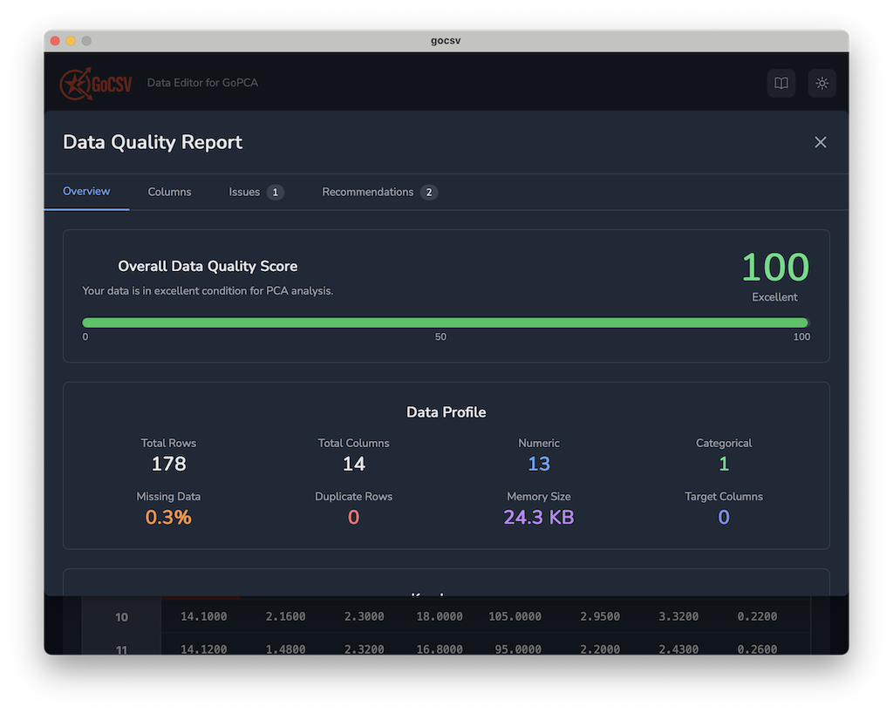

# GoPCA Suite - The Definitive Principal Component Analysis Toolset

Professional-grade PCA analysis made simple. A comprehensive suite of tools including a powerful command-line interface and intuitive desktop applications.

## What is GoPCA Suite?

GoPCA Suite is **the** go-to toolset for Principal Component Analysis, a fundamental machine learning technique for understanding complex  multivariate data. Whether you're analyzing spectroscopic data, exploring gene expression patterns, or reducing dimensionality in machine learning pipelines, GoPCA Suite provides the tools you need.


### Includes GoCSV Desktop Data Preparation Tool

GoPCA Suite includes **GoCSV Desktop**, a companion application for preparing your data. With its Excel-like interface, GoCSV Desktop makes it easy to clean, edit, and format your CSV files before PCA analysis - ensuring your data is analysis-ready.


## Three Powerful Tools in the Suite

### GoPCA Desktop

Perfect for interactive data exploration, method development, and teaching.


**Key GoPCA Desktop Features:**
- Interactive visualizations with zoom, pan, and export
- Real-time plot updates as you adjust parameters
- Confidence ellipses for group visualization
- Customizable color palettes for different data types
- Light and dark themes for comfortable viewing

### The pca CLI

Ideal for automation, batch processing, and integration into data pipelines.

```bash
# Analyze your data with a single command
pca analyze --components 3 --scale standard --output-dir results/ data.csv

# Validate data before analysis
pca validate spectra.csv

# Apply a saved PCA model to new data
pca transform model.json new_data.csv

# Transform with output options
pca transform -f json -o results/ model.json new_samples.csv
```

### GoCSV Desktop

Clean and prepare your data with an intuitive spreadsheet-like interface.



**GoCSV Desktop Features:**
- Edit cells directly like in Excel
- Add, remove, or reorder columns
- Multi-step undo/redo functionality
- Column type detection (numeric, categorical, target)
- Real-time validation against pca CLI requirements
- Missing value detection and handling
- Export clean CSV files ready for PCA analysis

## Key Features

### Comprehensive Analysis
- **Multiple algorithms**: 
  - SVD (default) - Fast and accurate for complete data
  - NIPALS - Handles missing data gracefully
  - Kernel PCA - For non-linear relationships
- **Flexible preprocessing**: 
  - Mean centering and scaling
  - Robust scaling for outlier resistance
  - SNV (Standard Normal Variate) for spectroscopy
  - Vector normalization
- **Missing data strategies**: Drop, mean imputation, or iterative methods

### Professional Visualizations


**Available Visualizations:**
- **Scores plots** - View samples in PC space with group coloring and confidence ellipses
- **Loadings plots** - Understand variable contributions to each component
- **Scree plots** - Determine optimal number of components
- **Biplots** - See samples and variables together with confidence ellipses
- **Circle of Correlations** - Visualize variable relationships on unit circle
- **Diagnostic plots** - Detect outliers with T² vs Q residuals
- **Eigencorrelation plots** - Explore correlations between PCs and original variables

All visualizations feature:
- Export to PNG for publications
- Interactive tooltips with detailed information
- Customizable color palettes (qualitative and sequential)
- Full-screen mode for presentations
- Optional row labels for identifying specific data points

### Built for Real Work
- **Example datasets included**: Four interesting datasets for immediate exploration
- **Handles real-world data**: Robust to missing values, mixed scales, and outliers
- **Smart defaults**: Automatic parameter selection based on your data
- **Cross-platform**: Native performance on Windows, macOS, and Linux
- **Fast**: Optimized implementations handle large datasets efficiently
- **Themeable**: Light and dark modes for comfortable extended use

## Getting Started

### GoPCA Desktop Application

1. **Download** the latest release for your platform from [GitHub Releases](https://github.com/bitjungle/gopca/releases)
2. **Launch** GoPCA Desktop
3. **Try an example** - Select one of the example datasets (NIR, Iris, Wine, or Swiss roll)
4. **Or load your data** - Click "Open CSV" to load your own file
5. **Configure preprocessing** - Choose centering, scaling, and other options
6. **Click "Go PCA!"** - Explore results interactively

<!--  -->
*[Screenshot placeholder: Step-by-step workflow visualization]*

### Data Preparation with GoCSV Desktop

1. **Launch** GoCSV Desktop from the GoPCA Suite installation folder
2. **Open** your raw CSV file or paste data from clipboard
3. **Clean** your data:
   - Remove empty rows/columns
   - Fix inconsistent headers
   - Handle missing values
   - Validate column types
   - Transform features (e.g., log, sqrt)
4. **Save** the cleaned file
5. **Open in GoPCA Desktop** with one click

### macOS Security Note

When downloading GoPCA Desktop and GoCSV Desktop from GitHub releases, macOS may apply security measures that prevent the apps from detecting each other. This happens because macOS runs downloaded apps from a temporary, randomized location (App Translocation) for security.

**Solutions:**
1. **Move both apps to Applications**: Drag both GoPCA.app and GoCSV.app to your Applications folder before launching
2. **Keep apps together**: Always keep both apps in the same folder (Applications, Downloads, or Desktop)
3. **Alternative launch method**: Right-click the app and choose "Open" instead of double-clicking

### Command-Line Interface

```bash
# Download the latest release
wget https://github.com/bitjungle/gopca/releases/latest/download/pca
chmod +x pca

# Basic analysis with automatic settings
./pca analyze mydata.csv

# Advanced analysis with custom parameters
./pca analyze \
  --components 4 \
  --scale standard \
  --preprocessing snv \
  --format json \
  --output-dir results/ \
  mydata.csv

# Validate your data first
./pca validate mydata.csv

# Apply a trained model to new samples
./pca transform trained_model.json new_samples.csv

# Transform with custom output and metrics
./pca transform \
  --format json \
  --output-dir predictions/ \
  --include-metrics \
  model.json test_data.csv
```

## Use Cases

### Chemometrics & Spectroscopy
Analyze NIR, FTIR, Raman, or UV-Vis spectroscopic data to identify chemical patterns, detect adulterants, or monitor reactions. The SNV preprocessing option is specifically designed for spectroscopic data.

### Bioinformatics
Explore gene expression, proteomics, or metabolomics data to find biological patterns, identify biomarkers, or understand disease mechanisms. Handle high-dimensional data with thousands of variables.

### Quality Control & Process Monitoring
Monitor industrial processes in real-time, detect anomalies before they become problems, and understand the relationships between process variables. Use diagnostic plots to identify out-of-specification samples.

### Data Science & Machine Learning
Reduce dimensionality before classification or regression, explore feature relationships, visualize high-dimensional clusters, or compress data while preserving variance. Export transformed data for use in other ML pipelines.

### Education & Research
Teach multivariate statistics with interactive visualizations, explore research data with publication-ready plots, or demonstrate the power of dimensionality reduction with real examples.

## Documentation

- [Introduction to PCA](docs/intro_to_pca.md) - Learn the fundamentals of Principal Component Analysis
- [Data Preparation Guide](docs/intro_to_data_prep.md) - Best practices for preparing your data
- [Data Format Specification](docs/data-format.md) - Detailed CSV format requirements
- Built-in help system - Hover over any control in GoPCA Desktop for instant help

## System Requirements

### Supported Platforms
- **Windows**: 64-bit Windows (where Go and Wails are supported)
- **macOS**: Intel and Apple Silicon Macs (where Go and Wails are supported)  
- **Linux**: 64-bit distributions (where Go and Wails are supported)

### Desktop Applications (GoPCA Desktop & GoCSV Desktop)
- Require a graphical environment
- Modern web browser engine (uses system WebView)
- Screen resolution that can display the application window

### Command-Line Interface
- Works on any platform where Go binaries can run
- No graphical environment required

*Note: Memory and disk requirements depend on your dataset size. The applications themselves are lightweight (~50-100MB), but processing large datasets will require corresponding RAM.*

## Support & Community

- **Report Issues**: [GitHub Issues](https://github.com/bitjungle/gopca/issues)
- **Ask Questions**: [GitHub Discussions](https://github.com/bitjungle/gopca/discussions)
- **Documentation**: See the docs folder for detailed guides

## License

GoPCA Suite is open-source software licensed under the MIT License. However, the author respectfully requests that it **not be used for military, warfare, or surveillance applications**.