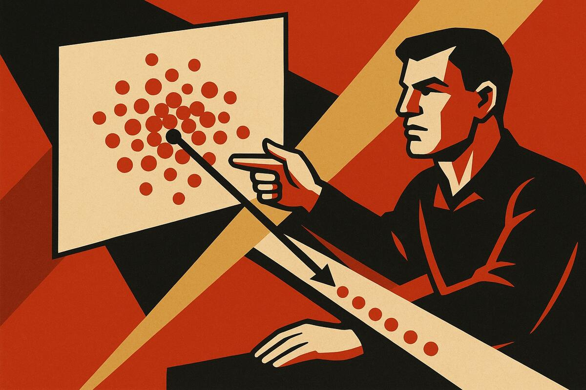
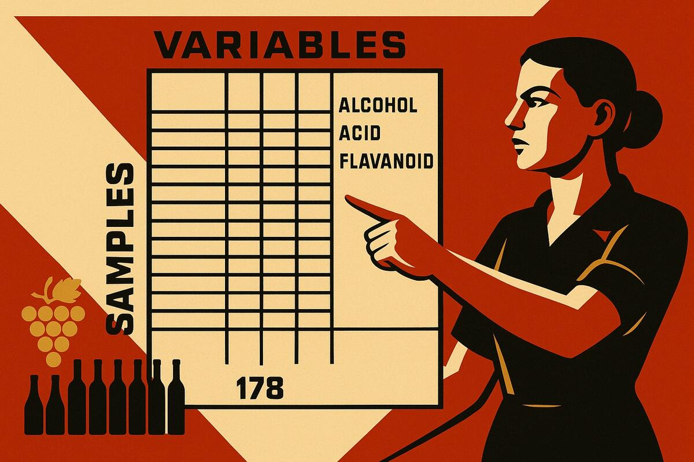
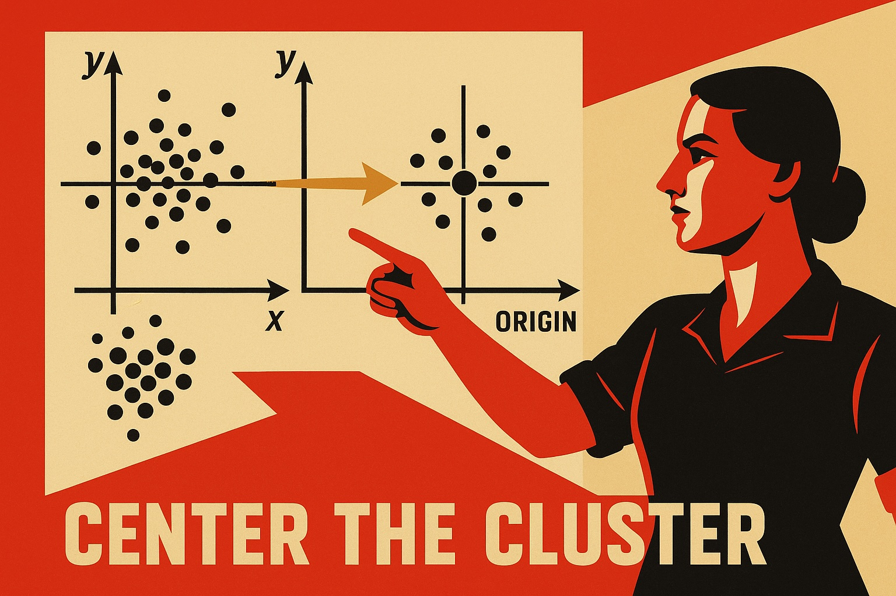
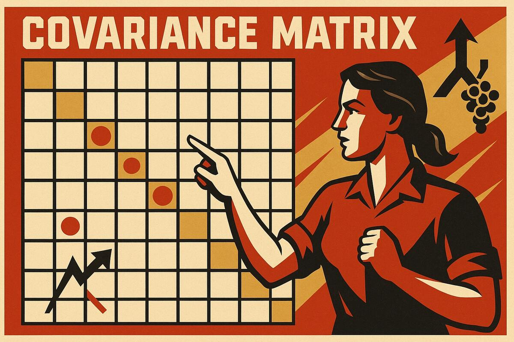
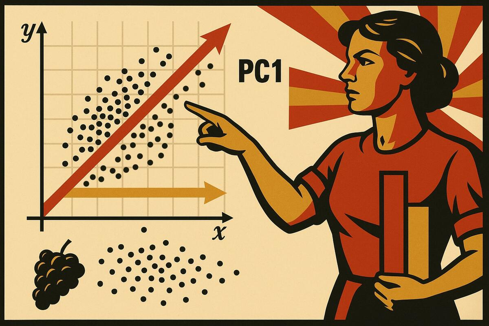
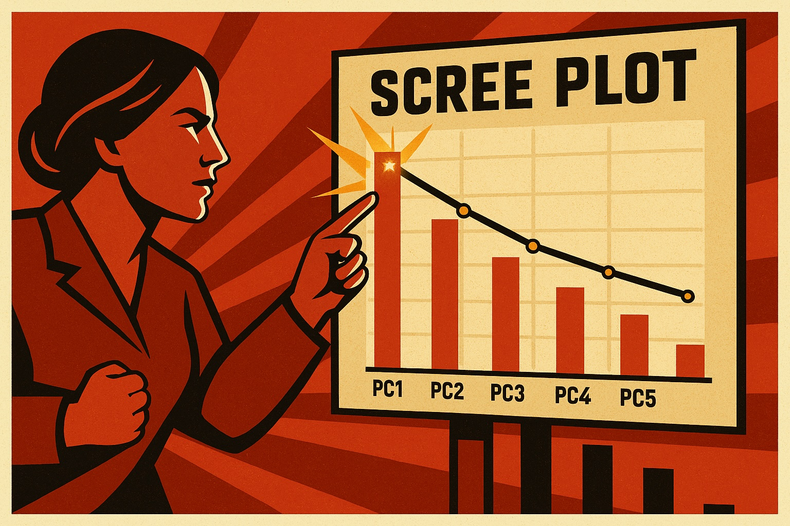
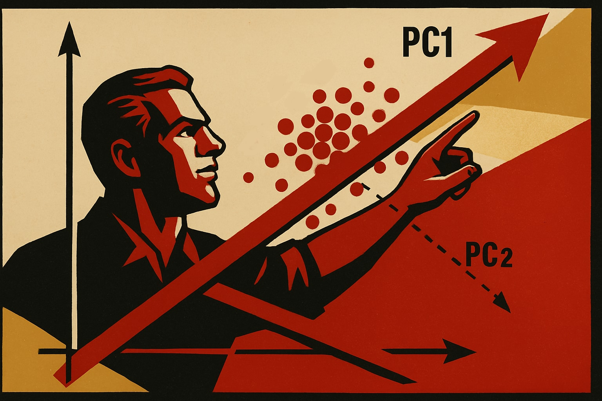
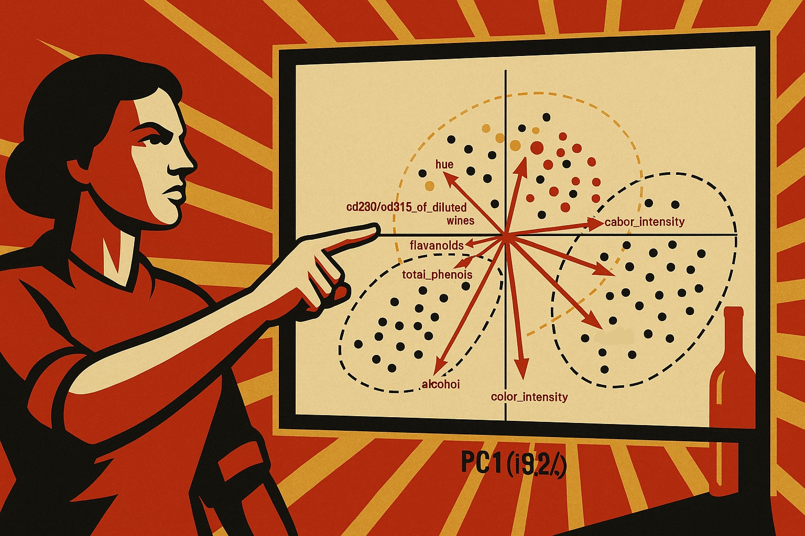

# An Introduction to Principal Component Analysis (PCA) with GoPCA

## 1. Introduction: The Need for Simpler Data

If you've ever felt overwhelmed by complex datasets with dozens or even hundreds of variables, you're not alone. This guide will show you how Principal Component Analysis (PCA) can help you make sense of complex data.

Consider these scenarios: You're a wine researcher with 178 Italian wines from three different cultivars, each analyzed for 13 chemical properties. Or perhaps you're monitoring a manufacturing plant with hundreds of sensors recording temperature, pressure, flow rates, and vibrations every second. Maybe you're studying gene expression with thousands of measurements per sample. How do you make sense of all this information? How do you find the patterns hidden in the numbers?

This is where **Principal Component Analysis (PCA)** becomes invaluable. Think of PCA as a sophisticated lens that helps you see through the complexity to find the essential patterns in your data. Just as a photographer might use different lenses or angles to capture the essence of a scene, PCA helps you capture the essence of your data by focusing on what matters most.

PCA has stood the test of time. **Developed over a century ago by Karl Pearson (1901) and later refined by Harold Hotelling (1933)**, PCA remains one of the most widely used techniques in modern data science. From movie streaming recommendation systems to climate science, from quality control in manufacturing to discoveries in genomics, PCA is everywhere. It's mathematically elegant, computationally efficient, and remarkably effective at revealing hidden structure in complex data.

The **GoPCA Suite** brings this powerful technique to your fingertips with a focused, professional-grade implementation. Whether you prefer the efficiency of command-line tools (pca CLI) for automation and reproducible research, or the intuitive visual exploration of GoPCA Desktop, our tools make PCA both accessible and practical.

GoPCA is designed to serve two roles simultaneously — and it does not compromise on either:

* **A learning tool:** GoPCA ships with seven carefully chosen sample datasets spanning biology, chemistry, spectroscopy, chemical engineering, neuroscience, and public health. Each dataset comes with a step-by-step interactive tutorial that teaches both PCA concepts and how to use the software. You can go from zero to a complete multivariate analysis — including data diagnostics, outlier removal, and interpretation — without leaving the application. The tutorials are not toy examples; they are real datasets with real challenges, selected precisely because they expose the situations you will encounter in your own work.

* **A professional analysis tool:** The same application you use to learn is the one you use on your own data. Load your CSV, configure your preprocessing, choose your method (standard SVD, NIPALS, Kernel PCA, or Temporal PCA), and export your model. There are no artificial limits, no watermarks, and no features locked behind a tutorial mode. When you are ready to analyse your own datasets, GoPCA is ready too.

> **Interactive Tutorials:**  
> GoPCA Desktop includes guided interactive tutorials for seven carefully chosen sample datasets. Each tutorial walks you through a complete analysis, explains what to look for, and teaches you a specific aspect of PCA or data analysis. This introduction gives you the conceptual foundation; the tutorials give you the hands-on experience. Look for the **Open Tutorial** button next to each sample dataset in GoPCA Desktop.

> **Note on Data Preparation:**  
> Before performing PCA, your data should be properly cleaned and structured. If you're starting with raw data that contains missing values, outliers, or quality issues, consider using **GoCSV Desktop** for data preparation. See our companion guide *"Data Preparation with GoCSV Desktop"* for detailed guidance on getting your data ready for analysis.

---

## 2. What is PCA? Understanding the Core Concept

Let's start with an analogy that makes PCA intuitive. Imagine you're a photographer trying to capture the essence of a bustling city square. You could take hundreds of photos, but most would show similar things from slightly different perspectives. Instead, a skilled photographer knows to find the few key vantage points that capture the most important aspects: one showing the grand architecture, another revealing the flow of people, perhaps a third highlighting the interplay of light and shadow. These few carefully chosen perspectives tell the complete story more effectively than hundreds of redundant shots.

PCA does something remarkably similar with your data. When you have many variables describing your samples, PCA finds the "best vantage points" called **principal components (PCs)** that capture the most important patterns in your data. Just as those key photos summarize the city square, principal components summarize your complex dataset.

Principal Component Analysis is a **dimensionality reduction** technique that transforms your original variables into a new set of uncorrelated variables called principal components. These components are special because:

* **They're ordered by importance:** The first principal component (PC1) captures the most variation in your data, PC2 captures the second-most (while being completely independent of PC1), and so on.

* **They're efficient:** Often, just 2–3 principal components can capture 80–90% of the information contained in dozens of original variables.

* **They're interpretable:** Each PC is a weighted combination of your original variables, revealing what aspects of your data each component represents.

Without diving too deep into the mathematics (we'll explore that later for those interested), PCA essentially rotates your data's coordinate system to align with the directions of maximum variation. It's like turning a tilted oval until it lies flat along the x-axis: suddenly, the main pattern becomes crystal clear.

By reducing complexity while preserving information, PCA enables you to:
- **Visualize high-dimensional data** in 2D or 3D plots that your brain can actually comprehend
- **Identify hidden patterns** that would be invisible when looking at variables individually
- **Remove noise** by focusing on the dominant patterns and ignoring minor variations
- **Prepare data** for further analysis, making subsequent statistical or machine learning methods more effective

---

## 3. Motivation and Intuition: Why Use PCA?

Modern data challenges often involve datasets with dozens, hundreds, or even thousands of variables. This complexity creates both computational and interpretational hurdles that PCA elegantly addresses. By transforming your data into a new coordinate system that highlights the most important patterns, PCA turns overwhelming complexity into manageable insight.

As the number of variables grows, data analysis quickly becomes unwieldy. With just 10 variables, there are already 45 possible pairwise scatterplots; with 100 variables, that number explodes to 4,950. Interpreting all of these possible relationships is simply impossible. And beyond visualization, high-dimensional data suffers from what's known as the **curse of dimensionality**: distances and densities become less meaningful, making statistical modeling and machine learning less reliable.

Compounding the problem, many real-world variables are correlated. In wine chemistry, for instance, high ethanol often goes hand-in-hand with high glycerol. In genomics, groups of genes are co-regulated. This redundancy inflates the apparent complexity of the data without adding new information.

PCA addresses these challenges head-on. It finds new variables — principal components — that capture the directions of greatest variation in the data. These components combine correlated variables into single, more informative dimensions, stripping away redundancy and focusing attention on what really matters. Often just a handful of components explain most of the variation across dozens or even hundreds of variables.

The benefits are immediate and tangible. A simple plot of the first two principal components can reveal clusters, trends, or groupings that would be invisible in the raw variables. PCA also prepares your data for downstream tasks. Whether you're running regressions, building classification models, or clustering samples, working in a reduced set of principal components often leads to models that are faster, less noisy, and more interpretable.

---

## 4. Seven Datasets, Seven Lessons

GoPCA Desktop ships with seven carefully selected sample datasets. Together they cover the most important situations you will encounter in practice — from a clean textbook case to spectroscopic data to a nonlinear manifold to a time series from a chemical reactor to a real population health survey. Each dataset teaches a specific lesson about data, preprocessing, and the choice of PCA method. This section introduces all seven. The interactive tutorials in GoPCA Desktop go deeper into each one.

---

### Dataset 1: Iris — Learning to See Clusters

**The data:** 150 flower measurements from three species of iris (*Setosa*, *Versicolor*, and *Virginica*). Four variables: sepal length, sepal width, petal length, and petal width. Collected by Ronald Fisher in 1936 and still one of the most widely used teaching datasets in statistics.

**Why it is special:** The dataset is clean, well-behaved, and small enough to understand completely. The three species form partially overlapping groups that become clearly separated in PCA space — making it a perfect first experience of PCA doing something useful.

**What you will learn:**
- How to load data and run a basic PCA in GoPCA Desktop
- How to read a Scores Plot: what clusters mean, what distances mean
- How to read a Loadings Plot: which variables drive the separation
- How to use the Scree Plot to decide how many components to keep
- Why the first two components are usually enough for visualization

**Preprocessing:** Mean centering is standard. Standard scaling is worth trying — it changes the result because the four measurements have different units and ranges, and comparing scaled vs. unscaled teaches you exactly what scaling does.

**PCA method:** Standard SVD. No special methods needed — this is the cleanest possible starting point.

> **→ Open the Iris tutorial in GoPCA Desktop** to work through this analysis step by step.

---

### Dataset 2: Wine — Variable Importance and Chemical Fingerprints

**The data:** 178 Italian wines from three grape cultivars (Barolo, Grignolino, Barbera), each analyzed for 13 chemical properties including alcohol, phenols, flavanoids, color intensity, and proline. Originally collected by Forina and colleagues (1986) to support wine authentication by objective chemical analysis.

**Why it is special:** Thirteen correlated chemical measurements, three cultivars, and a real-world motivation (detecting adulteration). The dataset shows how PCA handles correlated variables and reveals chemical fingerprints that distinguish the three cultivars — something no single measurement could do alone. The Biplot and Circle of Correlations become genuinely informative here.

**What you will learn:**
- Why standard scaling is important when variables have very different units and ranges
- How to read a Biplot: samples and variables on the same plot
- How to identify which variables are correlated by looking at their loading vectors
- What it means when a loading is near zero vs. near ±1
- How PCA supports authentication: wines with unusual chemical profiles appear as outliers

**Preprocessing:** Standard scaling (zero mean, unit variance) is essential here — proline ranges from 278 to 1680 mg/L while pH ranges from 2.74 to 4.01. Without scaling, proline dominates purely because of its larger numbers.

**PCA method:** Standard SVD. A clean example of correlation PCA at work.

> **→ Open the Wine tutorial in GoPCA Desktop** to explore chemical fingerprinting with PCA.

---

### Dataset 3: Corn NIR — Preprocessing for Spectroscopic Data

**The data:** 80 corn samples measured on near-infrared (NIR) spectrometers across 700 wavelength channels (1100–2498 nm at 2 nm intervals). Four composition values are also available for each sample: moisture, oil, protein, and starch.

**Why it is special:** This dataset represents a fundamentally different challenge from Iris and Wine: it has **700 variables and only 80 samples** — far more variables than observations. This is normal in spectroscopy. What is also normal is that NIR spectra are affected by physical effects (particle size, packing density) that cause the entire spectrum to shift up or down for a sample — a phenomenon called **multiplicative scatter**. These physical effects have nothing to do with the chemical composition and will dominate a naive PCA.

**What you will learn:**
- How to handle high-dimensional data (far more variables than samples)
- What multiplicative scatter looks like in a scores plot and why it is a problem
- How **SNV (Standard Normal Variate)** preprocessing removes scatter artifacts by normalizing each spectrum row-wise
- That the choice of preprocessing can completely change what PCA finds
- How PCA enables calibration: the scores from a well-preprocessed spectral PCA are excellent inputs for predicting composition values

**Preprocessing:** SNV is the key step here, applied before mean centering. The tutorial walks you through what the data looks like without SNV (a single scatter artifact dominates PC1) and then with SNV (genuine compositional variation becomes visible).

**PCA method:** Standard SVD. The lesson is entirely about preprocessing — the algorithm itself is unchanged.

> **→ Open the Corn tutorial in GoPCA Desktop** to see how preprocessing transforms the analysis.

---

### Dataset 4: Swiss Roll — When Standard PCA Is Not Enough

**The data:** 1,000 synthetic data points in three dimensions, arranged on a two-dimensional surface that has been rolled up like a Swiss roll pastry. Each point has three coordinates (x, y, z) and a special column `color #target` indicating position along the roll. Columns ending in `#target` are excluded from the PCA calculation and used only for colouring plots — a GoPCA convention for attaching external information to a dataset without influencing the analysis. See the [GoPCA Data Format Guide](data-format.md) for details.

**Why it is special:** This dataset has no noise problem, no scale problem, and no outlier problem — and yet standard PCA completely fails to reveal its structure. The reason is geometric: the data lives on a curved surface, and PCA can only find flat (linear) projections. When you project a Swiss roll onto a flat plane, the two ends of the roll overlap. The underlying two-dimensional structure — which is completely real — is invisible to standard PCA. This is the clearest possible demonstration of PCA's fundamental limitation.

**What you will learn:**
- What "nonlinear structure" means geometrically, and why linear PCA cannot see it
- How **Kernel PCA** maps the data into a higher-dimensional space where the curved structure becomes flat
- What the RBF (Radial Basis Function) kernel does and how the gamma parameter controls it
- That the choice of PCA *method* (not just preprocessing) can make the difference between seeing structure and missing it entirely

**Preprocessing:** No centering or scaling — Kernel PCA handles the geometry internally.

**PCA method:** Kernel PCA with the RBF kernel. The tutorial compares standard SVD PCA (which fails) with Kernel PCA (which succeeds), making the difference tangible.

> **→ Open the Swiss Roll tutorial in GoPCA Desktop** to see standard PCA fail — and Kernel PCA succeed.

---

### Dataset 5: CSTR — Time Series from a Chemical Process

**The data:** 801 simulated sensor readings from a non-isothermal Continuous Stirred-Tank Reactor (CSTR) running an exothermic first-order reaction A→B, sampled every minute over 800 minutes. Twelve process variables are recorded: reactor temperature, coolant outlet temperature, feed temperature, reactant and product concentrations, feed flow rate, feed concentration, cooling duty, reaction rate, conversion fraction, heat-transfer coefficient, and residence time. The simulation passes through six distinct operating phases — normal operation, two feed disturbances, a periodic flow oscillation (40-minute period), a cooling fault, and recovery.

**Why it is special:** Process data from a reactor is fundamentally different from independent samples like Iris or Wine — every measurement is connected to the previous one through the physics of the reactor. The energy and mass balances couple the variables to each other with time delays (thermal inertia, residence time, controller response), and the dataset contains both slow trends and a periodic oscillation designed to be identified by Temporal PCA. The cooling fault scenario makes the dataset directly relevant to industrial process monitoring and fault detection.

**What you will learn:**
- How to compare ordinary PCA (L = 0) to Temporal PCA, and what the lag parameter adds
- How to read PCA scores as a **process trajectory**: stable clusters, step jumps, loops from oscillations, and drift from faults
- How temporal loading curves reveal **delayed coupling** between variables (e.g. coolant temperature changes before reactor temperature responds)
- How to identify an SSA **oscillatory pair** from the shape of temporal loading curves — sinusoidal and ~90° phase-shifted — and why similar explained variance alone is not a reliable criterion
- How to select the lag parameter L based on process time constants
- How Temporal PCA can detect process faults by showing the reactor leaving its normal operating region

**Preprocessing:** Standard scaling is essential — temperatures, concentrations, and flow rates have completely different units and magnitudes. The tutorial starts with unscaled results so you can see the distortion directly.

**PCA method:** Temporal PCA. The tutorial compares L = 0, 5, 10, and 40 to show how the lag window controls which dynamics become visible. L = 40 is needed to resolve the 40-minute flow oscillation as a recognisable sine/cosine pair.

> **→ Open the CSTR tutorial in GoPCA Desktop** to explore process dynamics and fault detection with Temporal PCA.

---

### Dataset 6: EEG Eye State — PCA for Brain Signals

**The data:** 14,980 EEG measurements from a single subject wearing a 14-electrode headset, recorded at 128 Hz over 117 seconds. During the recording, the subject alternately opened and closed their eyes. Each row is one time point; each column is one EEG channel. The eye-state label (open/closed) is included.

**Why it is special:** This dataset breaks a fundamental assumption of standard PCA — that observations are independent. Every row is a snapshot of an ongoing brain signal: row 500 and row 501 are only 7.8 ms apart, and the brain was doing nearly the same thing at both moments. Shuffling the rows would give identical standard PCA results, which proves that standard PCA completely ignores temporal order. But the most scientifically interesting structure in EEG — oscillations, brain rhythms, the eye-state transition — is *entirely* in the temporal order.

**What you will learn:**
- Why time series data requires a different approach than independent samples
- How **Temporal PCA** (based on Singular Spectrum Analysis) gives PCA a memory by building a trajectory matrix from sliding windows
- How to read PCA scores as a **phase-space trajectory** rather than a sample cloud
- How to recognize oscillatory components in the **Temporal Loadings** plot from their sinusoidal shape — and why similar explained variance alone is not sufficient to identify a pair
- What alpha suppression looks like in PCA space (eyes-open brain state)

**Preprocessing:** Standard scaling, applied to the original 14 channels *before* building the trajectory matrix. The tutorial explains exactly why and what happens if you skip it.

**PCA method:** Temporal PCA with 32 time lags (250 ms window). The tutorial explains how to choose the window length based on the signal frequencies you want to detect.

> **Note for students without an EEG background:** EEG signals and brain rhythms (alpha, beta, theta waves) are a specialist topic. If the neuroscience context is unfamiliar, the tutorial is still valuable for learning Temporal PCA — but you may want to read a brief introduction to EEG before working through Steps 6 and 7. The CSTR dataset (Dataset 5) covers the same Temporal PCA concepts in a chemical engineering context that may be more accessible if you come from a natural science or engineering background.

> **→ Open the EEG Eye State tutorial in GoPCA Desktop** to explore brain dynamics with Temporal PCA.

---

### Dataset 7: Body Measures — What the Components Mean

**The data:** Seven body measurements from 5,096 US adults in the 2017–2018 National Health and Nutrition Examination Survey (NHANES): weight, height, upper leg length, upper arm length, and arm, waist, and hip circumferences. Unlike the curated benchmarks above, this is a slice of a real population survey.

**Why it is special:** Iris and Wine were about separating *known groups*. Body Measures has no natural classes — instead, the interesting question is what the components themselves *mean*. Because every body measurement grows with overall size, PCA hands you two remarkably interpretable axes: **PC1 (~60% of the variance) is an overall "size" factor** — all seven loadings share the same sign, so moving along it makes a person larger or smaller in every dimension at once — and **PC2 (~29%) is a "shape" factor** that contrasts stature (height, limb lengths) against girth (waist, hip, arm circumference). Together they capture about 88% of the variation in a clean 2D picture.

**What you will learn:**
- How a principal component can be an *interpretable factor* (size, shape), not just an abstract axis
- Why a set of positively correlated measurements always yields a first component with same-sign loadings — a general "size" component
- How to tell a *shift between overlapping groups* (men and women differ along the shape axis but overlap heavily) from the clean cluster separation seen in Iris
- That PCA finds the directions of greatest variance, which need not line up with any variable you care about (colouring by age reveals almost no structure)

**Preprocessing:** Standard scaling is essential — weight is in kilograms while the lengths and circumferences are in centimetres, and weight's numerical variance is roughly 60× that of arm length. Without scaling, weight and the largest girths dominate; with it, the size-and-shape structure emerges cleanly.

**PCA method:** Standard SVD. The lesson is about *interpretation* — reading meaning into the components — rather than a new algorithm.

> **→ Open the Body Measures tutorial in GoPCA Desktop** to see how PCA separates body size from body shape.

---

### The Seven Datasets at a Glance

| Dataset | Domain | Variables | Key lesson | Preprocessing | Method |
|---|---|---|---|---|---|
| **Iris** | Biology | 4 | Reading scores and loadings | Mean centering ± scaling | SVD |
| **Wine** | Chemistry | 13 | Variable importance, biplot | Standard scaling | SVD |
| **Corn NIR** | Spectroscopy | 700 | Preprocessing for spectra (SNV) | SNV + centering | SVD |
| **Swiss Roll** | Synthetic | 3 | Nonlinear structure | None | Kernel PCA |
| **CSTR** | Chemical engineering | 12 (×time) | Process dynamics, fault detection | Standard scaling | Temporal PCA |
| **EEG Eye State** | Neuroscience | 14 (×time) | Brain rhythms, phase-space trajectories | Standard scaling | Temporal PCA |
| **Body Measures** | Public health | 7 | Interpreting components (size vs shape) | Standard scaling | SVD |

---

## 5. How Does PCA Work? A Step-by-Step Guide

Now that you've seen PCA in action with our sample datasets, let's peek under the hood to understand the elegant mathematics that makes it work. Don't worry if math isn't your forte: we'll build understanding step by step, connecting each concept to practical intuition.

PCA transforms your data through six key steps: organizing your data, preprocessing it to ensure fair comparisons, finding relationships between variables, discovering the best new viewing angles, transforming to this new perspective, and deciding how much to keep. Each step has a clear purpose and builds on the previous one.

### Step 1: Organize Your Data Matrix

Start by organizing your data into a matrix **X**. Think of this as a spreadsheet where:
- Each row represents a sample (a wine bottle, a patient, a time point)
- Each column represents a variable (alcohol content, pH, temperature)
- If you have *n* samples and *p* variables, **X** is an *n × p* matrix

For the Iris example: 150 rows (flowers) × 4 columns (measurements) = a 150 × 4 matrix. For the Corn NIR dataset: 80 rows × 700 columns — far more variables than samples, a situation PCA handles naturally.

### Step 2: Preprocess Your Data

**Why Preprocessing Matters:**
Raw data rarely tells the full story. Variables measured in different units (mg/L vs pH) or with different ranges can bias your analysis. Preprocessing levels the playing field.

**Centering (Essential):**  
PCA requires **centered** data. By subtracting a reference value from each variable, you shift your data cloud to the origin — this ensures PCA finds the directions of genuine variation rather than being pulled toward arbitrary baseline levels. The standard approach subtracts each variable's **mean**. When your data contains outliers, the **median** is a more reliable choice, since a single extreme value can shift the mean substantially without changing the median at all.

**Scaling (Often Critical):**  
When variables have different units or ranges, **scaling** prevents variables with larger numbers from dominating. Consider:
- Proline in wine: ranges from 278 to 1680 mg/L
- pH in wine: ranges from 2.74 to 4.01

Without scaling, proline would dominate the analysis simply due to its larger numbers!

> **Decision Guide:**
> - **Always center** your data (PCA will not work properly without it)
> - **Scale with Standard Scaling when:** Variables have different units or vastly different ranges, and you have no extreme outliers
> - **Scale with Robust Scaling when:** Variables have different units or ranges *and* your data contains outliers that are genuine measurements — not errors — that you want to include without letting them distort the analysis
> - **Don't scale when:** All variables are in the same units and scale differences carry scientific meaning

**Advanced Preprocessing Options in GoPCA Suite:**

Beyond basic centering and scaling, GoPCA Suite offers specialized preprocessing methods:

1. **Standard Preprocessing:**
   - **Mean Centering**: Subtracts the mean of each variable (essential for PCA)
   - **Standard Scaling**: Divides by standard deviation (recommended for mixed units)
   - **Robust Scaling**: Achieves the same goals as Standard Scaling — centering each variable and equalizing their scales — but using statistics that are resistant to extreme values. Instead of the mean and standard deviation (which outliers can pull strongly), it uses the **median** and **MAD** (median absolute deviation). The practical difference: one unusually large measurement will barely affect the result of robust scaling, but can substantially distort standard scaling.

2. **Spectroscopic Preprocessing:**
   - **SNV (Standard Normal Variate)**: Row-wise normalization that removes multiplicative scatter effects in spectroscopic data
   - **Vector Normalization**: Normalizes each sample to unit length, useful for compositional data

**In GoPCA Suite:** Both the pca CLI and GoPCA Desktop provide simple options for all preprocessing methods. GoPCA Desktop offers intuitive checkboxes, while the pca CLI uses flags like `--no-mean-centering`, `--scale` (with options: none, standard, or robust), `--snv`, and `--vector-norm`.

> **Important:** These mathematical preprocessing steps (centering and scaling) are handled by GoPCA Suite during the analysis. Data cleaning tasks like handling missing values, removing outliers, and selecting variables should be done beforehand using appropriate data preparation tools like GoCSV Desktop.

### Step 3: Calculate the Covariance Matrix

Once your data is preprocessed, PCA examines how your variables relate to each other by computing the **covariance matrix**. This square matrix captures all pairwise relationships:

- **Diagonal elements:** The variance of each variable (how spread out it is)
- **Off-diagonal elements:** The covariance between pairs of variables (how they vary together)

For standardized data, this becomes the **correlation matrix**, where values range from −1 (perfect negative correlation) to +1 (perfect positive correlation).

### Step 4: Find the Principal Directions (Eigendecomposition)

Here's where the mathematical magic happens. PCA finds the "best" new coordinate system for your data through **eigendecomposition** of the covariance matrix.

**The Key Players:**
- **Eigenvectors:** These define the directions of your new axes (principal components). Each eigenvector is a recipe that combines your original variables.
- **Eigenvalues:** These tell you how much variance is captured along each direction. Bigger eigenvalue = more important direction.

**The Intuition:**
Imagine your data cloud as a swarm of points in space. PCA finds:
1. The direction along which the swarm is most stretched out (PC1)
2. The perpendicular direction with the next most stretch (PC2)
3. And so on, each perpendicular to all previous directions

**In Practice:**
GoPCA Suite uses either eigendecomposition or Singular Value Decomposition (SVD) depending on your data size and chosen algorithm. Both give equivalent results, but SVD is often more numerically stable and efficient.

### Step 5: Transform Your Data to Principal Components

With directions identified, PCA transforms your original data into the new coordinate system. This creates your **principal component scores**.

**What You Get:**
- **Scores:** The coordinates of each sample in the new PC space. If a wine sample has PC1 score of 2.3, it sits at position 2.3 along the first principal component axis.
- **Loadings:** The recipe for each PC. If PC1 has a loading of 0.42 for alcohol, it means alcohol contributes strongly and positively to PC1.

**Interpreting Components:**
- **PC1** might be "overall chemical intensity" (high loadings on phenols, color, proline in wine)
- **PC2** might be "alcohol vs acidity balance"
- Each sample now has just a few numbers (PC scores) that capture its essential characteristics

### Step 6: Decide How Many Components to Keep

Not all principal components are created equal. The **Scree Plot** helps you decide how many to retain. It shows each PC's explained variance as bars:
- PC1 typically explains the most (perhaps 30–50%)
- PC2 explains less (perhaps 10–30%)
- Each subsequent PC explains progressively less
- Eventually, PCs explain so little they're capturing noise

**Decision Strategies:**

1. **Elbow Method:** Look for the "elbow" where the curve flattens. Components before the elbow are signal; after are likely noise.

2. **Cumulative Variance:** Keep enough PCs to explain your target variance:
   - 70–80% for exploratory analysis
   - 90–95% for reconstruction or modeling

3. **Kaiser Criterion:** For standardized data, keep PCs with eigenvalues > 1 (explaining more variance than a single original variable).

---

## 6. The Geometry of PCA: Visualizing Data in Fewer Dimensions

While the mathematics of PCA involves matrices and eigenvalues, its true elegance emerges through geometry. In this chapter, we'll explore how PCA transforms your data cloud, why it works so well for dimension reduction, and what the various plots actually show you. Understanding these geometric concepts will deepen your intuition and help you interpret PCA results with confidence.

### Your Data as a Cloud of Points

Imagine your dataset as a cloud of points floating in multidimensional space. With the wine dataset, each of the 178 wines becomes a single point whose position is determined by its 13 chemical measurements. This creates a "wine cloud" in 13-dimensional space. While we can't visualize 13 dimensions directly, the geometric principles remain the same whether we're working in 2D, 3D, or 13D.

### What PCA Does Geometrically

PCA essentially rotates your coordinate system to align with the natural "shape" of your data cloud:

1. **Finding the Main Axis:** PCA first finds the direction through your data cloud along which the points are most spread out. This becomes PC1.
2. **Finding Perpendicular Axes:** It then finds the next direction of maximum spread that's perpendicular to the first. This becomes PC2.
3. **Continuing the Process:** This continues for PC3, PC4, and so on, each perpendicular to all previous ones.

Projecting onto PC1–PC2 is like shining a light through your data cloud and looking at its 2D shadow — but unlike random projections, this shadow is carefully chosen to preserve as much of the cloud's structure as possible.

### Geometric Interpretation of Key Concepts

**Loadings** tell you how the new axes (PCs) relate to the old axes (original variables):
- A loading of +0.71 means the PC points 45° toward that variable's positive direction
- A loading near 0 means the PC is nearly perpendicular to that variable
- A loading of ±1 means perfect alignment with that variable

**Scores** are simply the coordinates of each sample in the rotated coordinate system. Positive scores place a sample on one side of the center, negative on the other.

**The Biplot** overlays the sample positions (scores) with variable directions (loadings), creating a unified geometric view. When samples lie in the direction of a variable vector, they tend to have high values for that variable.

### Outliers and Diagnostics in PC Space

Outliers and anomalies are unusual samples that stand out geometrically:
- **Leverage points:** Far from center along major PCs (high Hotelling's T²)
- **Orthogonal outliers:** Far from the PC subspace (high Q residuals)
- **Mixed outliers:** Both far along PCs and poorly reconstructed

The **Diagnostic Plot** in GoPCA Desktop plots T² against Q-residuals, dividing the space into four quadrants and making outlier types immediately visible. This is particularly powerful in the EEG tutorial, where electrode artifacts appear as extreme outliers before the real structure can be seen.

### Beyond Linear Geometry: When PCA Struggles

PCA assumes linear geometry, but real data might have:
- **Curved manifolds:** Like the Swiss Roll dataset
- **Circular patterns:** Periodic or cyclic relationships
- **Temporal structure:** Where the order of observations carries information

When you see curved or horseshoe-shaped patterns in PCA scores plots, it is a sign that nonlinear methods (like Kernel PCA) might reveal additional structure.

---

## 7. Mathematical Foundations of PCA

Now that you've seen PCA in action and understood its geometry, let's explore the elegant mathematics that powers it. We'll build this understanding step by step, connecting each mathematical concept to practical intuition.

### Covariance: The Heart of PCA

**Covariance** measures whether two variables tend to vary together. Positive covariance means when one goes up, the other tends to go up. Negative covariance means when one goes up, the other tends to go down.

For a dataset with *p* variables, we can compute covariances between every pair, forming a *p × p* symmetric matrix called the **covariance matrix** $S$:

$$
S = \frac{1}{n-1} X^T X
$$

where $X$ is your mean-centered data matrix (*n* samples × *p* variables). For standardized data, this becomes the **correlation matrix**.

### Eigendecomposition: Finding the Principal Directions

PCA finds the principal directions by solving:

$$
S a = \lambda a
$$

This equation asks: *which direction $a$ (eigenvector), when we project our covariance structure onto it, simply scales by some amount $\lambda$ (eigenvalue) without changing direction?*

- The **eigenvectors** are the principal directions — each tells us how to combine original variables to form a PC, and they are always orthogonal (perpendicular) to each other.
- The **eigenvalues** tell us how much variance is captured along each direction. The ratio of each eigenvalue to the total gives the percentage of variance explained.

Once we have the eigenvectors, we project the data:

$$
t = X a
$$

These projections $t$ are the principal component scores.

### Singular Value Decomposition (SVD): The Modern Approach

In practice, GoPCA uses **SVD** — a more numerically stable approach that arrives at the same result. SVD decomposes your centered data matrix directly:

$$
X = U \Sigma V^T
$$

- **U**: Sample patterns — how samples relate to the principal components
- **Σ**: Diagonal matrix of singular values (related to the square roots of eigenvalues)
- **V**: Variable patterns — the loadings showing how variables contribute

The connection: loadings are the columns of **V**; scores are **U × Σ**; eigenvalues are the squared singular values divided by (*n*−1).

### The Optimization at the Heart of PCA

PCA solves a beautiful optimization problem: find the direction that captures the most variance in the data. For PC1:

$$
\text{maximize Var}(Xa) \text{ subject to } \|a\| = 1
$$

The constraint $\|a\| = 1$ (unit length) is crucial — without it, we could make the variance arbitrarily large by scaling up $a$. Each subsequent PC solves the same problem with the added constraint of being perpendicular to all previous PCs, ensuring no redundancy between components.

---

## 8. What Does PCA Do? Assumptions, Strengths and Limitations

Like any analytical tool, PCA excels in certain situations and struggles in others. Understanding both its powers and limitations helps you apply it wisely and know when to reach for alternatives.

### Assumptions: The Ground Rules of PCA

PCA works best under certain conditions:

**Linearity:** PCA assumes that relationships between variables are linear. This works well in cases like height vs weight, but fails for curved patterns (like enzyme activity vs pH, where the relationship is bell-shaped).

**Variance equals importance:** PCA assumes that the directions with the most spread contain the most meaningful signal. This is often true in measurement data, but can fail when subtle, low-variance signals matter more than broad fluctuations.

**Orthogonality:** Each principal component must be perpendicular to the others. This works well if the true underlying factors are independent, but if those factors are correlated, PCA may split them awkwardly across components.

**Continuous, quantitative data:** PCA handles measurements, concentrations, and intensities naturally, but struggles with categorical, binary, or purely count-based variables.

### Strengths: Where PCA Shines

**Uncovering hidden structure:** PCA considers all variables simultaneously, finding combinations that reveal underlying structure invisible when examining variables individually. In the wine dataset, no single chemical measurement cleanly separates the three cultivars — but PCA on all 13 reveals clear clustering.

**Efficient dimensionality reduction:** A handful of components often captures most of the meaningful variation in dozens or hundreds of variables. This isn't just compression — it's intelligent summarization.

**Natural noise filtering:** Systematic patterns concentrate in early components while random noise spreads across all components. Keeping only the major components automatically filters much of the measurement noise.

**Better features for downstream analysis:** PC scores capture coordinated patterns of variation. In machine learning, using PC scores as inputs often improves performance by reducing multicollinearity and overfitting.

**Visualization of the impossible:** We cannot directly picture 13-dimensional wine chemistry, but we can plot PC1 against PC2 — the optimal two-dimensional view that preserves as much variation as possible.

### Limitations: Where PCA Struggles

**Nonlinear relationships:** If your data contains important nonlinear patterns (like a Swiss Roll), linear PCA will miss them. This is why GoPCA Suite includes Kernel PCA for nonlinear patterns.

**Interpretability:** Each PC is a weighted combination of all original variables, sometimes mixing conceptually different measurements in ways that are hard to interpret.

**Scale sensitivity:** Results depend critically on variable scaling. Without standardization, variables with larger numerical ranges dominate — not because they are more important, but simply because their numbers are bigger.

**Outlier sensitivity:** A single extreme sample can pull the first principal component toward itself, distorting the entire analysis. The Diagnostic Plot in GoPCA Desktop helps identify these cases.

**Categorical variables:** PCA works best with continuous, quantitative measurements. Categories don't fit naturally into the PCA framework.

**Time series data:** Standard PCA treats observations as independent samples, ignoring temporal structure — trends, seasonality, or lagged dependencies. For sequential data like sensor readings or EEG, **Temporal PCA** is the appropriate method (see Section 11 and the EEG tutorial).

---

## 9. Practical Considerations and Applications

### Data Preparation Essentials

Before running PCA, ensure your data is clean and properly formatted. This involves handling missing values (remove or impute), investigating outliers (genuine extremes or errors?), and selecting relevant variables (avoid constants and near-duplicates).

**The Preprocessing Decision Tree:**
- **Always center** your data
- **Scale** when variables have different units or vastly different ranges
- **Use robust scaling** when outliers are present but genuine
- **Consider SNV or vector normalization** for spectroscopic or compositional data

> **Pro Tip:** When in doubt, try both scaled and unscaled PCA. If results differ dramatically, consider which makes more scientific sense for your application.

### Choosing the Right Number of Components

More components retain more information but add complexity. The main approaches:

1. **Scree Plot Elbow:** Look for where the variance curve flattens
2. **Cumulative Variance:** Use 70–80% for exploration, 90–95% for modeling
3. **Interpretability:** Can you explain what PC3 or PC4 represents?

In practice, 2–3 components often suffice for visualization and understanding main patterns.

### Interpreting Results

**Understanding Loadings:**
Loadings show how original variables combine to form each PC. Variables with similar loadings are correlated; the magnitude shows importance (closer to ±1 = more important). Opposing variables are negatively correlated; orthogonal variables are uncorrelated.

**Understanding Scores:**
Scores reveal sample patterns in PC space. Look for distinct clusters (different sample types), gradients (continuous variation), outliers (errors or discoveries), and horseshoe patterns (strong underlying gradients). The key insight: if a sample has high PC1 score and a variable has high PC1 loading, that sample likely has a high value for that variable.

**Real-World Example: Manufacturing Quality Control**

Imagine monitoring a chemical reactor. PC1 (60% variance) has high loadings for temperature-related variables — high scores mean hot conditions. PC2 (20% variance) has high loadings for pressure and flow. Normal operation clusters near the origin. A temperature excursion shifts points along PC1. A pressure problem shifts them along PC2. This creates a "normal operating envelope" in PC space — new samples outside this envelope trigger investigation.

### Visualization Tools in GoPCA Suite

GoPCA Suite provides comprehensive interactive visualizations:

- **Score Plots (2D/3D):** Explore sample relationships, identify clusters and outliers
- **Loadings Plots:** Understand variable contributions via bar charts and heatmaps
- **Scree Plot:** Determine optimal number of components
- **Biplot:** Combined view of samples and variables
- **Circle of Correlations:** Visualize variable relationships
- **Diagnostic Plots:** Advanced outlier detection using T² and Q statistics
- **Eigencorrelation Plots:** Relate PCs to external variables
- **Temporal Loadings:** Visualize patterns in time-series PCA (flat = global mean, monotone = trend, oscillating = rhythm)

All visualizations are interactive with zoom, pan, hover details, and high-quality export.

---

## 10. Beyond Linear PCA: Kernel PCA for Nonlinear Patterns

While classical PCA excels at finding linear patterns in data, real-world datasets often contain complex, nonlinear relationships that standard PCA cannot capture. GoPCA Suite implements **Kernel PCA**, a powerful extension that can uncover these hidden nonlinear structures.

### The Core Idea

Standard PCA can only find flat (linear) projections of your data. If your data lies on a curved surface — like a spiral, a shell, or the Swiss Roll — projecting it onto a flat plane collapses the structure into an uninterpretable tangle.

Kernel PCA overcomes this using the **kernel trick**: rather than explicitly mapping the data into a higher-dimensional space (which could be computationally prohibitive), it uses a kernel function to compute the similarity between data points *as if* they had been mapped. Standard PCA is then applied to this similarity structure, and the curved manifold is effectively unrolled.

### When to Use Kernel PCA

Consider Kernel PCA when:
- Score plots from standard PCA show circular or spiral patterns
- Known groups overlap significantly in linear PCA
- You suspect the true structure lies on a curved surface
- Working with data known to have nonlinear structure

### Available Kernels in GoPCA Suite

| Kernel | Best for | Key parameter |
|---|---|---|
| **RBF** (Radial Basis Function) | General nonlinear patterns, curved manifolds | gamma (controls flexibility) |
| **Linear** | Comparison baseline — equivalent to standard PCA | None |
| **Polynomial** | Polynomial relationships of a known degree | degree, gamma, coef0 |

The **RBF kernel** is the right starting point for most nonlinear problems. The gamma parameter controls how local the kernel is — small gamma captures global structure, large gamma captures fine local structure.

### Practical Note on Preprocessing

Kernel PCA handles centering internally in kernel space. Avoid preprocessing methods that include centering (mean centering, standard scaling, robust scaling). Use variance scaling, SNV, or vector normalization if preprocessing is needed.

**Computational note:** Kernel PCA scales with the square of the number of samples, making it more intensive than standard PCA. It works well for datasets up to ~5,000 samples.

> **→ See the Swiss Roll tutorial in GoPCA Desktop** for a hands-on comparison of standard PCA vs. Kernel PCA on data with a known nonlinear structure.

---

## 11. Temporal PCA: Analysis for Time-Series Data

While classical PCA treats each observation as independent, time-series data has inherent temporal structure where the order and timing of observations carry crucial information. GoPCA Suite implements **Temporal PCA** (based on Singular Spectrum Analysis, SSA), which captures these temporal dynamics by incorporating time dependencies directly into the analysis.

> **Important:** Temporal PCA is designed specifically for **time-series data** where observations represent sequential measurements over time. Do not use this method for cross-sectional data where sample order is arbitrary.

### The Core Idea

Standard PCA on time-series data has a revealing property: shuffle the rows in a random order and you get *exactly the same result*. PCA is completely blind to temporal order. But for EEG, sensor data, climate records, and financial time series, the *sequence* of observations is the entire point.

Temporal PCA addresses this by constructing a **trajectory matrix**: each observation is augmented with its recent history, creating a row that captures what happened in a short window of time rather than just at one instant. The window length *L* (number of time lags) is the key parameter — it determines what temporal scale the analysis can resolve.

Standard SVD is then applied to this expanded matrix. The result is components that represent **spatiotemporal patterns** — capturing not just which variables co-vary, but how that co-variation unfolds over time.

### What the Results Look Like

**Scores plot:** Unlike standard PCA, the scores are a *time-ordered trajectory* through PC space. You are watching the system's state evolve over time. Look for distinct regions (attractors where the system spends most of its time), loops (oscillations — the system traces repeated circles in PC space), and sweeping arms (transitions between states).

**Temporal Loadings plot:** Each component has a characteristic temporal shape across the window. Three types reveal different physics:
- **Nearly flat:** A global mean-shift component — the system-wide amplitude
- **Monotone (trend-like):** A slow drift or state transition
- **Oscillatory (sinusoidal):** A repeating rhythm at a specific frequency

**Paired components:** A fundamental property of SSA is that oscillatory signals produce *pairs* of components (Vautard & Ghil, 1989). The definitive signature of such a pair is **two temporal loading curves at the same frequency, approximately 90° phase-shifted from each other** — one resembling a sine, the other a cosine. For a pure sinusoidal signal, the pair will also have nearly equal explained variance; in practice, similar variance is a useful supporting indicator but not a reliable primary criterion, since two unrelated dynamics can explain the same percentage of variance by coincidence.

### Choosing the Window Length

The window length *L* should cover at least 1–2 full periods of the oscillation you want to detect. For EEG alpha waves (~10 Hz) at 128 Hz sampling rate, one period is ~13 samples — so *L* = 32 covers 2–3 cycles comfortably. For hourly industrial data with daily patterns, *L* = 24 is the natural choice.

> **→ See the EEG Eye State tutorial in GoPCA Desktop** for a complete walkthrough of Temporal PCA, including how to read trajectories, identify oscillatory pairs, and interpret the Temporal Loadings and Variable Importance plots.

### Comparison with Standard PCA

| Aspect | Standard PCA | Temporal PCA |
|---|---|---|
| Input | Data matrix [T × p] | Trajectory matrix [(T−L+1) × (p·L)] |
| Captures | Static correlations | Temporal dynamics and oscillations |
| Scores meaning | Sample cloud | Phase-space trajectory |
| When to use | Independent samples | Sequential/time-series data |

---

## 12. PCA in Practice: Tips for Effective Use

### The PCA Workflow (A Practical Checklist)

**Before You Start:**
- [ ] **Know your goal:** Exploration? Visualization? Dimensionality reduction? Outlier detection?
- [ ] **Understand your data:** What do variables represent? What's the expected structure?
- [ ] **Check data quality:** Missing values handled? Outliers investigated?
- [ ] **Consider scale:** Should all variables contribute equally?

**During Analysis:**
- [ ] **Start simple:** Try standard PCA first before reaching for variants
- [ ] **Iterate preprocessing:** Compare centered-only vs scaled results
- [ ] **Vary components:** Test different numbers to understand stability
- [ ] **Look for patterns:** Clusters? Trends? Outliers? Horseshoes?

**After Analysis:**
- [ ] **Validate findings:** Do results make scientific sense?
- [ ] **Test robustness:** How do results change with different preprocessing?
- [ ] **Document decisions:** Why this preprocessing? Why this many components?
- [ ] **Share visualizations:** Use plots to communicate findings

### Common Pitfalls and How to Avoid Them

**Pitfall 1: Over-interpreting Components**
- **Problem:** Assuming each PC represents a single, pure phenomenon
- **Reality:** PCs often capture mixtures of effects
- **Solution:** Look at loadings carefully; one PC might represent "overall size" (many correlated variables) rather than a specific process

**Pitfall 2: Ignoring the Rest of the Variance**
- **Problem:** Focusing only on PC1 and PC2 when they explain <50% variance
- **Reality:** Important patterns might be in PC3, PC4, or beyond
- **Solution:** Always check the Scree Plot; explore multiple PC combinations

**Pitfall 3: Forcing Interpretation**
- **Problem:** Creating elaborate explanations for noise components
- **Reality:** Beyond true structure, you're looking at random variation
- **Solution:** Use the elbow in the Scree Plot to identify where signal ends and noise begins

**Pitfall 4: Scale Amnesia**
- **Problem:** Forgetting whether data was scaled, leading to misinterpretation
- **Reality:** Scaled and unscaled PCA can give opposite conclusions
- **Solution:** Always document and report your preprocessing choices

### Domain-Specific Best Practices

**Spectroscopy (NIR, Raman, etc.):**
- Apply SNV preprocessing to remove scatter effects — see the Corn tutorial
- May need many components (10–20) for calibration tasks
- Watch for baseline effects dominating PC1

**Genomics/Proteomics:**
- Log-transform count data first
- Be aware of batch effects (may dominate PC1)
- Consider removing low-variance genes/proteins

**Process Monitoring:**
- Build model on normal operation data only
- Use T² and Q statistics for fault detection
- Update models periodically for process drift

**Time Series (EEG, sensors, climate):**
- Use Temporal PCA, not standard PCA
- Choose window length based on the oscillation period you want to detect
- Read scores as trajectories, not sample clouds

> **Golden Rule:** PCA is a tool for understanding, not an end in itself. The best PCA analysis is one that leads to insights, decisions, or hypotheses that can be tested further.

---

## 13. Conclusion: Your Path Forward with PCA

### What You've Learned

You've traveled from the basic intuition of PCA through its mathematical foundations to practical applications. You now understand:

- **The Core Concept:** How PCA transforms complex, high-dimensional data into a simpler form that preserves the essential patterns
- **The Mathematics:** From covariance matrices to eigendecomposition, the elegant math that powers PCA
- **The Practice:** How to preprocess data, choose components, and interpret results
- **The Variants:** When to use Kernel PCA for nonlinear patterns or Temporal PCA for time series
- **The Limitations:** When PCA shines and when to reach for alternatives

### Your Next Steps with GoPCA Suite

**Start with the interactive tutorials:** Each of the seven sample datasets has a guided tutorial in GoPCA Desktop. Work through the first six in order — Iris first to build your foundations, then Wine, Corn, Swiss Roll, CSTR, and EEG. By the end of the EEG tutorial, you will have used every major feature of GoPCA and encountered every major challenge that real datasets present. Then finish with Body Measures, the seventh — a fitting close: a simple, real population dataset that steps back from method complexity to ask what the principal components actually *mean* — how PC1 and PC2 become interpretable "size" and "shape" factors.

**Then bring your own data:**
1. Prepare your data with GoCSV Desktop (handle missing values, check quality)
2. Start with standard PCA to establish a baseline
3. Try different preprocessing options to understand their impact
4. Use multiple visualizations to fully explore your results
5. Document your choices for reproducibility

**For automation and pipelines:** The pca CLI supports all the same methods and preprocessing options as GoPCA Desktop, making it straightforward to move from interactive exploration to reproducible batch analysis.

### A Final Thought

Over a century ago, Karl Pearson developed the mathematical foundations of what would become PCA. Today, you're using those same principles, refined and implemented in modern software, to solve 21st-century problems. From understanding wine chemistry to monitoring manufacturing processes, from analyzing spectroscopic data to exploring brain dynamics, PCA continues to reveal the hidden simplicity within complexity.

Welcome to the community of PCA practitioners. May your principal components be interpretable, your variance well-explained, and your insights profound!

---

## 14. References and Further Reading

### Foundational Papers
- **Pearson, K. (1901).** On lines and planes of closest fit to systems of points in space. *Philosophical Magazine*, 2(11), 559–572.
- **Hotelling, H. (1933).** Analysis of a complex of statistical variables into principal components. *Journal of Educational Psychology*, 24(6), 417–441.

### Modern Reviews and Tutorials
- **Jolliffe, I. T., & Cadima, J. (2016).** Principal component analysis: a review and recent developments. *Philosophical Transactions of the Royal Society A*, 374, 20150202.
- **Bro, R., & Smilde, A. K. (2014).** Principal component analysis. *Analytical Methods*, 6, 2812–2831. Practical guide from a chemometrics perspective.
- **Shlens, J. (2014).** A Tutorial on Principal Component Analysis. *arXiv:1404.1100.* Clear mathematical exposition suitable for self-study.
- **Gallagher, N. B., Blake, T. A., & Gassman, P. L. (2020).** The effect of data centering on PCA models. *Journal of Chemometrics*, 34(3), e3189.

### Books for Deeper Study
- **Jolliffe, I. T. (2002).** *Principal Component Analysis* (2nd ed.). Springer. The definitive reference covering theory and applications.
- **Esbensen, K. H., et al. (2002).** *Multivariate Data Analysis: In Practice.* CAMO Process AS. Industry-focused with real-world chemometrics examples.

### Kernel PCA
- **Schölkopf, B., Smola, A., & Müller, K.-R. (1998).** Nonlinear component analysis as a kernel eigenvalue problem. *Neural Computation*, 10(5), 1299–1319.

### Temporal PCA and Singular Spectrum Analysis
- **Broomhead, D. S., & King, G. P. (1986).** Extracting qualitative dynamics from experimental data. *Physica D: Nonlinear Phenomena*, 20(2–3), 217–236.
- **Vautard, R., & Ghil, M. (1989).** Singular spectrum analysis in nonlinear dynamics, with applications to paleoclimatic time series. *Physica D: Nonlinear Phenomena*, 35(3), 395–424.
- **Golyandina, N., Korobeynikov, A., Shlemov, A., & Usevich, K. (2015).** Multivariate and 2D extensions of singular spectrum analysis with the Rssa package. *Journal of Statistical Software*, 67(2), 1–78.
- **Golyandina, N. (2020).** Particularities and commonalities of singular spectrum analysis as a method of time series analysis and signal processing. *WIREs Computational Statistics*, 12(4), e1487.

### Implementation References
- **Golub, G. H., & Van Loan, C. F. (2013).** *Matrix Computations* (4th ed.). Johns Hopkins University Press.
- **Wold, H. (1966).** Estimation of principal components and related models by iterative least squares. *Multivariate Analysis*, 391–420.
