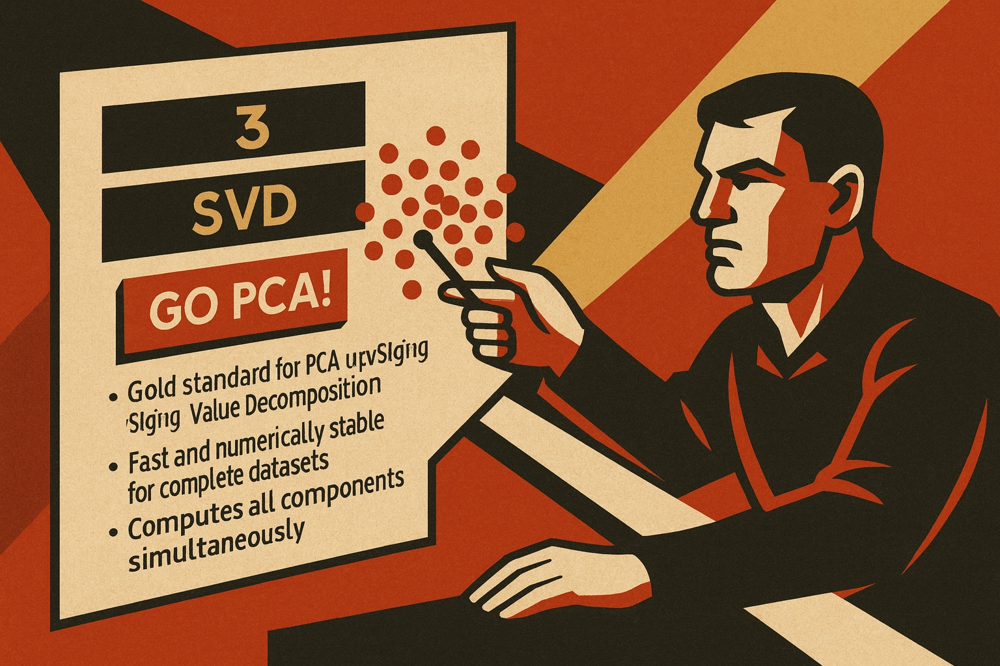
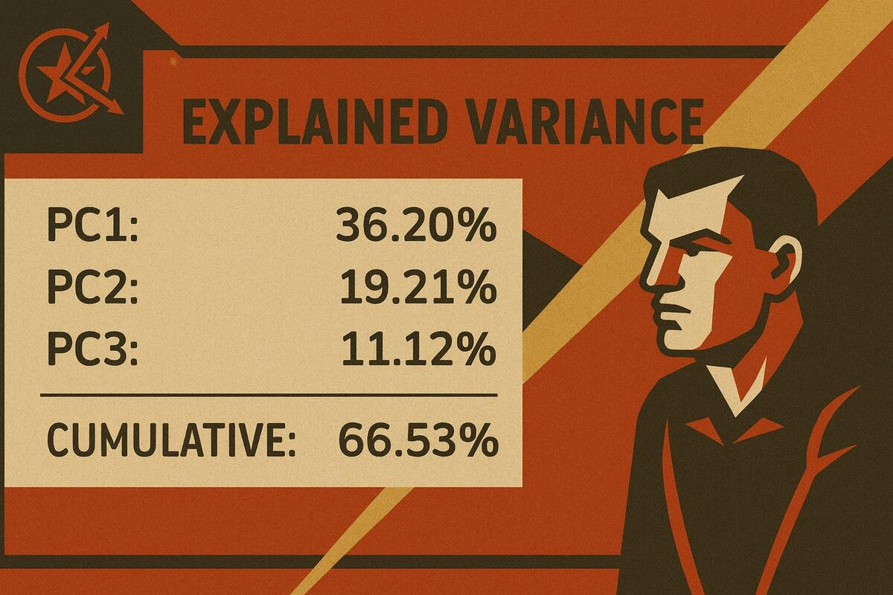
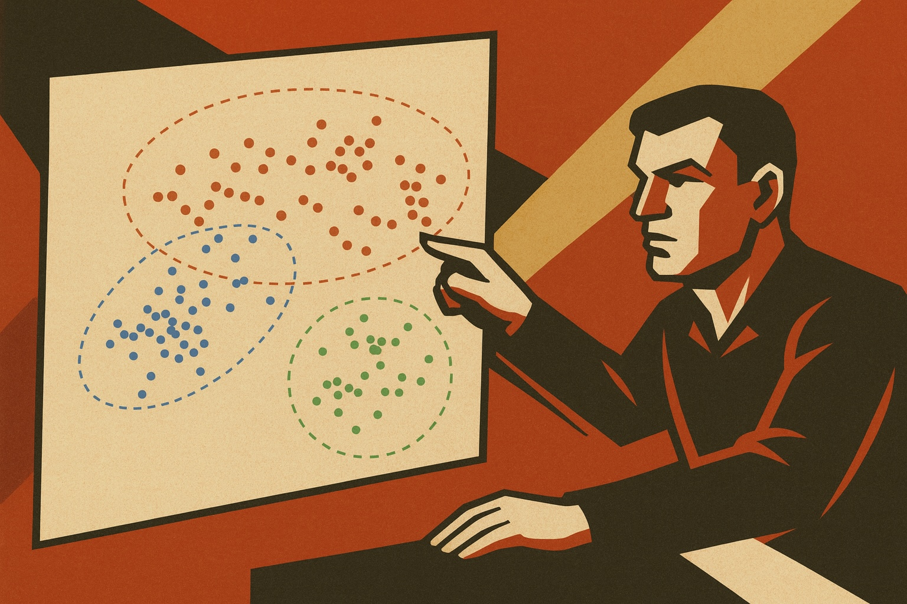

# An Introduction to Principal Component Analysis (PCA) with GoPCA

## 1. Introduction: The Need for Simpler Data

If you've ever felt overwhelmed by complex datasets with dozens or even hundreds of variables, you're not alone. This guide will show you how Principal Component Analysis (PCA) can help you make sense of complex data.

Consider these scenarios: You're a wine researcher with 178 Italian wines from three different cultivars (Barolo, Grignolino, and Barbera), each analyzed for 13 chemical properties. Or perhaps you're monitoring a manufacturing plant with hundreds of sensors recording temperature, pressure, flow rates, and vibrations every second. Maybe you're studying gene expression with thousands of measurements per sample. How do you make sense of all this information? How do you find the patterns hidden in the numbers?


This is where **Principal Component Analysis (PCA)** becomes invaluable. Think of PCA as a sophisticated lens that helps you see through the complexity to find the essential patterns in your data. Just as a photographer might use different lenses or angles to capture the essence of a scene, PCA helps you capture the essence of your data by focusing on what matters most.

PCA has stood the test of time. **Developed over a century ago by Karl Pearson (1901) and later refined by Harold Hotelling (1933)**, PCA remains one of the most widely used techniques in modern data science. From a movie streaming service recommendation system to climate science, from quality control in manufacturing to discoveries in genomics, PCA is everywhere. It's mathematically elegant, computationally efficient, and remarkably effective at revealing hidden structure in complex data.

The **GoPCA Suite** brings this powerful technique to your fingertips with a focused, professional-grade implementation. Whether you prefer the efficiency of command-line tools (pca CLI) for automation and reproducible research, or the intuitive visual exploration of GoPCA Desktop, our tools make PCA both accessible and practical. This guide will take you from the fundamental concepts to advanced applications, helping you gain both understanding and confidence in using PCA for your own data challenges.

> **Note on Data Preparation:**  
> Before performing PCA, your data should be properly cleaned and structured. If you're starting with raw data that contains missing values, outliers, or quality issues, consider using **GoCSV Desktop** for data preparation. See our companion guide *"Data Preparation with GoCSV Desktop"* for detailed guidance on getting your data ready for analysis.

---

## 2. What is PCA? Understanding the Core Concept

Let's start with an analogy that makes PCA intuitive. Imagine you're a photographer trying to capture the essence of a bustling city square. You could take hundreds of photos, but most would show similar things from slightly different perspectives. Instead, a skilled photographer knows to find the few key vantage points that capture the most important aspects: one showing the grand architecture, another revealing the flow of people, perhaps a third highlighting the interplay of light and shadow. These few carefully chosen perspectives tell the complete story more effectively than hundreds of redundant shots.


PCA does something remarkably similar with your data. When you have many variables describing your samples, PCA finds the "best vantage points" called **principal components (PCs)** that capture the most important patterns in your data. Just as those key photos summarize the city square, principal components summarize your complex dataset.

Principal Component Analysis is a **dimensionality reduction** technique that transforms your original variables into a new set of uncorrelated variables called principal components. These components are special because:

* **They're ordered by importance:** The first principal component (PC1) captures the most variation in your data, PC2 captures the second-most (while being completely independent of PC1), and so on.

* **They're efficient:** Often, just 2-3 principal components can capture 80-90% of the information contained in dozens of original variables.

* **They're interpretable:** Each PC is a weighted combination of your original variables, revealing what aspects of your data each component represents.

Without diving too deep into the mathematics (we'll explore that later for those interested), PCA essentially rotates your data's coordinate system to align with the directions of maximum variation. It's like turning a tilted oval until it lies flat along the x-axis: suddenly, the main pattern becomes crystal clear.


By reducing complexity while preserving information, PCA enables you to:
- **Visualize high-dimensional data** in 2D or 3D plots that your brain can actually comprehend
- **Identify hidden patterns** that would be invisible when looking at variables individually
- **Remove noise** by focusing on the dominant patterns and ignoring minor variations
- **Prepare data** for further analysis, making subsequent statistical or machine learning methods more effective

---

## 3. Motivation and Intuition: Why Use PCA?

Modern data challenges often involve datasets with dozens, hundreds, or even thousands of variables. This complexity creates both computational and interpretational hurdles that PCA elegantly addresses. By transforming your data into a new coordinate system that highlights the most important patterns, PCA turns overwhelming complexity into manageable insight.


As the number of variables grows, data analysis quickly becomes unwieldy. With just 10 variables, there are already 45 possible pairwise scatterplots; with 100 variables, that number explodes to 4950. Interpreting all of these possible relationships is simply impossible. And beyond visualization, high-dimensional data suffers from what’s known as the curse of dimensionality: distances and densities become less meaningful, making statistical modeling and machine learning less reliable.

Compounding the problem, many real-world variables are correlated. In wine chemistry, for instance, high ethanol often goes hand-in-hand with high glycerol. In genomics, groups of genes are co-regulated. This redundancy inflates the apparent complexity of the data without adding new information.

PCA addresses these challenges head-on. It finds new variables—principal components—that capture the directions of greatest variation in the data. These components combine correlated variables into single, more informative dimensions, stripping away redundancy and focusing attention on what really matters. Often just a handful of components explain most of the variation across dozens or even hundreds of variables.

The benefits are immediate and tangible. A simple plot of the first two principal components can reveal clusters, trends, or groupings that would be invisible in the raw variables. In our wine dataset, PCA turns 13 overlapping chemical measurements into a clear picture that separates grape cultivars by their distinct chemical fingerprints.

PCA also prepares your data for downstream tasks. Whether you’re running regressions, building classification models, or clustering samples, working in a reduced set of principal components often leads to models that are faster, less noisy, and more interpretable. Rather than drowning in complexity, PCA helps you focus on the essential structure of your data—making discovery possible where raw variables only create confusion.

---

## 4. A Concrete Example: Wine Analysis Walkthrough

Let's make PCA tangible with a real example you can follow along with in GoPCA Desktop using the included wine dataset. This is a classic dataset from chemical analyses of Italian wines, used to distinguish wines by their grape cultivar origin.


**Your Data:**
- 178 wine samples from the Piedmont region of Italy
- 3 grape cultivars: Barolo (59 samples), Grignolino (71 samples), and Barbera (48 samples)
- 13 chemical measurements per wine: alcohol, malic acid, ash, alkalinity of ash, magnesium, total phenols, flavanoids, nonflavanoid phenols, proanthocyanins, color intensity, hue, OD280/OD315 of diluted wines, and proline

With 13 dimensions, you can't visualize your data directly. You could make 78 different scatter plots (every pair of variables), but you'd likely miss the big picture. Plus, many of these chemical properties are correlated; for instance, total phenols and flavanoids show strong positive correlation.

Using GoPCA Desktop with the included wine dataset, here's what happens when you apply PCA:

1. **Load and Preprocess:**
   - Open GoPCA Desktop and load the sample wine dataset (File → Open Sample Dataset → Wine)
   - Enable mean-centering (essential) and standard scaling (important since variables have different units)
   - Choose to compute 3 principal components
   - 

2. **The Results:**
   - PC1 explains approximately 36% of the variation
   - PC2 explains approximately 19% of the variation
   - PC3 explains approximately 11% of the variation
   - Together, these 3 components capture about 66% of all the information in your 13 variables!
   - 

3. **The Visualization Magic:**
   When you create a scores plot (PC1 vs PC2), something remarkable happens:
   - Barolo wines (class_0) cluster distinctly on one side
   - Grignolino wines (class_1) form their own group
   - Barbera wines (class_2) separate into a third cluster
   - 
   
   The three cultivars separate beautifully, something you'd never see looking at individual chemical properties!

4. **Understanding the Patterns:**
   The loadings plot reveals what drives these differences:
   - PC1 (horizontal separation): Primarily driven by phenolic compounds (flavanoids, total phenols), color properties (OD280/OD315, hue), and proline
   - PC2 (vertical separation): Influenced by alcohol content, color intensity, and malic acid
   
   This tells you that:
   - Different grape varieties have distinct chemical fingerprints
   - Phenolic compounds are key discriminators between cultivars
   - Each variety has its characteristic balance of alcohol, acidity, and color compounds

5. **The Practical Insight:**
   With just 2 numbers per wine (PC1 and PC2 scores) instead of 13, you can:
   - Quickly identify which grape cultivar a wine comes from
   - Understand the key chemical differences between varieties
   - Detect potential mislabeling or adulteration
   - Support wine authentication and quality control

This real dataset demonstrates how PCA was used in the 1980s by Forina and colleagues to objectively classify wines, supporting certification systems and complementing sensory analysis.

This is the power of PCA: transforming complexity into clarity, revealing patterns that were always there but hidden in high-dimensional space.

---

## 5. How Does PCA Work? A Step-by-Step Guide

Now that you've seen PCA in action with our wine dataset, let's peek under the hood to understand the elegant mathematics that makes it work. Don't worry if math isn't your forte: we'll build understanding step by step, connecting each concept to practical intuition.


PCA transforms your data through six key steps: organizing your data, preprocessing it to ensure fair comparisons, finding relationships between variables, discovering the best new viewing angles, transforming to this new perspective, and deciding how much to keep. Each step has a clear purpose and builds on the previous one.

Let's walk through each step, using our wine data as a concrete example.

### Step 1: Organize Your Data Matrix

Start by organizing your data into a matrix **X**. Think of this as a spreadsheet where:
- Each row represents a sample (a wine bottle, a patient, a time point)
- Each column represents a variable (alcohol content, pH, temperature)
- If you have *n* samples and *p* variables, **X** is an *n × p* matrix

For our wine example: 178 rows (wines) × 13 columns (chemical properties) = a 178 × 13 matrix.


### Step 2: Preprocess Your Data

**Why Preprocessing Matters:**
Raw data rarely tells the full story. Variables measured in different units (mg/L vs pH) or with different ranges can bias your analysis. Preprocessing levels the playing field.

**Centering (Essential):**  
PCA requires **centered** data. By subtracting each variable's mean, you shift your data cloud to the origin. This ensures PCA finds the directions of maximum variance rather than being pulled toward arbitrary baseline levels.

**Scaling (Often Critical):**  
When variables have different units or ranges, **scaling** prevents variables with larger numbers from dominating. Consider:
- Proline in wine: ranges from 278 to 1680 mg/L
- pH in wine: ranges from 2.74 to 4.01
Without scaling, proline would dominate the analysis simply due to its larger numbers!

> **Decision Guide:**
> - **Always center** your data (PCA won't work properly without it)
> - **Scale when:** Variables have different units, vastly different ranges, or you want equal contribution
> - **Don't scale when:** All variables are in the same units and scale differences are meaningful

**Advanced Preprocessing Options in GoPCA Suite:**

Beyond basic centering and scaling, GoPCA Suite offers specialized preprocessing methods:

1. **Standard Preprocessing:**
   - **Mean Centering**: Subtracts the mean of each variable (essential for PCA)
   - **Standard Scaling**: Divides by standard deviation (recommended for mixed units)
   - **Robust Scaling**: Uses median and MAD instead of mean and SD (better for data with outliers)

2. **Spectroscopic Preprocessing:**
   - **SNV (Standard Normal Variate)**: Row-wise normalization that removes multiplicative scatter effects in spectroscopic data
   - **Vector Normalization**: Normalizes each sample to unit length, useful for compositional data

**In GoPCA Suite:** Both the pca CLI and GoPCA Desktop provide simple options for all preprocessing methods. GoPCA Desktop offers intuitive checkboxes, while the pca CLI uses flags like `--no-mean-centering` (to disable centering), `--scale` (with options: none, standard, or robust), `--snv`, and `--vector-norm`.


> **Important:** These mathematical preprocessing steps (centering and scaling) are handled by GoPCA Suite during the analysis. Data cleaning tasks like handling missing values, removing outliers, and selecting variables should be done beforehand using appropriate data preparation tools like GoCSV Desktop.

### Step 3: Calculate the Covariance Matrix

Once your data is preprocessed, PCA examines how your variables relate to each other by computing the **covariance matrix**. This square matrix captures all pairwise relationships:

- **Diagonal elements:** The variance of each variable (how spread out it is)
- **Off-diagonal elements:** The covariance between pairs of variables (how they vary together)


For standardized data, this becomes the **correlation matrix**, where values range from -1 (perfect negative correlation) to +1 (perfect positive correlation).

**What PCA Sees:**
In our wine data, the covariance matrix might reveal:
- Total phenols and flavanoids have high positive covariance (they increase together)
- Alcohol and color intensity show moderate positive relationship
- These relationships hint at the underlying patterns PCA will extract

### Step 4: Find the Principal Directions (Eigendecomposition)

Here's where the mathematical magic happens. PCA finds the "best" new coordinate system for your data through **eigendecomposition** of the covariance matrix.

**The Key Players:**
- **Eigenvectors:** These define the directions of your new axes (principal components). Each eigenvector is a recipe that combines your original variables.
- **Eigenvalues:** These tell you how much variance is captured along each direction. Bigger eigenvalue = more important direction.

**The Intuition:**
Imagine your data cloud as a swarm of points in space. PCA finds:
1. The direction along which the swarm is most stretched out (PC1)
2. The perpendicular direction with the next most stretch (PC2)
3. And so on, each perpendicular to all previous directions

**In Practice:**
GoPCA Suite uses either eigendecomposition or Singular Value Decomposition (SVD) depending on your data size and chosen algorithm. Both give equivalent results, but SVD is often more numerically stable and efficient.


### Step 5: Transform Your Data to Principal Components

With directions identified, PCA transforms your original data into the new coordinate system. This creates your **principal component scores**.

**What You Get:**
- **Scores:** The coordinates of each sample in the new PC space. If wine #37 has PC1 score of 2.3, it means that wine sits at position 2.3 along the first principal component axis.
- **Loadings:** The recipe for each PC. If PC1 has a loading of 0.42 for alcohol, it means alcohol contributes strongly and positively to PC1.

**The Transformation:**
For each sample, PCA calculates:
- **PC1 score** = (loading₁ × variable₁) + (loading₂ × variable₂) + ... 
- **PC2 score** = different weighted combination of the same variables
- And so on for each component

**Interpreting Components:**
In our wine analysis:
- **PC1** might be "overall wine intensity" (high loadings on phenols, color, proline)
- **PC2** might be "alcohol vs acidity balance" (positive for alcohol, negative for acids)
- Each wine now has just a few numbers (PC scores) that capture its essential characteristics

### Step 6: Decide How Many Components to Keep

Not all principal components are created equal. The **scree plot** helps you decide how many to retain. The plot shows each PC's explained variance (eigenvalue) as bars or points:
- PC1 typically explains the most (perhaps 30-50%)
- PC2 explains less (perhaps 10-30%)
- Each subsequent PC explains progressively less
- Eventually, PCs explain so little they're just capturing noise


**Decision Strategies:**

1. **Elbow Method:** Look for the "elbow" where the curve flattens. Components before the elbow are signal; after are likely noise.

2. **Cumulative Variance:** Keep enough PCs to explain your target variance:
   - 70-80% for exploratory analysis
   - 90-95% for reconstruction or modeling
   - 99% for near-perfect reconstruction

3. **Kaiser Criterion:** For standardized data, keep PCs with eigenvalues > 1 (explaining more variance than a single original variable).

---

## 6. The Geometry of PCA: Visualizing Data in Fewer Dimensions

While the mathematics of PCA involves matrices and eigenvalues, its true elegance emerges through geometry. In this chapter, we'll explore how PCA transforms your data cloud, why it works so well for dimension reduction, and what the various plots actually show you. Understanding these geometric concepts will deepen your intuition and help you interpret PCA results with confidence.


### Your Data as a Cloud of Points

Imagine your dataset as a cloud of points floating in multidimensional space. With our wine dataset, each of the 178 wines becomes a single point whose position is determined by its 13 chemical measurements. This creates a "wine cloud" in 13-dimensional space. While we can't visualize 13 dimensions directly, the geometric principles remain the same whether we're working in 2D, 3D, or 13D.

### What PCA Does Geometrically

PCA essentially rotates your coordinate system to align with the natural "shape" of your data cloud. Think of it like this:

1. **Finding the Main Axis:** PCA first finds the direction through your data cloud along which the points are most spread out. This becomes PC1.

2. **Finding Perpendicular Axes:** It then finds the next direction of maximum spread that's perpendicular to the first. This becomes PC2.

3. **Continuing the Process:** This continues for PC3, PC4, and so on, each perpendicular to all previous ones.

Another way to think about PCA is as creating "shadows" of your high-dimensional data. Projecting onto PC1-PC2 is like shining a light through your data cloud and looking at its 2D shadow. But unlike random projections, this shadow is carefully chosen to preserve as much of the cloud's structure as possible. PCA finds the "best" angles that reveal the most information.

Variance in each direction corresponds to how far the data points spread along that axis. High variance means points spread far apart, creating a long ellipsoid axis and an important PC. Conversely, low variance means points cluster tightly, resulting in a short ellipsoid axis and a less important PC.

### Understanding Projections and Reconstructions

When we project data onto the first few PCs, we're essentially:
1. Taking each high-dimensional point
2. Finding its coordinates along the new PC axes
3. Keeping only the first few coordinates
4. Ignoring the rest

The beauty of PCA is that it minimizes information loss:
- If you use all PCs, you can perfectly reconstruct the original data (minus centering/scaling)
- With fewer PCs, you get an approximation
- The approximation error equals the sum of variances of the excluded PCs
- This error appears as "reconstruction residuals" in diagnostic plots

For example, if PC1-3 explain 66% of variance in wine data, using only these three components loses 34% of the information, but this might be acceptable noise and minor variations.

### Geometric Interpretation of Key Concepts

**Loadings** tell you how the new axes (PCs) relate to the old axes (original variables):
- A loading of +0.71 means the PC points 45° toward that variable's positive direction (cos(45°) ≈ 0.71)
- A loading of -0.71 means it points 135° from that variable
- A loading near 0 means the PC is nearly perpendicular to that variable
- A loading of ±1 means perfect alignment with that variable

This is why variables with similar loadings on a PC are correlated: they point in similar directions in space.

**Scores** are simply the coordinates of each sample in the rotated coordinate system. A sample's score on PC1 tells you how far along the first principal axis it lies. Positive scores place it on one side of the center, negative on the other, while large absolute scores indicate the sample is far from the center along that axis.

**The biplot** overlays the sample positions (scores) with variable directions (loadings), creating a unified geometric view. Samples appear as points while variables appear as vectors from the origin. When samples lie in the direction of a variable vector, they tend to have high values for that variable.


### Distance and Similarity in PC Space

In PC space, **Euclidean distance** has special meaning. The distance between samples reflects their overall dissimilarity, but now corrected for correlations between variables. Two wines close in PC space are chemically similar overall, taking into account all the relationships between their chemical properties.

There's a beautiful relationship between PCA and the **Mahalanobis distance**. While Mahalanobis distance measures how far a point is from the center, accounting for correlations, in PC space with standardized axes it becomes simple Euclidean distance. This transformation is why outlier detection works so well in PC space.

### Visualizing Different Data Structures

When data contains distinct groups, they appear as separate point clouds in PC space. The first PCs often capture between-group differences while later PCs might capture within-group variation. In our wine example, the three cultivars form distinct clusters in PC1-PC2 space, clearly separated by their chemical profiles.

When data varies continuously, points form elongated clouds or gradients rather than distinct clusters. Colors or trajectories reveal the underlying pattern. For instance, temperature readings over a day might show a smooth arc through PC space as conditions gradually change.

Outliers and anomalies are unusual samples that stand out geometrically. They can be categorized as:
- **Leverage points:** Far from center along major PCs (high Hotelling's T²)
- **Orthogonal outliers:** Far from the PC subspace (high Q residuals)
- **Mixed outliers:** Both far along PCs and poorly reconstructed

### The Curse and Blessing of Dimensionality

Real-world high-dimensional data rarely fills all available dimensions. Data often lies on or near a lower-dimensional "manifold" because many variables are correlated, creating redundancy. While noise spreads thinly across many dimensions, signal concentrates in fewer dimensions. PCA exploits this structure by finding the lower-dimensional subspace where your data actually lives.

Noise and signal have distinct geometric signatures. Noise typically spreads equally in all directions (spherical), contributing small amounts to many PCs and getting relegated to later, minor components. Signal, in contrast, has structure and direction, concentrating in early PCs and creating the elongated axes of the data ellipsoid. This separation is what makes PCA effective at denoising.

### Practical Geometric Insights

**Reading Score Plots:**
- **Distance from origin:** How extreme or typical a sample is
- **Angle between samples:** Their similarity (small angle = similar)
- **Density of points:** Common vs. rare combinations of characteristics
- **Empty regions:** Impossible or unlikely combinations

**Understanding Loading Plots:**
- **Vector length:** How much that variable contributes overall
- **Vector direction:** Which PC(s) the variable influences
- **Angles between vectors:** Variable correlations (0° = perfect positive, 180° = perfect negative, 90° = uncorrelated)

In 2D score plots, the 95% confidence ellipse shows where most "normal" samples should fall:
- Based on the chi-square distribution with 2 degrees of freedom
- Points outside are potential outliers
- Shape reveals correlation structure in PC space
- Useful for quality control and anomaly detection

### Beyond Linear Geometry: When PCA Struggles

PCA assumes linear geometry, but real data might have:
- **Curved manifolds:** Like the Swiss Roll dataset
- **Circular patterns:** Periodic or cyclic relationships
- **Hierarchical structure:** Nested groups at different scales

When you see these patterns in PCA plots, it's a sign that nonlinear methods (like Kernel PCA) might reveal additional structure.

### The Beauty of the Geometric View

Understanding PCA geometrically transforms it from a black-box technique into an intuitive tool:
- You can predict how changes in preprocessing will affect results
- You can diagnose problems by visualizing the geometry
- You can explain results to others using spatial analogies
- You can connect PCA to other geometric techniques

This geometric foundation is why PCA remains so powerful and widely used: it provides a principled way to find and visualize the "natural" coordinate system for your data, revealing structure that was always there but hidden in the complexity of high dimensions.

---

## 7. Mathematical Foundations of PCA

Now that you've seen PCA in action and understood its geometry, let's explore the elegant mathematics that powers it. We'll build this understanding step by step, connecting each mathematical concept to practical intuition. Even if linear algebra isn't your strength, you'll gain appreciation for the mathematical beauty of PCA.


### Covariance: The Heart of PCA

Before we tackle covariance, let's recall **variance**: how spread out a single variable's values are. If wine alcohol content ranges from 11% to 15%, it has higher variance than pH ranging from 3.1 to 3.4.

**Covariance** measures whether two variables tend to vary together. Positive covariance means when one goes up, the other tends to go up (like height and weight in people). Negative covariance means when one goes up, the other tends to go down (like altitude and temperature).

For our wine dataset with 13 variables, we can compute covariances between every pair. That's 78 unique covariances plus 13 variances on the diagonal, forming a 13×13 symmetric matrix. This **covariance matrix** $ S $ captures all the linear relationships in your data:

$$ 
S = \frac{1}{n-1} X^T X 
$$

where $ X $ is your mean-centered data matrix (n samples × p variables).

The covariance matrix is like a complete map of how your variables relate to each other. PCA's job is to find the best way to navigate this map: the directions that capture the most variation.

### Eigendecomposition: Finding the Principal Directions

The mathematical magic happens when we solve

$$ 
S a = \lambda a 
$$

This equation asks: *Which direction $ a $ (eigenvector), when we project our covariance structure onto it, simply scales by some amount $ \lambda $ (eigenvalue) without changing direction?* Think of it like finding the natural “grain” of wood: directions along which the structure naturally aligns.

The eigenvectors are the principal directions in the original variable space. Each one tells us how to combine the original variables to create a principal component, and they are always perpendicular (orthogonal) to each other, ensuring no redundancy.

The eigenvalues tell us how much variance is captured along each corresponding eigenvector. Larger eigenvalues indicate more important directions, and the ratio of each eigenvalue to the sum of all eigenvalues gives the percentage of variance explained by that component.

Once we have the eigenvectors, we project our data onto them:

$$ 
t = X a 
$$

These projections $ t $ are the principal component scores, the coordinates of each sample in the new principal component space.

### Singular Value Decomposition (SVD): The Modern Approach


While eigendecomposition is conceptually clear, in practice we use **SVD**: a more numerically stable and efficient approach that arrives at the same result.

SVD decomposes your centered data matrix directly:

$$ 
X = U \Sigma V^T 
$$

**What Each Part Represents:**
- **U**: The "sample patterns" matrix showing how samples relate to the principal components
- **Σ** (Sigma): A diagonal matrix of singular values (related to the square roots of eigenvalues)
- **V**: The "variable patterns" matrix (the loadings showing how variables contribute)

**The Beautiful Connection:**
- **Loadings**: The columns of V are your principal directions (same as eigenvectors)
- **Scores**: U × Σ gives you the PC scores for each sample
- **Variance**: The squared singular values (σ²) divided by (n-1) equal the eigenvalues

### How Many Components Can We Extract?

The maximum number of meaningful principal components is the smaller of:
- $ n-1 $ (number of samples minus one), or
- $ p $ (number of variables)

Why These Limits?
- With $ n $ samples, you can only define $ n-1 $ independent directions (like how 3 points define a plane)
- With $ p $ variables, you can't have more than $ p $ orthogonal directions in $ p $-dimensional space

Thankfully, you rarely need all possible components! Real-world data has **intrinsic dimensionality** where the true complexity is much lower than the number of variables. Beyond a certain point, you hit the **noise floor** and are just capturing measurement noise. Additionally, more than 3-5 components become hard to interpret meaningfully.

> **Example:**.  
> In our wine dataset with 178 samples and 13 variables, we could extract at most min(177, 13) = 13 components. But in practice, 2-3 components capture 55-66% of the variation, which is sufficient to clearly separate the three grape cultivars; the rest captures finer chemical variations and noise.

### The Optimization at the Heart of PCA

**What PCA is Really Doing:**
PCA solves a beautiful optimization problem: "Find the direction that captures the most variance in the data."

**For the First Principal Component:**
Mathematically, we're solving:

$$ 
( \text{maximize } \text{Var}(Xa) \text{ subject to } ||a||=1 ) 
$$

In plain English: "Find the unit vector $ a $ such that when we project our data $ X $ onto it, the projected values have maximum spread (variance)."

**The Constraint Matters:**
The constraint $ ||a||=1 $ (unit length) is crucial. Without it, we could make the variance arbitrarily large by simply scaling up $ a $. It's like asking "What's the best direction?" rather than "What's the best direction times infinity?"

**For Subsequent Components:**
Each additional PC solves the same problem with an added constraint:
- PC2: Maximize variance, subject to being perpendicular to PC1
- PC3: Maximize variance, subject to being perpendicular to PC1 and PC2
- And so on...

**The Geometric Intuition:**
Imagine your data as a cloud of points in space:
1. PC1 points along the longest axis of the cloud
2. PC2 points along the second-longest axis, perpendicular to the first
3. Each subsequent PC finds the next-best perpendicular direction

It's like finding the length, width, and height of an irregular 3D object, except in high-dimensional space!

**Why Orthogonality?**
Requiring components to be perpendicular ensures no redundancy between components (zero correlation), with each component capturing unique information. This orthogonality perfectly partitions the total variance among components while providing mathematical simplicity and computational efficiency.

---

## 8. What Does PCA Do? Assumptions,Strengths and Limitations

Like any analytical tool, Linear PCA (SVD and NIPALS) excels in certain situations and struggles in others. Understanding both its powers and limitations helps you apply it wisely and know when to reach for alternatives. Let's explore what PCA does brilliantly, where it falls short, and how to recognize which situation you're facing.

### Assumptions: The Ground Rules of PCA

Like any tool, PCA works best under certain conditions. These assumptions are not absolute laws, but they shape when PCA is appropriate and when another method might serve you better.

First, PCA assumes that relationships between variables are linear. This works well in cases like height versus weight, where the general trend is straight-line. But it fails for curved patterns, such as enzyme activity versus pH, where the relationship is bell-shaped.

Second, PCA assumes that variance equals importance—that the directions with the most spread contain the most meaningful signal. This is often true in measurement data, where genuine structure dominates noise. But it can fail in situations where subtle, low-variance signals matter more than broad fluctuations. In those cases, PCA might filter out what you care about most.

Third, PCA enforces orthogonality, meaning each principal component must be perpendicular to the others. This works well if the true underlying factors are independent. But if those factors are correlated, PCA may split them awkwardly across components.

Finally, PCA assumes continuous, quantitative data. It handles measurements, concentrations, and intensities beautifully, but struggles with categorical, binary, or purely count-based variables. While you can sometimes shoehorn such data into PCA through encoding, the results can be misleading.

Understanding these ground rules helps you recognize when PCA is the right tool—and when it’s time to reach for alternatives like kernel methods, ICA, or techniques designed for categorical data.


### Strengths: Where PCA Shines

PCA excels at uncovering hidden structure in data. It reveals patterns and relationships invisible when examining variables individually. In the wine dataset, for instance, no single chemical measurement cleanly separates the three cultivars. But when PCA combines all 13 measurements, clear clustering emerges, showing that the cultivars have distinct chemical fingerprints. This works because PCA considers all variables simultaneously, finding the combinations that best reveal the underlying structure.

Another strength is its ability to reduce dimensionality without losing the essence of the data. A handful of principal components often capture most of the meaningful variation in dozens or even hundreds of variables. This isn’t just data compression—it’s intelligent summarization. Reducing 13 wine measurements to two or three principal components still preserves the cultivar separation, highlighting the essential chemical differences while discarding minor variations. The result is not only faster analysis but also more robust conclusions.

PCA also acts as a natural noise filter. Systematic patterns concentrate in early components, while random noise spreads across all components. By keeping only the major components, much of the measurement noise and experimental variation is automatically filtered out. This denoising requires no explicit noise model or thresholds; it simply emerges from the variance-maximization principle at the heart of PCA.

Another major benefit is that PCA creates powerful new features. Principal components are engineered variables that often work better than the original ones in downstream analyses. These PC scores capture coordinated patterns of variation across the dataset. In machine learning, using PC scores as inputs often improves performance by reducing multicollinearity and overfitting. In the wine example, classification models built on PC1 and PC2 would likely outperform models built on any single pair of original chemical measurements.

Finally, PCA enables visualization of the impossible. We cannot directly picture 13-dimensional wine chemistry, but we can easily plot PC1 against PC2. These aren’t arbitrary projections—they’re the optimal two-dimensional view that preserves as much variation as possible. This makes otherwise incomprehensible datasets accessible to human pattern recognition, turning abstract numbers into clear, interpretable pictures.


### Limitations: Where PCA Struggles

Linear PCA (SVD and NIPALS) only captures linear relationships between variables. If your data contains important nonlinear patterns (like polynomial relationships, interactions, or curved manifolds), linear PCA will miss them. Imagine data points arranged in a spiral: linear PCA would try to fit straight lines through a fundamentally curved structure. This is why GoPCA Suite includes Kernel PCA for nonlinear patterns, though interpreting kernel components is often more challenging than "standard" PCs.

While principal components are mathematically optimal, they can be difficult to interpret. Each PC is a weighted combination of all original variables, sometimes mixing conceptually different measurements. In wine analysis, for example, PC1 might combine alcohol, phenols, and color intensity in ways that don’t correspond to any single chemical process. This contrasts with techniques like factor analysis, which explicitly seeks interpretable factors—though at the cost of losing some of PCA’s optimality properties.

PCA results depend critically on variable scaling. Without standardization, variables with larger numerical ranges dominate the analysis. In the wine dataset, Proline (ranging 278–1680) would overwhelm pH (ranging 2.74–4.01) in unscaled PCA, not because Proline is inherently more important, but simply because its numbers are bigger. This isn’t a bug but a feature: sometimes you want variables with more variation to have more influence. The key is making a conscious choice about scaling based on your analytical goals.

Because PCA seeks directions of maximum variance, outliers can dramatically influence results. A single contaminated wine sample far from others might pull the first principal component toward itself, distorting the entire analysis. While GoPCA Suite offers robust scaling options that reduce outlier influence, severe outliers should be investigated and potentially removed before analysis. This sensitivity also means PCA can be a useful outlier detection tool.

PCA works best with continuous, quantitative measurements. Categorical variables (like wine region or production method) don’t fit naturally into the PCA framework, which assumes meaningful numerical distances between values. While you can encode categories numerically, this introduces arbitrary choices that affect results. For mixed continuous and categorical data, consider techniques like Multiple Factor Analysis (MFA), or simply use categories for coloring plots rather than including them in the analysis.

Linear PCA also struggles with time series data. Traditional PCA treats observations as independent samples, ignoring temporal structure such as trends, seasonality, or lagged dependencies. As a result, it may miss the dynamics that drive variation over time. Temporal approaches such as Singular Spectrum Analysis (SSA), implemented as Temporal PCA in GoPCA Suite, explicitly account for time ordering by embedding lagged versions of the data. This allows PCA-like decomposition of temporal patterns, making it well-suited for analyzing signals, sensor data, or other sequential processes.

Finally, PCA only considers means and covariances (second-order statistics), potentially missing higher-order patterns. It decorrelates variables but cannot capture more complex dependencies. For instance, if two variables are independent but become dependent when a third variable is considered (conditional dependence), PCA won’t detect this relationship. Independent Component Analysis (ICA) addresses some of these limitations but lacks PCA’s geometric interpretability.

---

## 9. Practical Considerations and Applications


### Data Preparation Essentials

Before running PCA, ensure your data is clean and properly formatted. This involves handling missing values (remove or impute), investigating outliers (genuine extremes or errors?), and selecting relevant variables (avoid constants and near-duplicates).

**The Preprocessing Decision Tree:**
The mathematical preprocessing (centering and scaling) was covered in Chapter 5. As a quick reminder:
- **Always center** your data
- **Scale** when variables have different units or vastly different ranges
- **Use robust scaling** when outliers are present but genuine
- **Consider SNV or vector normalization** for specialized data types (spectroscopy, compositional)

> **Pro Tip:** When in doubt, try both scaled and unscaled PCA. If results differ dramatically, consider which makes more scientific sense for your application.

### Choosing the Right Number of Components

More components retain more information but add complexity. The key is finding the sweet spot for your application. The main approaches (detailed in Chapter 5) are:

1. **Scree Plot Elbow:** Look for where the variance curve flattens
2. **Cumulative Variance:** Use 70-80% for exploration, 90-95% for modeling
3. **Cross-Validation:** For predictive tasks, choose components that minimize test error
4. **Interpretability:** Can you explain what PC3 or PC4 represents?

In practice, 2-3 components often suffice for visualization and understanding main patterns. For the wine dataset, PC1-PC3 capture 66% of variance and clearly separate the cultivars, making additional components unnecessary for classification purposes.

### Interpreting Results

**Understanding Loadings:**
Loadings show how original variables combine to form each PC. In our wine data, PC1 has high positive loadings for flavanoids and phenols (+0.42, +0.39) and negative loadings for nonflavanoid phenols (-0.29). This reveals PC1 contrasts phenolic-rich wines against those with different chemical profiles. Variables with similar loadings are correlated; the magnitude shows importance (closer to ±1 = more important).

Variables pointing in similar directions are correlated, opposing variables are negatively correlated, and orthogonal variables are uncorrelated.

**Understanding Scores:**
Scores reveal sample patterns in PC space. Look for distinct clusters (different sample types), gradients (continuous variation), outliers (errors or discoveries), and horseshoe patterns (strong underlying gradients). The key insight: if a sample has high PC1 score and a variable has high PC1 loading, that sample likely has a high value for that variable.

**Real-World Example: Manufacturing Quality Control**

Imagine monitoring a chemical reactor:
- **PC1 (60% variance):** Temperature-related variables have high loadings
  - High scores → Hot conditions
  - Low scores → Cool conditions
  
- **PC2 (20% variance):** Pressure and flow rate have high loadings
  - High scores → High pressure/flow
  - Low scores → Low pressure/flow

**Daily Operations:**
- Normal operation: Samples cluster near the origin
- Temperature excursion: Points shift along PC1
- Pressure problem: Points shift along PC2
- Complex fault: Movement in both directions

This creates a "normal operating envelope" in PC space. New samples outside this envelope trigger investigation.

### Visualization Tools in GoPCA Suite

GoPCA Suite provides comprehensive interactive visualizations to transform mathematical results into insights:

- **Score Plots (2D/3D):** Explore sample relationships, identify clusters and outliers
- **Loadings Plots:** Understand variable contributions via bar charts and heatmaps
- **Scree Plot:** Determine optimal number of components
- **Biplot:** Combined view of samples and variables
- **Circle of Correlations:** Visualize variable relationships
- **Diagnostic Plots:** Advanced outlier detection using T² and Q statistics
- **Eigencorrelation Plots:** Relate PCs to external variables
- **Temporal Loadings:** Visualize patterns in time-series (smooth = trends, oscillations = cycles)

All visualizations are interactive with zoom, pan, hover details, and high-quality export capabilities. Start with 2D score plots, add dimensions as needed, and use color strategically (categories vs gradients).

### Typical Applications

PCA finds use across diverse fields: chemometrics (spectroscopy, chromatography), bioinformatics (omics data), engineering (process monitoring, fault detection), finance (risk analysis, portfolio management), and image processing (compression, denoising). GoPCA Suite serves all these applications through the pca CLI for automation and batch processing, GoPCA Desktop for interactive exploration, and GoCSV Desktop for data preparation.

---

## 10. Beyond Linear PCA: Kernel PCA for Nonlinear Patterns

While classical PCA excels at finding linear patterns in data, real-world datasets often contain complex, nonlinear relationships that standard PCA cannot capture. GoPCA Suite implements **Kernel PCA**, a powerful extension that can uncover these hidden nonlinear structures.


### The Limitation of Linear PCA

Imagine data points arranged in a spiral pattern or lying on a curved surface like a Swiss Roll. Standard PCA, which only looks for straight-line projections, would fail to reveal the underlying two-dimensional structure of such data. This is because PCA is fundamentally limited to finding linear combinations of variables.

### How Kernel PCA Works

Kernel PCA overcomes this limitation using the "kernel trick", a mathematical technique that implicitly maps data into a higher-dimensional space where nonlinear patterns become linear. Instead of explicitly computing this transformation (which could be computationally prohibitive or even infinite-dimensional), Kernel PCA uses kernel functions to compute similarities between data points directly.

The key insight is that many algorithms, including PCA, only need to compute dot products between data points. Kernel functions provide a way to compute these dot products in the transformed space without ever explicitly performing the transformation.

### Available Kernels in GoPCA Suite

GoPCA Suite supports three kernel types, each suited to different kinds of nonlinear patterns:

**RBF (Radial Basis Function) Kernel:**
- Most versatile and widely used
- Excellent for general nonlinear patterns, circular structures, and unknown relationships
- Key parameter: `gamma` controls the flexibility of the transformation
  - Small gamma (0.001-0.01): Smooth, global patterns
  - Large gamma (0.1-10): Tight, local patterns
  - Default: 1/number_of_features

**Linear Kernel:**
- Equivalent to standard PCA
- Useful for comparing Kernel PCA results with regular PCA
- No additional parameters needed

**Polynomial Kernel:**
- Captures polynomial relationships of a specified degree
- Parameters: degree (2=quadratic, 3=cubic), gamma, and coef0
- Best when you know the data contains polynomial patterns

### When to Use Kernel PCA

Consider Kernel PCA when:
- Score plots from standard PCA show circular or spiral patterns
- Known groups overlap significantly in linear PCA
- You suspect nonlinear relationships between variables
- Working with data known to have nonlinear structure (e.g., certain types of spectroscopy)

### Practical Considerations

**Preprocessing:** Kernel PCA handles centering internally in kernel space. Avoid preprocessing methods that include centering:
- ❌ Mean centering
- ❌ Standard scaling (includes centering)
- ❌ Robust scaling (includes centering)
- ✅ Variance scaling only
- ✅ SNV (for spectroscopic data)
- ✅ Vector normalization

**Computational Cost:** Kernel PCA scales with the square of the number of samples, making it more computationally intensive than standard PCA. It works well for datasets up to ~5,000 samples.

**Interpretation:** Unlike standard PCA, Kernel PCA doesn't produce traditional loadings (variable contributions). The transformation is too complex to express as simple linear combinations of the original variables. When exporting Kernel PCA models, the loadings matrix will be empty, and only kernel-specific parameters relevant to the chosen kernel type will be included.

### Example: Unrolling the Swiss Roll

The Swiss Roll dataset, included with GoPCA Suite, perfectly demonstrates Kernel PCA's power. This three-dimensional spiral structure has an underlying two-dimensional nature that standard PCA cannot reveal:

```bash
# Using pca CLI with RBF kernel
pca analyze --method kernel --kernel-type rbf \
  --kernel-gamma 0.333 swiss_roll.csv

# Compare with standard PCA
pca analyze swiss_roll.csv  # SVD is the default method
```

In the GUI:
1. Load the Swiss Roll sample dataset
2. Select "Kernel PCA" as the method
3. Choose RBF kernel (gamma automatically set to 0.333)
4. Run the analysis to see the beautifully unrolled structure

### Implementation Methods in GoPCA Suite

Beyond the choice of kernel vs. standard PCA, GoPCA Suite offers two numerical algorithms for computing principal components:

**SVD (Singular Value Decomposition):**
- Default method for standard PCA
- Numerically stable and efficient
- Recommended for most datasets

**NIPALS (Nonlinear Iterative Partial Least Squares):**
- Iterative algorithm that computes components sequentially
- Useful for very wide datasets (many more variables than samples)
- Can handle some missing data scenarios
- Allows computation of only the first few components without computing all

Both methods produce equivalent results for complete datasets but offer different computational trade-offs.

---

## 11. Temporal PCA: Analysis for Time-Series Data

While classical PCA treats each observation as independent, time-series data has inherent temporal structure where the order and timing of observations carry crucial information. GoPCA Suite implements **Temporal PCA** (also known as Time-Delay PCA or SSA-style PCA), which captures these temporal dynamics by incorporating time dependencies directly into the analysis.


> **⚠️ Important:** Temporal PCA is designed specifically for **time-series data** where observations represent sequential measurements over time. Do not use this method for spatial datasets (like Swiss Roll) or cross-sectional data where sample order is arbitrary. For such data, use standard PCA, Kernel PCA, or other appropriate methods.

### The Limitation of Standard PCA for Time Series

Imagine monitoring a manufacturing process with multiple sensors. At any moment, the system state depends not just on current readings but also on recent history: temperature trends, pressure changes, flow patterns. Standard PCA treats each time point independently and would miss these temporal relationships entirely.

### How Temporal PCA Works

Temporal PCA addresses this by constructing a **lag matrix** (also called a trajectory or Hankel matrix), where each observation is augmented with its recent history. This clever transformation converts temporal patterns into spatial patterns that PCA can analyze.

**Mathematically:**  
For time series **X** ∈ ℝ^(T×p) with T time points and p variables, the lag matrix **Φ(X,L)** ∈ ℝ^((T-L+1)×(p·L)) is constructed where each row contains L consecutive observations:

```
Time t: [x₁(t), x₂(t), ..., xₚ(t), x₁(t-1), ..., xₚ(t-1), ..., x₁(t-L+1), ..., xₚ(t-L+1)]
         └── current values ──┘  └── lag 1 values ──┘    └── lag L-1 values ──┘
```

Standard PCA via SVD is then applied to this expanded matrix, revealing temporal structure through the principal components.

### Strengths and Applications

**Strengths:**
- **Captures temporal dynamics:** Reveals how variables evolve and influence each other over time
- **Identifies patterns:** Extracts trends, oscillations, and seasonal components
- **Enables anomaly detection:** High reconstruction error indicates unusual temporal behavior
- **Preserves time structure:** Unlike standard PCA, respects the sequential nature of data

**Applications:**
- **Process monitoring:** Quality control with temporal dependencies, shift-to-shift variations
- **Signal processing:** Denoising while preserving temporal structure
- **Predictive maintenance:** Early detection of equipment degradation patterns
- **Climate analysis:** Separating trends from oscillatory modes (El Niño, seasonal cycles)
- **Financial time series:** Identifying temporal factors in market data

### Choosing the Number of Lags

The lag parameter L is crucial and depends on your data's temporal structure:

**Practical Guidelines:**
- **Hourly data with daily patterns:** L = 24
- **Daily data with weekly patterns:** L = 7  
- **Monthly data with annual patterns:** L = 12
- **General exploration:** Start with L = T/4 and adjust based on results

**Technical Considerations:**
- L should be at least as large as the dominant period
- Ensure T >> L for stability (minimum T > 4L)
- Memory usage scales as O(T×p×L)
- Use autocorrelation analysis to identify significant lags

### Interpreting Results

**Understanding Temporal Structure Through Eigenvectors:**

In Temporal PCA, which is based on Singular Spectrum Analysis (SSA), the decomposition reveals not just variable relationships but temporal patterns. The loadings matrix has dimensions [components × (variables × lags)], but there's something even more insightful we can examine: the temporal eigenvectors.

When we perform SVD on the lag matrix, we obtain what SSA researchers call the **U matrix** or **temporal Empirical Orthogonal Functions (EOFs)**. These are the fundamental temporal patterns that, when combined, can reconstruct your time series. Think of them as the "temporal building blocks" discovered in your data.

**The Temporal Loadings Pattern Visualization:**

GoPCA Desktop provides a specialized visualization that displays these temporal eigenvectors. While we call it "Temporal Loadings Pattern" for consistency with PCA terminology, it's actually showing you the columns of the U matrix from the SVD decomposition: the temporal EOFs that capture how patterns evolve across your chosen time window.

Here's what you're seeing in this plot:
- **X-axis:** Lag index (0, 1, 2, ..., L-1), representing consecutive time steps in your window
- **Y-axis:** Eigenvector values, showing the strength and direction of the pattern
- **Each line:** One temporal eigenvector (EOF), representing a fundamental temporal pattern
- **Legend:** Shows which principal component each line represents, along with its explained variance

**Interpreting Temporal Patterns (A Practical Guide):**

Reading these patterns takes a bit of practice, but once you understand what to look for, they become incredibly informative:

1. **Smooth, Monotonic Curves** 
   - What they show: Trends or slow-varying patterns
   - Example: A gradually declining curve might indicate a cooling process or market downturn captured within your lag window
   - Typically found in: PC1 or PC2 for trending data

2. **Oscillating Patterns**
   - What they show: Periodic or cyclical components
   - Count the peaks: If you see n peaks across L lags, the period is approximately L/n time units
   - Example: In daily data with L=30, six peaks suggest a 5-day cycle (perhaps a business week pattern)
   - Look for pairs: Components with similar variance often come in sine/cosine pairs representing the same oscillation

3. **Sharp Peaks or Valleys**
   - What they show: Specific lag dependencies or memory effects
   - Example: A spike at lag 7 in daily data might reveal weekly effects
   - Useful for: Identifying delayed responses or feedback loops

4. **Rapidly Varying, Noisy Patterns**
   - What they show: High-frequency variations or noise
   - Typically found in: Higher-numbered components
   - Use these to assess: Where signal ends and noise begins

**A Concrete Example: Understanding Manufacturing Cycles**

Imagine you're analyzing hourly temperature readings from an industrial process with L=24 (one day). Your temporal loadings might reveal:

- **PC1:** A smooth U-shaped curve → The daily heating/cooling cycle of the facility
- **PC2 & PC3:** Sine and cosine waves with 3 cycles → 8-hour shift patterns (24/3 = 8 hours)
- **PC4:** Sharp peak at lag 12 → Lunch-break effect exactly 12 hours ago
- **PC5+:** Increasingly erratic patterns → Random variations and measurement noise

This tells you that your process is dominated by daily temperature cycles, with clear shift patterns and even a detectable lunch-break signature!

**Why This Matters:**

Unlike standard PCA loadings that show which variables are important, these temporal patterns show *how* your system evolves through time. They're particularly powerful for:
- Detecting hidden periodicities you might not have suspected
- Understanding system memory (how long past events influence the present)
- Identifying the temporal scales at which your system operates
- Separating signal from noise based on temporal structure rather than just variance

Remember, these patterns are the actual basis functions extracted from your data. When multiplied by their corresponding scores and summed, they reconstruct your original time series, but now you understand the fundamental temporal modes that comprise it.

**Variable Importance in Temporal PCA:**

The **Variable Importance Plot** for Temporal PCA shows how your original variables contribute to each temporal component, aggregated across all lags. This bridges the gap between temporal patterns (U matrix) and variable contributions (V matrix), making it easier to identify which variables drive the discovered temporal patterns. This feature provides familiar PCA-style interpretation while preserving the temporal richness of SSA.

**Reconstruction Error:**
Unlike standard PCA, reconstruction error in Temporal PCA specifically indicates deviation from normal temporal patterns, making it powerful for anomaly detection and change point identification.

### Implementation in GoPCA Suite

**Using pca CLI:**
```bash
# Basic temporal PCA with 24 lags
pca analyze --method temporal --temporal-lags 24 --components 5 data.csv

# Automatic component selection via variance explained
pca analyze --method temporal --temporal-lags 12 --var-explained 0.95 data.csv

# With preprocessing for sensor data
pca analyze --method temporal --temporal-lags 8 --scale standard sensor_data.csv
```

**Using GoPCA Desktop:**
1. Load your time-series CSV file
2. Select "Temporal" as the PCA method
3. Configure the number of lags based on your data's periodicity
4. Choose preprocessing options if needed (centering/scaling)
5. Run the analysis

**Available Visualizations for Temporal PCA:**
- **Scores Plot:** Shows sample trajectories in PC space, colored by time progression
- **3D Scores Plot:** Three-dimensional view of temporal evolution
- **Scree Plot:** Variance explained by each temporal component
- **Temporal Loadings Pattern:** Specialized plot showing how loadings evolve across lags (unique to temporal PCA)
- **Biplot:** Available when preprocessing is applied, overlays scores and loadings

Note that some standard PCA visualizations (Circle of Correlations, Diagnostic Plot) are not available for temporal PCA due to the high-dimensional nature of the lagged feature space.

**Implementation Features:**
- Efficient concurrent processing for large lag matrices
- Automatic memory estimation with warnings
- Variance explained criterion for component selection
- Full integration with preprocessing pipeline
- Comprehensive edge case handling

**Practical Example - Manufacturing Quality Control:**
```bash
# Monitor production line with 8-hour window (one shift)
pca analyze --method temporal --temporal-lags 8 \
  --components 3 --scale standard production_sensors.csv
```

This might reveal:
- PC1: Overall production level (trend)
- PC2: Shift-to-shift variations  
- PC3: Within-shift oscillations

### Comparison with Standard PCA

| Aspect | Standard PCA | Temporal PCA |
|--------|-------------|--------------|
| **Input** | Data matrix [T×p] | Lag matrix [(T-L+1)×(p·L)] |
| **Captures** | Static correlations | Temporal dynamics |
| **Memory** | O(T·p) | O(T·p·L) |
| **Use when** | Samples are independent | Sequential/time dependencies matter |
| **Interpretation** | Variable relationships | Variable evolution over time |

### Mathematical Foundation

This approach is grounded in dynamical systems reconstruction theory:
- **Broomhead & King (1986):** Extracting qualitative dynamics from experimental data
- **Golyandina et al. (2001):** Analysis of Time Series Structure: SSA and related techniques
- **Ghil et al. (2002):** Advanced spectral methods for climatic time series

The method is closely related to Singular Spectrum Analysis (SSA) and provides a bridge between time-series analysis and multivariate statistics. In fact, what GoPCA implements as Temporal PCA is essentially SSA applied through the PCA framework, making it accessible to users familiar with standard PCA while providing the full power of SSA for time-series decomposition.

---

## 12. PCA in Practice: Tips for Effective Use


### The PCA Workflow (A Practical Checklist)

**Before You Start:**
- [ ] **Know your goal:** Exploration? Visualization? Dimensionality reduction? Outlier detection?
- [ ] **Understand your data:** What do variables represent? What's the expected structure?
- [ ] **Check data quality:** Missing values handled? Outliers investigated?
- [ ] **Consider scale:** Should all variables contribute equally?

**During Analysis:**
- [ ] **Start simple:** Try standard PCA first before reaching for variants
- [ ] **Iterate preprocessing:** Compare centered-only vs scaled results
- [ ] **Vary components:** Test different numbers to understand stability
- [ ] **Look for patterns:** Clusters? Trends? Outliers? Horseshoes?

**After Analysis:**
- [ ] **Validate findings:** Do results make scientific sense?
- [ ] **Test robustness:** How do results change with different preprocessing?
- [ ] **Document decisions:** Why this preprocessing? Why this many components?
- [ ] **Share visualizations:** Use plots to communicate findings

### Common Pitfalls and How to Avoid Them

**Pitfall 1: Over-interpreting Components**
- **Problem:** Assuming each PC represents a single, pure phenomenon
- **Reality:** PCs often capture mixtures of effects
- **Solution:** Look at loadings carefully; one PC might represent "size" (many correlated variables) rather than a specific process

**Pitfall 2: Ignoring the Rest of the Variance**
- **Problem:** Focusing only on PC1 and PC2 when they explain <50% variance
- **Reality:** Important patterns might be in PC3, PC4, or beyond
- **Solution:** Always check the scree plot; explore multiple PC combinations

**Pitfall 3: Forcing Interpretation**
- **Problem:** Creating elaborate explanations for noise components
- **Reality:** Beyond true structure, you're looking at random variation
- **Solution:** Use permutation tests or cross-validation to identify meaningful components

**Pitfall 4: Scale Amnesia**
- **Problem:** Forgetting whether data was scaled, leading to misinterpretation
- **Reality:** Scaled and unscaled PCA can give opposite conclusions
- **Solution:** Always document and report preprocessing choices

### Advanced Visualization Techniques

**1. Biplots (The Swiss Army Knife):**
- Overlays scores and loadings on one plot
- Shows which variables drive sample separation
- Best for small numbers of variables (<20)
- In GoPCA Desktop: Available when preprocessing is applied

**2. Contribution Plots (Debugging Individual Samples):**
- Shows which variables contribute most to a sample's position
- Useful for understanding why a sample is an outlier
- Calculate: contribution = loading × standardized value

**3. Loading Heatmaps (Pattern Recognition):**
- Visualize all loadings as a colored matrix
- Quickly spot which variables load together
- Useful for many variables (genomics, spectroscopy)

**4. Paired Score Plots (Complete Exploration):**
- Plot PC1 vs PC2, PC1 vs PC3, PC2 vs PC3 simultaneously
- Different patterns may appear in different projections
- Essential when first 2 PCs explain <60% variance

### Domain-Specific Best Practices

**Spectroscopy (NIR, Raman, etc.):**
- Often use SNV preprocessing to remove scatter effects
- Consider derivatives to enhance peak differences
- May need many components (10-20) for calibration
- Watch for baseline effects dominating PC1

**Genomics/Proteomics:**
- Log-transform count data first
- Be aware of batch effects (may dominate PC1)
- Consider removing low-variance genes/proteins
- Use permutation testing for significance

**Process Monitoring:**
- Build model on normal operation data only
- Use T² and Q statistics for fault detection
- Update models periodically for process drift
- Consider moving window PCA for non-stationary processes

**Sensory/Consumer Data:**
- Scale is crucial (preference vs intensity scales)
- Consider removing individual panelist effects
- Use confidence ellipses for product groupings
- Combine with preference mapping techniques

### Making PCA Reproducible

**Documentation Essentials:**
```yaml
PCA Analysis Record:
  Date: 2024-01-15
  Dataset: wine_quality_v3.csv
  Samples: 44 wines (4 regions × 11 samples)
  Variables: 14 chemical properties
  Preprocessing:
    - Missing data: None
    - Outliers: Removed sample #27 (contamination)
    - Centering: Yes
    - Scaling: Standard (all variables different units)
  Method: SVD
  Components retained: 3 (explaining 79% variance)
  Key findings:
    - PC1 (45%): Phenolic content gradient
    - PC2 (22%): Acidity variation
    - PC3 (12%): Alcohol-sugar balance
  Software: GoPCA Suite v1.0.0
```

### The Art of PCA Storytelling

**For Technical Audiences:**
- Lead with the mathematics and variance explained
- Show loadings and discuss variable contributions
- Include diagnostic plots and validation

**For Business Stakeholders:**
- Start with the visual (score plot with meaningful colors/labels)
- Explain axes in business terms ("quality", "cost", not "PC1")
- Focus on actionable insights

**For Publications:**
- Report preprocessing clearly
- Include scree plot or variance table
- Show both scores and loadings
- Validate with permutation tests or cross-validation

> **Golden Rule:** PCA is a tool for understanding, not an end in itself. The best PCA analysis is one that leads to insights, decisions, or hypotheses that can be tested further.

---

## 13. Conclusion: Your Path Forward with PCA


### What You've Learned

You've traveled from the basic intuition of PCA through its mathematical foundations to practical applications. You now understand:

- **The Core Concept:** How PCA transforms complex, high-dimensional data into a simpler form that preserves the essential patterns
- **The Mathematics:** From covariance matrices to eigendecomposition, the elegant math that powers PCA
- **The Practice:** How to preprocess data, choose components, and interpret results
- **The Variants:** When to use Kernel PCA for nonlinear patterns or Temporal PCA for time series
- **The Limitations:** When PCA shines and when to reach for alternatives

### Your Next Steps with GoPCA Suite

**If You're New to PCA:**
1. Start with the included example datasets (wine, iris)
2. Experiment with different preprocessing options
3. Practice interpreting score and loading plots
4. Build confidence before moving to your own data

**If You're Ready for Your Own Analysis:**
1. Prepare your data with GoCSV Desktop (handle missing values, check quality)
2. Start with standard PCA to establish a baseline
3. Try different preprocessing options to understand their impact
4. Use multiple visualizations to fully explore your results
5. Document your choices for reproducibility

**If You're Building Workflows:**
1. Use the pca CLI for automated, reproducible analyses
2. Integrate PCA into your data pipelines
3. Export models for deployment or sharing
4. Leverage JSON schemas for validation

### The Power in Your Hands

With GoPCA Suite, you have professional-grade PCA tools that are both powerful and accessible:

**pca CLI** for when you need:
- Speed and automation
- Reproducible workflows  
- Integration with other tools
- Batch processing of multiple datasets

**GoPCA Desktop** for when you want:
- Interactive exploration
- Rich visualizations
- Intuitive interface
- Real-time feedback

**GoCSV Desktop** for when you need:
- Data preparation
- Quality checking
- Missing value handling
- Variable selection

### Remember: PCA is a Tool for Discovery

PCA is often the beginning of understanding, not the end. It reveals structure, suggests hypotheses, and guides further investigation. Whether you discover distinct clusters that lead to a classification model, identify outliers that reveal process problems, or find patterns that inspire new research questions, PCA is your trusted companion for making sense of complex data.

### A Final Thought

Over a century ago, Karl Pearson developed the mathematical foundations of what would become PCA. Today, you're using those same principles, refined and implemented in modern software, to solve 21st-century problems. From understanding wine chemistry to monitoring manufacturing processes, from analyzing gene expression to exploring climate patterns, PCA continues to reveal the hidden simplicity within complexity.

Welcome to the community of PCA practitioners. May your principal components be interpretable, your variance well-explained, and your insights profound!

---

## 14. References and Further Reading


### Foundational Papers
- **Pearson, K. (1901).** On lines and planes of closest fit to systems of points in space. _Philosophical Magazine_, 2(11), 559-572. The original formulation of what would become PCA.
- **Hotelling, H. (1933).** Analysis of a complex of statistical variables into principal components. _Journal of Educational Psychology_, 24(6), 417-441. Extended Pearson's work to multiple dimensions.

### Modern Reviews and Tutorials
- **Jolliffe, I. T., & Cadima, J. (2016).** Principal component analysis: a review and recent developments. _Philosophical Transactions of the Royal Society A_, 374, 20150202. Comprehensive overview of modern PCA applications.
- **Bro, R., & Smilde, A. K. (2014).** Principal component analysis. _Analytical Methods_, 6, 2812–2831. Practical guide from chemometrics perspective.
- **Shlens, J. (2014).** A Tutorial on Principal Component Analysis. _arXiv:1404.1100_. Clear mathematical exposition suitable for self-study.

### Books for Deeper Study
- **Jolliffe, I. T. (2002).** Principal Component Analysis (2nd ed.). Springer. The definitive reference covering theory and applications.
- **Jackson, J. E. (1991).** A User's Guide to Principal Components. Wiley. Focuses on practical interpretation and applications.
- **Esbensen, K. H., et al. (2002).** Multivariate Data Analysis: In Practice. CAMO Process AS. Industry-focused with real-world examples.

### Specialized Topics
- **Kernel PCA:** Schölkopf, B., Smola, A., & Müller, K. R. (1998). Nonlinear component analysis as a kernel eigenvalue problem. _Neural Computation_, 10(5), 1299-1319.
- **Temporal PCA/SSA:** Golyandina, N., & Zhigljavsky, A. (2013). Singular Spectrum Analysis for Time Series. Springer.
- **Robust PCA:** Candès, E. J., et al. (2011). Robust principal component analysis? _Journal of the ACM_, 58(3), 11.

### Implementation References (Used in GoPCA Suite)
- **SVD Algorithm:** Golub, G. H., & Van Loan, C. F. (2013). Matrix Computations (4th ed.). Johns Hopkins University Press.
- **NIPALS:** Wold, H. (1966). Estimation of principal components and related models by iterative least squares. _Multivariate Analysis_, 391-420.
- **Numerical Stability:** Trefethen, L. N., & Bau, D. (1997). Numerical Linear Algebra. SIAM.
