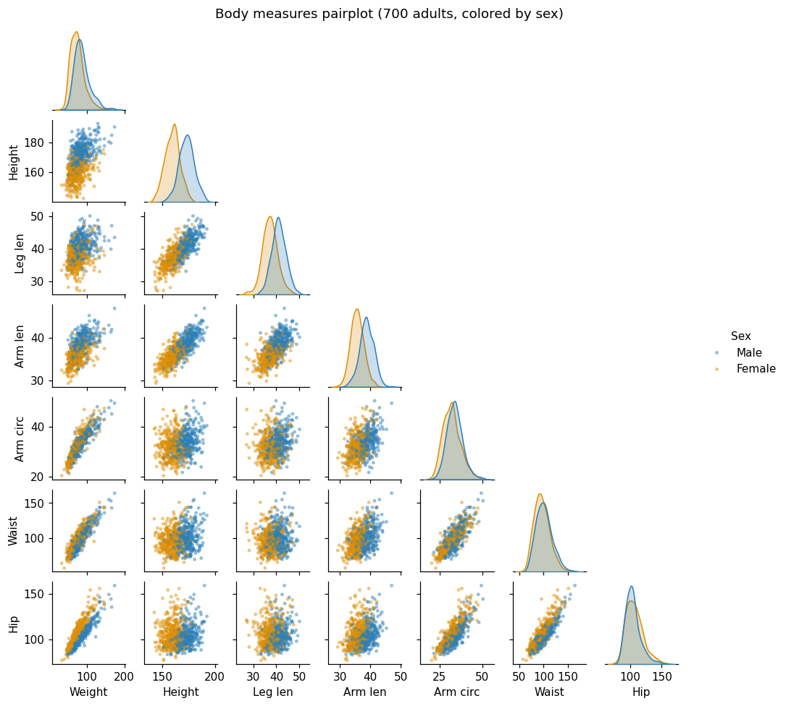
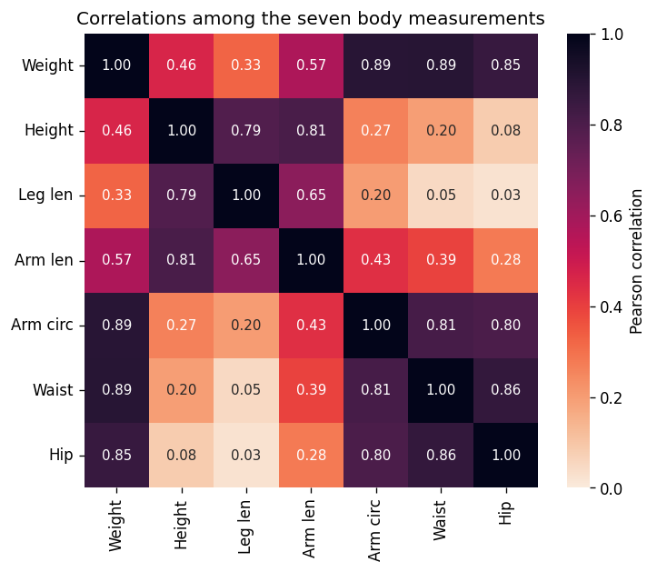

# Exploring Structure in Data: The Body Measures Dataset and PCA

## Background: measuring the human body

Every two years, the US **National Health and Nutrition Examination Survey
(NHANES)** sends trained examiners to measure a representative sample of the US
population. The **body-measures** component records standardized anthropometric
measurements — weight, height, and a set of lengths and circumferences — taken
with the same protocol for every participant.

This dataset is drawn from the 2017–2018 NHANES cycle. Unlike the Iris and Wine
datasets, which are small curated benchmarks assembled to demonstrate a method,
this is a slice of a **real population survey**: **5096 adults** (age 18 and
over), each described by **seven measurements**:

* Weight (kg)
* Height (cm)
* Upper leg length (cm)
* Upper arm length (cm)
* Arm circumference (cm)
* Waist circumference (cm)
* Hip circumference (cm)

Each person is therefore a point in a **7-dimensional space**.

---

## A different kind of question

In the Iris and Wine tutorials, the data came with **known groups** (flower
species, grape cultivars), and the interesting question was whether PCA could
recover that grouping without being told the labels.

Body measures pose a different question. There are no natural "classes" of
people hiding in these seven numbers. Instead, the measurements are all driven by
a few **underlying factors** — and our goal is to let PCA *reveal what those
factors are*. As you will see, the components PCA finds here are not arbitrary
mathematical axes; they turn out to have clear, interpretable meaning.

This is one of the oldest and most elegant uses of PCA. In a classic 1960 study
of painted turtles, Jolicoeur and Mosimann showed that when you apply PCA to a
set of body measurements, the first component captures overall **size** and the
later components capture **shape** — the proportions that remain once size is
accounted for. We will rediscover exactly this structure in human data.

---

## First look at the data

Below is a *pair plot* of the seven measurements for a sample of adults, colored
by sex. The diagonal shows each variable's distribution; the off-diagonal panels
show every pairwise relationship.

Take a few minutes to study it.

### Reflect:

* Look at the scatter panels. Do the clouds mostly slope **upward** — that is,
  are the measurements **positively correlated**? Is anyone who is larger in one
  dimension tending to be larger in the others?
* Are there panels where the relationship is **weak** (a round, shapeless cloud)?
  Look at hip versus leg length, or hip versus height.
* On the diagonals, where do the two sexes differ most — in the **length**
  variables (height, leg, arm length) or the **girth** variables (waist, hip)?

👉 Almost every panel slopes upward: bigger people tend to be bigger *everywhere*.
This shared "everyone-grows-together" tendency is the signature of a single
dominant factor — overall body size — and it is what PC1 will capture.

---

## Why all these positive correlations matter

The pattern of correlations is easier to read as a heat map:

Two things stand out:

* **Every correlation is positive.** No measurement shrinks as another grows.
* There are **two blocks**. The *girth/mass* measurements (weight, arm
  circumference, waist, hip) correlate strongly with each other (around
  0.80–0.89). The *length* measurements (height, leg length, arm length)
  correlate strongly with each other (around 0.65–0.81). But the two blocks are
  only weakly related — hip and leg length correlate just 0.03.

Keep this picture in mind. The all-positive structure will produce the **size**
component; the two weakly-connected blocks will produce the **shape** component.

> **A note on why the first component *must* be a size factor.** When every
> variable is positively correlated with every other, a mathematical result
> (the Perron–Frobenius theorem) guarantees that the leading eigenvector of the
> correlation matrix has **all entries of the same sign**. In plain terms: if
> everything grows together, the single direction that best summarizes the data
> is the one where everything increases at once — a general size axis. This is
> not a quirk of this dataset; it is a property of any set of positively
> correlated measurements.

---

# Your task: find the hidden factors using PCA

You will use **GoPCA** to explore the dataset. Work through the steps in order —
the sequence is deliberate. Do not rush to "the answer"; **experiment, observe,
and reflect**.

---

## Step 1: Standardize first, then run PCA

The seven measurements are on very different scales. Weight is tens of kilograms
with a large spread; arm length is tens of centimetres with a small spread. In
fact the numerical variance of weight is roughly **60 times** that of arm length.

PCA finds directions of maximum variance, so if you feed it the raw numbers it
will fixate on whichever variable happens to have the largest units — here,
weight — and ignore the rest.

Try it both ways.

* First set **Preprocessing → Mean Center Only** and click **Go PCA**. Open the
  **Loadings Plot** for PC1.
* Then set **Preprocessing → Standard Scale** and click **Go PCA** again. Compare
  the PC1 loadings.

#### Questions:

* With **Mean Center Only**, which two or three variables dominate PC1? Do the
  length variables contribute anything?
* With **Standard Scale**, do all seven variables now contribute?

👉 Without standardization, PC1 is essentially "weight + waist + hip" — the
high-variance columns drown everything else out, and the lengths barely appear.
**Standard Scale** divides each variable by its standard deviation, giving all
seven equal footing. Only then does the full size-and-shape structure emerge.

> Keep **Standard Scale** active for all remaining steps.

---

## Step 2: The first component is *size*

With Standard Scale active, open the **Scree Plot**.

#### Questions:

* How much variance does PC1 explain on its own?
* How much do PC1 and PC2 together explain?
* Where is the elbow?

You should find that PC1 explains about **60%** of the variance and PC2 about
**29%**, so the two together capture roughly **88%** — a compact, informative 2D
summary.

Now open the **Loadings Plot** and look at **PC1**.

#### Questions:

* What do the **signs** of the seven PC1 loadings have in common?
* Are any of them near zero, or do all seven contribute?

👉 Every PC1 loading has the **same sign**, and all seven are sizeable. That is
the fingerprint of a **general size factor**: moving along PC1 means getting
larger (or smaller) in *all seven measurements at once*. A person high on PC1 is
simply a bigger person — taller, heavier, wider all around.

We can confirm this reading directly. Set **Color by → `BMI`** on the **Scores
Plot**.

#### Questions:

* Does BMI vary smoothly along the PC1 axis — low BMI at one end, high BMI at the
  other?

👉 BMI tracks PC1 closely (their correlation is about 0.8). This is strong
confirmation that PC1 is an overall body-size/mass axis: the more "body" a
person has, the further along PC1 they sit.

---

## Step 3: The second component is *shape*

If PC1 is size, what is left for PC2 to describe? Once you know how *big* someone
is, the remaining question is how they are *proportioned* — and that is exactly
what PC2 captures.

Open the **Loadings Plot** and switch to **PC2**.

#### Questions:

* Which variables load **positively** on PC2? (Look at height, leg length, arm
  length.)
* Which variables load **negatively**? (Look at waist, hip, arm circumference.)
* So PC2 sets one group *against* another. Which two groups?

👉 On PC2 the **length** variables point one way and the **girth** variables
point the opposite way. PC2 is a **shape contrast**: at one end sit people who
are long-limbed and tall relative to their girth (a lean, linear build); at the
other end, people who are wide relative to their height (a rounder, stockier
build). Crucially, two people can share the same **size** (same PC1) yet sit at
opposite ends of PC2 — same "amount" of body, different proportions.

> This is the size-and-shape decomposition that Jolicoeur and Mosimann described
> in 1960: PC1 answers *how big?* and PC2 answers *what shape?* The two are
> nearly independent, which is why PCA — whose components are orthogonal by
> construction — separates them so cleanly.

Now open the **Circle of Correlations** to see both components at once.

#### Questions:

* Can you see the length variables (height, leg, arm length) clustering in one
  direction and the girth variables (waist, hip, arm circumference) in another?
* Where does **weight** sit relative to the two groups?

👉 Weight points *between* the two groups — it correlates with both length and
girth, because heavy people tend to be both taller and wider. Weight is the one
measurement that belongs partly to size and partly to both shape groups.

---

## Step 4: Sex and the shape axis

Set **Color by → `Gender`** on the **Scores Plot**.

#### Questions:

* Along which axis are the two sexes most offset — PC1, PC2, or both?
* Do the sexes form **separate clusters**, or two **overlapping clouds** that are
  shifted relative to each other?

👉 The two sexes are offset most clearly along **PC2**, the shape axis (they also
differ somewhat on size). But notice they **overlap heavily** — this is nothing
like the clean species separation in Iris. You are looking at two broad,
overlapping distributions whose *centers* differ, not two distinct groups.

Enable **Confidence Ellipses** (95%) to make the shift visible.

#### Questions:

* The ellipse centers are clearly separated along PC2, yet the ellipses overlap.
  What does that tell you about predicting an individual's sex from body shape
  alone?

👉 On average, adult men and women differ in body proportions and in how fat is
distributed — men tend toward a more central (waist) distribution, women toward
the hips — a well-documented difference (WHO, 2011). PC2 picks this up as a shift
along the shape axis. But the large overlap is the honest and important part:
population averages differ, while individuals span the whole range.

> **A caution about interpretation.** PCA reports *statistical* axes of variation.
> That the sexes' averages differ along PC2 is a description of this sample, not a
> boundary between two kinds of people. The overlapping ellipses are the visual
> reminder: a shift in averages is not a separation of individuals.

---

## Step 5: Put size and shape together — the Biplot

Open the **Biplot**, which shows samples (scores) and variables (loading arrows)
in the same plot.

#### Questions:

* Which arrows point along the size axis (PC1) — do all seven point broadly the
  same way along it?
* Along the shape axis (PC2), which arrows point *up* and which point *down*?
* Find a lean, tall build and a short, round build on the plot. Are they far
  apart along PC2 but potentially close along PC1?

👉 The biplot makes the whole story visible at once: all seven arrows lean the
same way along PC1 (size), while along PC2 the length arrows and girth arrows
split apart (shape). Every person's position is a combination of *how big* they
are and *how they are proportioned*.

---

## Step 6: What PCA does *not* show — color by Age

It is tempting to assume that principal components will line up with whatever
metadata you have. Let us test that. Set **Color by → `Age`**.

#### Questions:

* Does age form a smooth gradient along PC1 or PC2, the way BMI did along PC1?
* Or are the colors mixed throughout, with no clear direction?

👉 Age shows **almost no alignment** with either component (its correlation with
both PC1 and PC2 is weak). Among adults, overall body size is not strongly tied
to age, so PCA — which only knows about the seven measurements — has no reason to
produce an "age axis." This is an important lesson: **PCA finds the directions of
greatest variance in the data you give it, and those need not correspond to any
particular variable you care about.** If you want to study age specifically, PCA
of body measurements is the wrong tool; a method that uses age directly would be
better.

---

## Step 7: Push your understanding further

Try these explorations:

* **Why isn't BMI one of the input features?** BMI is defined as
  weight ÷ height², so it is an exact function of two variables already in the
  dataset. Including it would add no new information and would distort the
  loadings by double-counting weight and height. That is why BMI is provided only
  as a coloring target, not as a measurement. (Try adding it back as a feature in
  GoCSV and see how the loadings change.)

* **Look at PC3.** Switch to the **3D Scores Plot** (PC1 vs PC2 vs PC3), or select
  PC3 in the Loadings Plot. PC3 explains only about 5% of the variance and
  contrasts **leg length against arm length** — a subtle limb-proportion axis.
  Does the Scree Plot suggest PC3 is worth keeping?

* **Split the sexes.** In GoCSV, filter to only males or only females before
  loading into GoPCA. Does the size-and-shape structure still appear within a
  single sex? (It should — size and shape are not *created* by mixing sexes.)

---

# What you should take away

After completing this exploration, you should be able to:

* Recognize that PCA components can be **interpretable factors**, not just
  abstract axes — here, **size** (PC1) and **shape** (PC2)
* Explain why a set of **positively correlated** measurements produces a first
  component with all-same-sign loadings (a general size factor)
* Distinguish a **shift between overlapping distributions** (the sexes here) from
  a **clean separation into clusters** (the species in Iris)
* Confirm the meaning of a component using an external variable (BMI along PC1)
* Accept that PCA need **not** align with every variable you have (age here) —
  and know when that means PCA is the wrong tool for a question

---

## Final reflection

> You began with seven body measurements and no labels. PCA reduced them to two
> axes that together explain about 88% of the variation — and those two axes
> turned out to *mean* something: how big a person is, and how they are shaped.

Think about these questions:

* PC1 explained ~60% of the variance with all-positive loadings. If you measured
  ten more body dimensions (finger length, foot width, …), do you expect PC1
  would still be a size factor? Why?
* BMI correlated ~0.8 with PC1, yet we deliberately excluded BMI from the inputs.
  What does it mean that PCA "rediscovered" a size/mass axis without ever being
  shown BMI?
* The sexes overlapped heavily along the shape axis. If someone claimed they
  could determine a person's sex from these seven measurements, what would the
  confidence ellipses lead you to say?
* Jolicoeur and Mosimann found the same size-then-shape structure in turtles in
  1960. Why might this pattern appear across such different organisms?

---

## References

* Jolicoeur, P., & Mosimann, J. E. (1960). *Size and shape variation in the
  painted turtle: A principal component analysis.* Growth, 24, 339–354.
  (The classic demonstration that PC1 = size and later PCs = shape.)
* Jolliffe, I. T., & Cadima, J. (2016). *Principal component analysis: a review
  and recent developments.* Philosophical Transactions of the Royal Society A,
  374, 20150202. https://doi.org/10.1098/rsta.2015.0202
* World Health Organization (2011). *Waist Circumference and Waist–Hip Ratio:
  Report of a WHO Expert Consultation, Geneva, 8–11 December 2008.*
  https://iris.who.int/handle/10665/44583
  (Sex differences in body-fat distribution.)
* Centers for Disease Control and Prevention, National Center for Health
  Statistics. *NHANES 2017–2018 Body Measures (BMX_J).*
  https://wwwn.cdc.gov/Nchs/Data/Nhanes/Public/2017/DataFiles/BMX_J.htm
