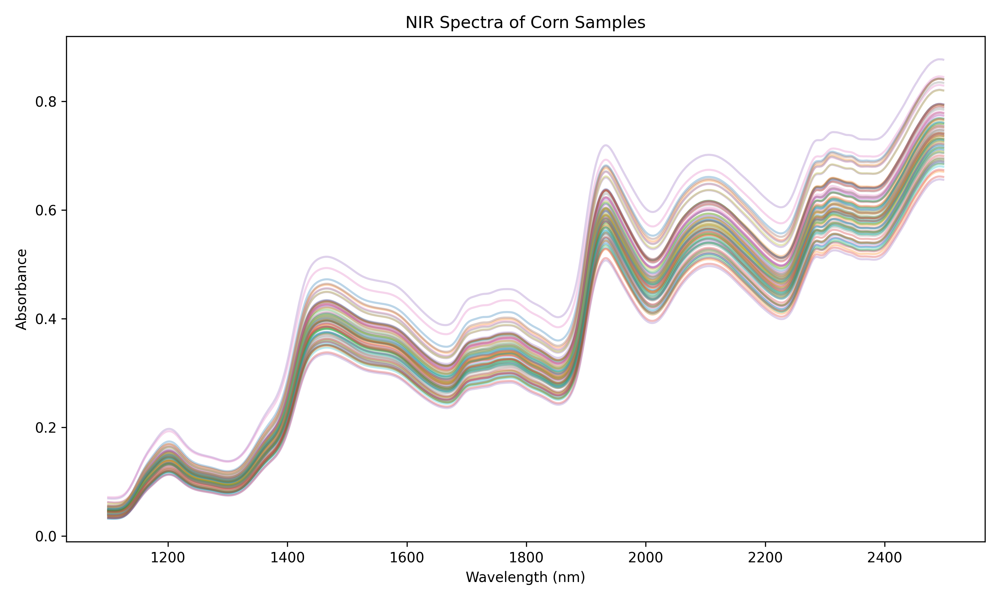

# Exploring Structure in Data: The Corn (NIR) Dataset and PCA

## Background: Spectroscopy, chemistry, and a different kind of data

Near-infrared (NIR) spectroscopy is a rapid, non-destructive technique widely used in food science and agriculture. Instead of breaking down a sample chemically, an NIR instrument shines near-infrared light through the sample and measures how much light is absorbed at each wavelength. The resulting *absorption spectrum* reflects the molecular composition of the sample — water, fat, protein, and starch all absorb NIR light at characteristic wavelengths.

This dataset consists of **80 corn samples**, each measured by an NIR instrument. The instrument recorded absorbance at **700 wavelengths** from **1100 nm to 2498 nm** in steps of 2 nm. For each sample, the true compositional values were also determined by conventional laboratory (wet chemistry) methods:

* `Moisture#target` — moisture content (%)
* `Oil#target` — oil content (%)
* `Protein#target` — protein content (%)
* `Starch#target` — starch content (%)

The original purpose of such a dataset is **calibration**: build a model that predicts chemical composition from the spectrum alone, so future samples can be analysed in seconds rather than hours. This is a supervised problem — it uses the known laboratory values to train a model.

Here, we will approach the same data with **Principal Component Analysis (PCA)** — an *unsupervised* method that ignores the laboratory values entirely. The question becomes: what structure does PCA find in the spectra on its own? And does that structure relate to chemistry?

👉 This dataset is fundamentally different from Iris and Wine:

* Each of the 700 variables is **not an independent measurement** — together they form a **continuous absorption spectrum**
* Adjacent wavelength channels are extremely highly correlated
* There are no predefined sample classes — variation is **continuous**, not categorical

The data originates from Cargill and was made publicly available through Eigenvector Research (https://eigenvector.com/data/Corn/). It has been used in food chemistry research, including Engel et al. (2022).

---

## First look at the data

Below is a plot showing all 80 spectra overlaid on a single graph.

Take a few minutes to study this figure carefully.

### Reflect:

* Do all spectra look similar in overall shape?
* Can you see peaks or shoulders at specific wavelengths where absorbance changes sharply?
* Do any spectra stand out from the rest — sitting above or below the main group?

👉 Even though the spectra look broadly similar, small sample-to-sample differences carry the chemical information we are trying to understand. PCA will find and compress this variation.

---

## The challenge

Each sample is described by **700 highly correlated variables**, but there are only **80 samples**.

Working directly in 700 dimensions is impossible. Even looking at individual wavelengths one at a time misses the fact that they are not independent — the entire shape of the spectrum matters.

Your task is to use **Principal Component Analysis (PCA)** to:

> Compress the spectral data into a small number of components while preserving as much of the variation as possible.

Think of PCA as:

* A way to find the **main patterns of spectral variation** across samples
* A way to **detect unusual samples** that do not fit the main pattern
* A first step toward understanding which parts of the spectrum carry chemical information

---

# Your task: Explore the dataset using GoPCA

You will use the application **GoPCA** to explore the dataset.

Do not try to "get the right answer" immediately.
Instead, **experiment, observe, and reflect**.

---

## Step 1: Load the data and run PCA

* Load the Corn dataset into GoPCA
* Do not set a target column yet — explore the raw spectral structure first
* Run PCA with default settings

### Look at the **Scores Plot (PC1 vs PC2)**

#### Questions:

* How are the 80 samples distributed?
* Do you see distinct clusters, or more of a continuous spread?
* Are there any samples noticeably far from the main group?

👉 Hint: Unlike Iris and Wine, you are not looking for predefined cultivar groups. The variation you see reflects real differences in spectral shape between corn samples.

---

## Step 2: Explore explained structure

Open the **Scree Plot**.

#### Questions:

* How much variance is explained by PC1 alone?
* How much by PC1 + PC2 together?
* How many components seem "enough" to describe the spectral variation?

👉 In NIR spectral data, it is common for the first 2–3 components to capture the vast majority of the structure — even though there are 700 variables. This is a direct consequence of the high correlation between adjacent wavelength channels.

---

## Step 3: Understand what the loadings mean for spectral data

Open the **Loadings Plot**.

👉 Important: this plot will look very different from what you saw for Iris and Wine.

For Iris and Wine, the loadings plot showed a small number of isolated arrows — one per variable. Here, there are **700 variables**. Each one is a point in the loadings plot, ordered by wavelength. Instead of isolated arrows, the 700 points form a **smooth curve** in loading space. The shape of this curve is itself a spectral signature — it tells you which parts of the spectrum contribute most to each principal component.

#### Questions:

* Does the PC1 loading curve look smooth, or jagged?
* Which wavelength regions show the strongest contribution to PC1?
* How does the PC2 loading curve differ from PC1?

👉 Hint:

* Peaks and valleys in the loading curve correspond to wavelength regions of particular chemical importance
* The smooth shape is expected — it reflects the high correlation between adjacent wavelengths

---

## Step 4: Connect PCA to chemistry

Now set a target column to colour the samples by composition.

In GoPCA, set the **target column** to `Moisture#target`. Look at the **Scores Plot**.

#### Questions:

* Do you see a gradient in the scores — samples ordered by moisture content?
* Does the gradient run along PC1, PC2, or diagonally?

👉 Try switching the target column to `Starch#target`, then `Protein#target`, then `Oil#target`:

* Which compositional property is most strongly captured by the first principal component?
* Are all four properties captured equally well, or do some require higher components?

👉 Key insight: PCA captures **continuous variation**, not just clusters. When scores correlate with a chemical property, it means the spectral variation along that component is driven by that chemistry.

---

## Step 5: Look for outliers

Return to the Scores Plot with no target column selected.

#### Questions:

* Are any samples noticeably far from the main group?
* What might cause an outlier in NIR spectral data?

👉 Possible causes of spectral outliers:

* Measurement artefact (instrument problem during that scan)
* Sample contamination or unusual physical properties (e.g. very different particle size)
* A genuinely unusual corn sample

Outlier detection is one of the most practical uses of PCA in spectroscopy. A sample that appears as an outlier in the scores plot should be examined carefully before being included in a calibration model.

---

## Step 6: Preprocessing — SNV and scatter correction

This is the **critical preprocessing step for spectral data**, and it differs fundamentally from the column-wise standardisation used for Iris and Wine.

### Why spectra need scatter correction

NIR spectra are affected by **multiplicative scatter effects**: differences in particle size, sample packing density, and optical path length shift the baseline and overall slope of a spectrum — even when the chemistry is identical. This is a physical measurement artefact, not a chemical signal.

Without correcting for scatter, PCA components may be dominated by physical measurement differences rather than chemistry.

### Apply SNV in GoPCA

In GoPCA, find the **Row Preprocessing** selector and choose **SNV (Standard Normal Variate)**.

SNV operates **per spectrum** (per row):

* Subtract the mean of that spectrum's 700 absorbance values
* Divide by its standard deviation

The result is that each individual spectrum is centred and scaled to unit variance *within itself*, making spectra physically comparable across samples regardless of scatter differences.

#### Compare results

Run PCA both without SNV and with SNV applied:

#### Questions:

* Do the spectra in the spectral plot align more tightly after SNV?
* Does the Scores Plot change — do the components shift or the spread of samples change?
* Does the relationship between scores and compositional targets become clearer?

### Combining with column-wise preprocessing

SNV (row-wise) and mean centering (column-wise) are complementary and are often applied together. In GoPCA, you can combine:

* **SNV** in the Row Preprocessing selector
* **Mean Center Only** in the column-wise preprocessing selector

👉 This is the standard workflow in NIR spectroscopy: remove scatter variation first (SNV), then mean-center each wavelength channel across samples. Try this combination and observe how it affects the scores.

---

## Step 7: Push your understanding further

Try these explorations:

* **Exclude the water absorption regions** using GoCSV's column selection before loading into GoPCA

  * The strong water bands at ~1400–1450 nm and ~1900–1960 nm can dominate the spectrum
  * Does removing them change which component captures moisture vs starch?

* **Explore the 3D Scores Plot**

  * Does a third component reveal additional structure not visible in 2D?

* **Compare all four compositional targets**

  * Color by `Moisture#target`, `Oil#target`, `Protein#target`, and `Starch#target` in turn
  * Which is best separated along PC1? Which requires PC2 or PC3?

---

# What you should take away

After completing this exploration, you should be able to:

* Understand PCA as a tool for **high-dimensional spectral data**
* Interpret:

  * Scores plots showing continuous sample variation
  * Loadings as smooth spectral curves rather than isolated arrows
* Explain how PCA can:

  * Compress 700 correlated variables into a few meaningful components
  * Reveal chemical structure without using laboratory reference values
  * Detect unusual samples (outliers)
* Recognise the importance of:

  * **SNV preprocessing** for removing physical scatter effects in spectral data
  * The difference between row-wise (per-spectrum) and column-wise preprocessing

---

## Final reflection

Think about this:

> You started with 700 variables forming a spectrum — far more variables than samples.
> With PCA, you compressed the data into 2–3 components and revealed structure that relates to chemistry.

* How is PCA on spectral data different from PCA on independent measurements like Iris or Wine?
* Why do the loadings appear as smooth curves rather than isolated vectors?
* Why is SNV more appropriate here than column-wise standard scaling?
* The original purpose of this dataset was to build a calibration model predicting composition from spectra. Could you use the PCA scores as input to such a model? What might be the advantage of using scores instead of raw spectra?

---

## References

Eigenvector Research. *Corn dataset*. https://eigenvector.com/data/Corn/

Engel, J., et al. (2022). Towards predicting the quality of food mixtures using NIR spectroscopy.
*Food Chemistry*, 383, 132442. https://doi.org/10.1016/j.foodchem.2022.132442
