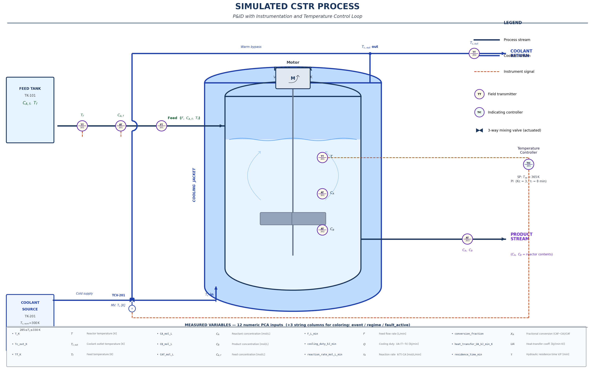

# Monitoring a Chemical Reactor: Process Data and Temporal PCA

## Background: Why reactors produce time-series data

In a chemical plant, sensors log dozens of measurements every minute — temperatures, flow rates, concentrations, pressures, valve positions. The goal of **process monitoring** is to detect abnormal behaviour early, understand the relationship between variables, and distinguish faults from ordinary process disturbances.

This dataset was simulated from a **non-isothermal Continuous Stirred-Tank Reactor (CSTR)** running an irreversible first-order exothermic reaction:

$$\text{A} \rightarrow \text{B} \quad (\text{exothermic})$$

> **A chemistry note:** This is a *unimolecular* first-order reaction — A spontaneously converts into B without requiring a second reactant. Real examples include thermal decomposition, isomerisation, and cracking reactions. The key physics is the **Arrhenius temperature dependence** of the rate constant, $k(T) = k_0\, e^{-E/RT}$: higher temperature accelerates the reaction, releasing more heat, which drives the temperature higher still. That thermal feedback is what makes the CSTR a classic system for studying nonlinear process dynamics. No catalyst is modelled explicitly — the effect of any catalyst is absorbed into the kinetic pre-factor $k_0$.

A CSTR is one of the most studied systems in chemical engineering [Uppal, Ray & Poore, 1974]. Reactant A flows in continuously, the reaction occurs inside the tank, and product B flows out. Because the reaction releases heat, a coolant circuit controls the reactor temperature.

> **Rich nonlinear dynamics:** Uppal, Ray & Poore (1974) showed analytically that, depending on the Damköhler number and the heat of reaction, a CSTR can have one or three steady states, and can exhibit *intrinsic* self-sustaining oscillations (limit cycles) arising purely from the Arrhenius thermal feedback — with no external forcing whatsoever. The simulation in this tutorial is tuned to a single stable operating point, so you will not encounter multiple steady states here. The 40-minute oscillation you will identify in Temporal PCA is an *externally imposed* feed flow disturbance, not an Arrhenius-driven limit cycle. In a real plant operating near a limit cycle boundary, oscillations would persist even after the external disturbance was removed — a substantially harder fault scenario to diagnose.

### The PI temperature controller

A proportional-integral (PI) controller manipulates the coolant temperature T_c to keep the reactor temperature T near the setpoint (365 K). When T rises above setpoint, the controller requests colder coolant; when it falls, warmer coolant. Anti-windup logic prevents the controller from accumulating a large integral error when the coolant valve is fully open or closed.

This controller introduces **closed-loop dynamics** into the data — disturbances cause transients, the controller responds, and variables return to steady state. Temporal PCA can capture all of this.

> A temporal PCA analysis of this dataset teaches something deeper than ordinary PCA: not just *which variables are correlated*, but *how process dynamics evolve through time*. That is exactly why dynamic PCA became central to chemical process monitoring.

*Simplified P&ID showing the measured variables, instrumentation, and PI temperature control loop for the simulated CSTR process.*

### The dataset

The simulation runs for **800 minutes** at 1-minute sampling, producing **801 observations** across **12 process variables**:

| Column | Symbol | Units | Description |
|---|---|---|---|
| `T_K` | *T* | K | Reactor temperature (controlled variable) |
| `Tc_out_K` | *T*_c,out | K | Coolant outlet temperature (manipulated via PI) |
| `Tf_K` | *T*_f | K | Feed temperature |
| `CA_mol_L` | *C*_A | mol/L | Reactant A concentration in reactor |
| `CB_mol_L` | *C*_B | mol/L | Product B concentration in reactor |
| `CAf_mol_L` | *C*_A,f | mol/L | Reactant A concentration in feed |
| `F_L_min` | *F* | L/min | Volumetric feed flow rate |
| `cooling_duty_kJ_min` | *Q* | kJ/min | Heat removed by coolant system |
| `reaction_rate_mol_L_min` | *r*_A | mol/L/min | Rate of reaction A→B |
| `conversion_fraction` | *X*_A | — | Fraction of A converted to B |
| `heat_transfer_UA_kJ_min_K` | *UA* | kJ/(min·K) | Overall heat-transfer coefficient |
| `residence_time_min` | *τ* | min | Hydraulic residence time (V/F) |

The dataset also includes three string columns that label the operating state at each time point. All three are automatically excluded from PCA by GoPCA and are available for score-plot coloring.

| Column | Distinct values | Description |
|---|---|---|
| `event` | 6 values | Fine-grained scenario label: `normal`, `feed_conc_high`, `feed_temp_high`, `flow_oscillation`, `cooling_fault`, `recovery` |
| `regime` | 4 values | Coarser grouping: `normal` (baseline + recovery), `feed_disturbance` (both feed steps combined), `oscillation`, `cooling_fault` |
| `fault_active` | `yes` / `no` | Binary flag: `no` during normal operation and recovery, `yes` during all disturbance and fault periods |

All three describe the same 800-minute timeline at different levels of detail — `event` is the most specific, `fault_active` the broadest. **Use `regime` as your color target**: four clearly named categories give the most useful visual separation in the scores plot, and the two feed disturbances are grouped together because they produce similar multivariate signatures.

### Operating scenarios

The simulation passes through six distinct operating phases designed to produce recognisable signatures in Temporal PCA:

| Time (min) | Scenario | What happens |
|---|---|---|
| 0 – 120 | **Normal** | Reactor near steady state. Use this period to establish your mental baseline. |
| 120 – 240 | **Feed concentration step** | Feed concentration rises +10 %. Reactant A rises, more heat is released, controller corrects temperature. |
| 240 – 360 | **Feed temperature step** | Feed enters +7 K hotter. Thermal disturbance; controller compensates with colder coolant. |
| 360 – 520 | **Flow oscillation** | Feed flow oscillates ±8 % at a **40-minute period**. Creates periodic variation across nearly all variables. |
| 520 – 680 | **Cooling fault** | Heat-transfer coefficient drops 28 % — partial fouling or cooling water problem. Reactor temperature drifts upward; controller saturates. |
| 680 – 800 | **Recovery** | Nominal conditions restored. |

---

## Key process time constants — choose your lag L wisely

Before running Temporal PCA, you need to decide how many lags L to include. The right choice depends on the dynamics you want to capture:

| Dynamic | Time constant | Recommended L |
|---|---|---|
| Residence time τ = V/F | ≈ 1 min | L = 2–5 |
| PI integral time τ_I | 8 min | L = 8–16 (captures one controller action) |
| Step response settling | ≈ 20–30 min | L = 20–30 |
| Flow oscillation period | 40 min | L = 40–80 (to fully resolve) |

Start with **L = 10** to see the controller dynamics clearly. Then try L = 5 (faster dynamics) and L = 20 (slower trends). Note: at L = 10–20 the 40-minute oscillation will appear as a low-frequency oscillatory pair of components — which is exactly what you want to identify.

---

# Your task: Monitor the reactor using Temporal PCA

Work through the steps in order. Each step builds on the previous one.

---

## Step 1: Start with ordinary PCA — establish a baseline

Before introducing time lags, run ordinary PCA (L = 0) first. This lets you see exactly what temporal PCA adds.

Load `cstr_temporal_pca.csv` into GoPCA. Set:

* **Target column** → `regime` (for coloring)
* **Preprocessing** → **Standard Scale**
* **Lags (L)** → **0**
* **Number of Components** → **5**
* **PCA Method** → SVD (default)

Click **Go PCA**.

> **Why Standard Scale?** The 12 variables have completely different units and magnitudes — temperatures in the hundreds of Kelvin, flow rates in hundreds of L/min, concentrations below 1 mol/L, heat duty in thousands of kJ/min. Without scaling, PCA would be dominated by whichever variable has the largest numerical variance, not the most process-relevant variation.

Open the **Scores Plot** (color by `regime`) and the **Loadings Plot**.

#### Questions:

* Can you identify clusters corresponding to normal operation, feed disturbances, the cooling fault, and the oscillation regime?
* PC1 typically captures **overall reaction intensity** — which variables have the largest loadings? You would expect `T_K`, `reaction_rate_mol_L_min`, and `conversion_fraction` to dominate, since they are all tightly coupled through the energy and mass balances at steady state.
* PC2 often separates **feed and composition effects** from **thermal and cooling effects** — do the loadings support this?
* The **cooling fault** should appear far from the normal cluster along PC1. If it does, check the loadings — which variables drive this separation? Does the large offset compress the rest of the score plot into a small region on the left side?
* Now look at the **flow oscillation** period. Rather than forming a compact cluster, it scatters broadly across the full vertical range of the plot. Why? Ordinary PCA has no sense of time — each measurement at minute 362 is treated as an independent sample, not as part of a repeating cycle. The oscillation appears as diffuse scatter rather than a recognisable structure.

👉 Ordinary PCA sees the process at a **single instant in time**. It can detect large regime shifts (the cooling fault stands out clearly), but it cannot understand *how* a disturbance propagates through the process, *how quickly* the controller responds, or *whether* a periodic signal is present. The oscillation period looks like noise. That is the key limitation ordinary PCA cannot overcome — and what Temporal PCA is designed to fix.

---

## Step 2: Switch to Temporal PCA

Now change the configuration to:

* **Lags (L)** → **10**
* **Number of Components** → **8**

Click **Go Temporal PCA**.

Each observation now carries a short process history — the current values plus the 10 preceding minutes. PCA is now finding directions of maximum variance in this extended state space, which includes time.

---

## Step 3: Read the Scree Plot — how many components carry information?

Open the **Scree Plot**.

#### Questions:

* Where is the elbow — after the first component, the second, or later?
* How many components are needed to reach 80% cumulative variance?
* How does the Scree Plot for this dataset compare to Iris (4 variables, clean separation) or Wine (13 variables, ~55% in 2D)?

👉 A CSTR at steady state has only a few degrees of freedom (temperature, concentration, flow are tightly coupled through the energy and mass balances). During disturbances and faults, additional variation enters from different directions. The Scree Plot reflects this: a few large components capturing steady-state variation, then smaller components capturing the specific disturbance signatures.

---

## Step 4: The scores plot — reading a process trajectory

Open the **Scores Plot (PC1 vs PC2)** and color by `regime`.

For time-series data, the scores form a **time-ordered trajectory** through PC space. This is different from a static dataset like Iris or Wine, where each point is an independent sample. Here, consecutive points are connected in time — the path the reactor traces through multivariate space.

**How to read a process trajectory:**

* **Tight cluster** → reactor operating in a stable, repeating condition
* **Slow drift away from cluster** → gradual process change (e.g., fouling, catalyst deactivation)
* **Sharp jump** → step disturbance (e.g., feed change)
* **Closed loop or ellipse** → periodic oscillation (the 40-minute flow cycle will appear this way)
* **Failure to return** → fault that the controller cannot correct

#### Questions:

* Can you identify which region of the plot corresponds to normal operation?
* Where does the cooling fault period appear — close to normal operation or far from it?
* Does the flow oscillation period trace a recognisable loop? How large is it compared to the steady-state cluster?
* Does the reactor return to the normal region during the recovery period?

> **Chemical engineering connection:** This is the same logic as a yield–selectivity map in a reaction engineering course. When you plot yield vs. selectivity over time during a runaway, the trajectory moves away from the optimal operating point. The scores plot is a multivariate generalisation of that idea — it shows where the process is in a compressed, multi-dimensional operating space.

---

## Step 5: The Temporal Loadings — what dynamics are in each component?

Open the **Temporal Loadings Plot**. Display at least 8 components.

Each panel shows how one component's loading evolves across lags 0 to L. The x-axis is lag (minutes into the past); the y-axis shows the loading of the dominant channel for that component.

**Three patterns to look for:**

| Shape | Interpretation |
|---|---|
| **Flat / near-zero** | No temporal structure — component captures instantaneous variance |
| **Monotone decay** | Exponential response — controller or first-order process dynamics |
| **Sinusoidal oscillation** | Periodic variation — oscillatory process behaviour |

#### Questions:

* Which components show a monotone decaying shape? What time constant does the decay suggest (how many lags before it flattens)?
* Can you find any components with a sinusoidal shape? These represent the 40-minute flow oscillation.
* Compare the decay time constant to the PI integral time τ_I = 8 minutes. Do they match?
* Look carefully at components dominated by `Tc_out_K` (coolant temperature) versus `T_K` (reactor temperature). Do their loading curves peak at different lags? This is **delayed thermal coupling**: the reactor has thermal inertia, so a change in coolant temperature takes several minutes to propagate into a change in reactor temperature. The lag axis makes this sequence visible — something ordinary PCA cannot show.

> **Hint:** A sinusoidal temporal loading pattern means that component is tracking a variable that oscillates in time. The period of the oscillation can be estimated from the zero-crossings: if you count k zero-crossings over L lags, the oscillation period ≈ 2L/k minutes. For a 40-minute oscillation with L = 10 lags, you will see only about **one quarter of a cycle** (10/40 = 0.25) — far too little to recognise a clean sinusoid. Try L = 40 to resolve the full period.

---

## Step 6: Identify the oscillatory pair

Temporal PCA (SSA) represents a single oscillation as a **pair of components**. The correct way to identify such a pair is by the **shape of the temporal loading curves**:

1. Both curves are sinusoidal at the same frequency
2. One is approximately 90° phase-shifted relative to the other (a sine and a cosine)

This pairing occurs because a sine wave requires both a sine and a cosine component to be fully represented.

> **On equal explained variance:** For a pure, noise-free sinusoidal signal, SSA theory guarantees that an oscillatory pair will have exactly equal eigenvalues. In practice, however, two completely unrelated dynamics can explain the same percentage of variance by coincidence — so equal variance is a *supporting indicator*, not a reliable primary criterion. Always start from the shape of the temporal loading curves, and treat similar variance as confirmation, not identification.

> **Important — you will not see a clean pair at L = 10.** The flow oscillation has a 40-minute period. With L = 10, the lag window covers only 10/40 = 25% of one cycle. SSA cannot decompose an oscillation into a sine/cosine pair when the window is too short to contain even a half cycle. At L = 10, the oscillation appears as slow-varying trend components rather than recognisable sinusoids.

**What you will actually see at L = 10:**

- Two components with equal explained variance (e.g. both 3.1%) — but with temporal loading curves that are not sinusoidal. One may be a linear ramp, the other nearly flat. These are slow trend components capturing the step disturbances and controller response, not the flow oscillation.
- One or two higher-numbered components (low variance, <1%) with slightly curved or V-shaped loading curves — partial traces of the oscillation, but too compressed to identify clearly.

**To actually find the oscillatory pair, switch to L = 40:**

Run Temporal PCA with **L = 40** and **10 components**. Now the lag window spans one full oscillation period. The pair should become clearly visible:

* Two adjacent components with nearly equal variance
* One with a cosine-shaped temporal loading (starts high, passes through zero, goes negative)
* One with a sine-shaped temporal loading (starts near zero, rises or falls monotonically across the window)
* Both dominated by the same process variable — `F_L_min` (feed flow rate)

#### Questions (at L = 40):

* Can you now identify the oscillatory pair? Which component numbers are they, and what are their explained variances?
* Are the temporal loading curves of the two components approximately 90° shifted from each other?
* Which variable dominates the loading of this pair? Does it match your expectation from the simulation?
* Compare the Scree Plot at L = 40 to L = 10. Why does the explained variance of the top components drop when L increases?

---

## Step 7: Fault detection — does Temporal PCA see the cooling fault?

The cooling fault (minutes 520–680) reduces the heat-transfer coefficient by 28 %. The controller tries to compensate by lowering T_c, but eventually saturates at its minimum value.

Return to the Scores Plot.

#### Questions:

* Is the cooling fault period clearly separated from the normal operation cluster in PC1–PC2 space?
* If not, try PC1 vs PC3, or PC2 vs PC3 — the fault may project most strongly onto a higher component
* Open the Loadings Plot for the component(s) that best separate the fault period. Which variables have the largest loadings? Do they include `cooling_duty_kJ_min`, `heat_transfer_UA_kJ_min_K`, or `T_K`?

👉 A 28 % drop in UA is a significant fault. In a real plant, this would appear gradually over hours or days. The key question is: which combination of variables carries the fault signature, and how early in the fault period does it become visible in the scores plot?

#### Extension:

* In industrial practice, control charts are placed on the scores of a PCA model built on normal data only. Any new sample whose scores fall outside the 95% confidence ellipse is flagged as abnormal. Does the cooling fault period fall outside the 95% confidence ellipse for normal operation?

---

## Step 8: Compare lag settings — L = 0, L = 5, L = 10, L = 20

Run Temporal PCA four times: **L = 0** (ordinary PCA), **L = 5**, **L = 10**, **L = 20** (keep 8 components, Standard Scale). Compare the Scree Plots, Temporal Loadings, and Scores Plots across all four.

#### Questions:

* At L = 0, how does the scores plot compare to what you saw in Step 1? (It should be identical — L = 0 is exactly ordinary PCA.)
* Does increasing L reveal more temporal structure (more sinusoidal components)?
* At L = 5, does the Scree Plot still show a clear elbow?
* At L = 20, how many components do you need to explain 80% of the variance? Why does the number increase with L?
* Which lag setting gives you the most useful separation between normal operation and the cooling fault in the scores plot?
* Look at which variables dominate the early PCs across all four settings. At L = 0, fast variables (feed flow, coolant temperature) and slow variables (reactor temperature, concentrations) appear mixed together. As L increases, do you notice any separation of **fast dynamic modes** from **slow process modes** in the component structure? Fast variables (feed flow, coolant control) evolve on the timescale of the residence time (≈1 min); slow variables (reactor temperature, concentrations) evolve on the timescale of the PI integral time (8 min) and thermal inertia. Temporal PCA can separate these time scales into different components.

> **Rule of thumb:** L should be at least as large as the longest process time constant you want to capture. For controller dynamics (τ_I = 8 min), L ≥ 10 is sensible. For the full flow oscillation (40 min), you need L ≥ 40. Larger L improves frequency resolution but increases the size of the trajectory matrix — for 801 observations and L = 40, each "augmented observation" spans 41 time steps, leaving 761 usable rows.

---

# What you should take away

After completing this exploration, you should be able to:

* Explain why **Standard Scale is essential** for process datasets with mixed units
* Read a **process trajectory** in a scores plot — identifying stable operation, disturbances, oscillations, and faults
* Recognise the **time constant** of process dynamics from the shape of temporal loading curves
* Identify a **paired oscillatory component** in the Scree Plot and Temporal Loadings
* Select an appropriate **lag parameter L** based on the process time constants you want to capture
* Describe how **Temporal PCA could be used for fault detection** in a real plant

---

## Final reflection

> You started with 12 process variables measured every minute for 800 minutes. A conventional pairwise analysis would give you 66 panels and no information about how the variables evolve together over time.

If you have worked through the other GoPCA tutorials, you have now seen PCA applied across four fundamentally different data structures:

| Dataset | What PCA discovers |
|---|---|
| **Iris / Wine** | Geometric and chemical structure — clusters and correlations among static samples |
| **Corn (NIR)** | Correlated wavelength structure — hundreds of channels carrying the same compositional signal |
| **Swiss Roll** | Nonlinear manifold geometry — Kernel PCA unrolling a curved surface that linear PCA cannot separate |
| **CSTR (time series)** | Dynamic process modes — time-dependent structure, delayed coupling, oscillations, fault propagation |

Each dataset required a different analytical lens. The CSTR dataset shows that by embedding lagged process history into the data matrix, PCA gains the ability to *see time* — revealing not just which variables are related, but how they influence each other across minutes and hours. That conceptual bridge connects standard PCA to the full toolkit of dynamic process monitoring used in industrial practice.

Think about these questions:

* The PI controller reduces temperature variation — it actively fights the disturbances. Does this make Temporal PCA harder or easier? What would the scores plot look like without any controller?
* The cooling fault changes `heat_transfer_UA_kJ_min_K` directly. But which other variables are affected indirectly, and how quickly? Can you trace the fault propagation through the scores trajectory?
* In a real plant, you would build the Temporal PCA model on normal data only, then apply it to new data in real time. What would you need to store — the loadings? The mean and standard deviation for scaling? The lag structure?
* The flow oscillation was designed as a process disturbance. Could it also be a deliberate sinusoidal test signal, used to identify the process frequency response? How would Temporal PCA help you characterise the plant dynamics?

---

## References

Uppal, A., Ray, W. H., & Poore, A. B. (1974). On the dynamic behavior of continuous stirred tank reactors. *Chemical Engineering Science*, 29(4), 967–985. — Foundational analysis of CSTR multiplicity and limit cycles; establishes analytically the full classification of dynamic behaviour as a function of the Damköhler number and heat of reaction.

Seborg, D. E., Edgar, T. F., Mellichamp, D. A., & Doyle, F. J. III. *Process Dynamics and Control* (4th ed.). Wiley. — Standard chemical engineering reference for CSTR modelling and PI control.

Vautard, R., & Ghil, M. (1989). Singular spectrum analysis in nonlinear dynamics, with applications to paleoclimatic time series. *Physica D*, 35(3), 395–424. — Foundational paper for SSA (the mathematical basis of Temporal PCA).

Qin, S. J. (2003). Statistical process monitoring: basics and beyond. *Journal of Chemometrics*, 17(8–9), 480–502. — PCA-based fault detection in process industries.

Kantor, J. C. *CBE30338: Simulation of an Exothermic CSTR*. — Open-source chemical engineering course material used as reference for this simulation.
