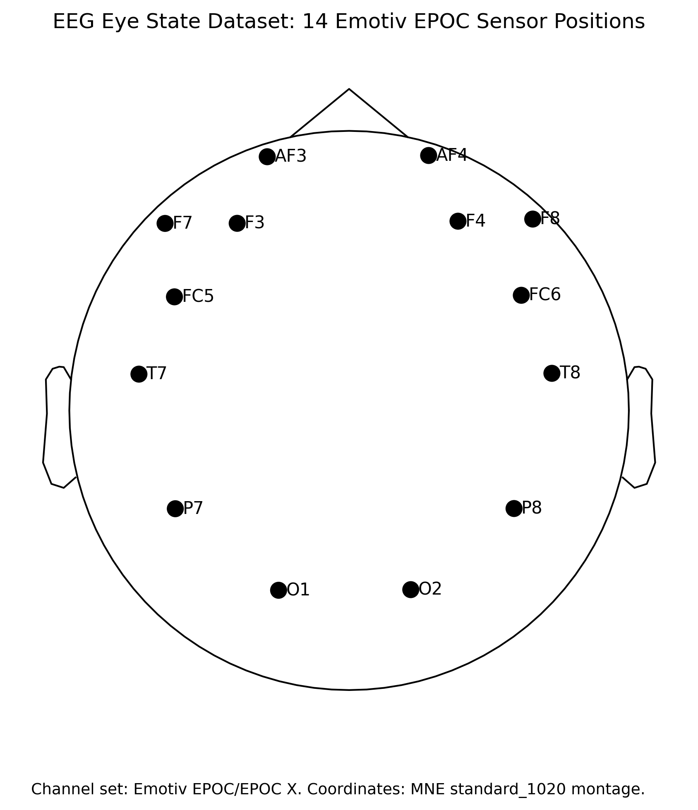

# Exploring Structure in Data: EEG Eye State Dataset and Temporal PCA

## Background: Brain signals, time series, and a different kind of data

Electroencephalography (EEG) measures electrical activity at the scalp by placing small electrodes at standardised positions across the head. Each electrode records a voltage signal reflecting the summed electrical activity of neurons underneath. EEG is fast — it captures changes that occur within milliseconds — and it is widely used in neuroscience and brain–computer interface research.

This dataset contains a recording from **one subject** using the **Emotiv EEG Neuroheadset**, with 14 electrodes placed according to the international 10–20 system:

* Frontal: `AF3`, `F7`, `F3`, `F4`, `F8`, `AF4`
* Central/temporal: `FC5`, `T7`, `T8`, `FC6`
* Parietal/occipital: `P7`, `O1`, `O2`, `P8`

The figure below shows the scalp positions of all 14 electrodes, viewed from above (nose pointing up). The occipital electrodes `O1` and `O2` sit at the bottom — the region most sensitive to visual and alpha-band activity.



The recording lasted **117 seconds** at a sampling rate of **128 Hz** — giving one measurement every 7.8 ms and approximately **14,980 rows** in total. During the recording, the subject alternately opened and closed their eyes. Eye state was determined from a video camera and added manually as a label:

* `eye_state = open` — eyes open
* `eye_state = closed` — eyes closed

In the original UCI dataset, eye state is encoded numerically: **0 = eyes open, 1 = eyes closed**. GoPCA displays these as `open` and `closed` text labels.

> **Note on data quality**: the dataset contains four isolated time points with extreme values — at approximately t = 7 s, 81 s, 90 s, and 103 s — where one or more channels reach values 70–150× the normal signal range (almost certainly brief electrode or cable artifacts). These will appear as isolated extreme points far from the main cluster in the scores plot. They are part of the real dataset and do not need to be removed for this exploration, but keep them in mind when interpreting unexpected structure in the results.

The original research motivation was classification: can the EEG signal alone predict whether the eyes are open or closed? Here, we approach the same data using **Principal Component Analysis (PCA)** — an *unsupervised* method that ignores the labels entirely. The question becomes: what structure does PCA find in the EEG channels on its own, and does that structure relate to eye state?

---

## From Swiss Roll to EEG Eye State: when the problem is time

In the previous tutorial, the Swiss Roll showed us that the shape of the data matters — a linearly inseparable structure required a different PCA method. Here, the challenge is different: the structure is not about geometry, it is about **time**.

| | Swiss Roll | EEG Eye State |
|---|---|---|
| **What each row is** | One independent data point | One snapshot of an ongoing signal |
| **What PCA sees first** | Geometric shape of the data cloud | Spatial correlations between 14 channels |
| **What PCA misses** | Curved manifold structure | Temporal dynamics and oscillations |
| **The solution** | Kernel PCA — work in a higher-dimensional feature space | Temporal PCA — give PCA a memory by embedding time |
| **Why standard PCA fails** | Data lies on a curved surface, not a flat subspace | Shuffling the rows gives *identical* PCA results |

> **The key analogy**: Kernel PCA transforms *space*. Temporal PCA transforms *time*. Both use the same SVD algorithm on a larger, restructured matrix — but the restructuring reveals very different kinds of hidden structure.

This dataset is fundamentally different from Iris, Wine, Corn, and Swiss Roll:

* Each row is **one time point**, not one independent sample — neighbouring rows are consecutive observations separated by 7.8 ms
* The 14 EEG channels are measured **simultaneously** and are correlated in space and in time
* There are no predefined sample classes in the static sense — variation is both spatial (across channels) and temporal (across time)

This is a **multivariate time series**. Standard PCA can find spatial correlation patterns between channels, but it treats each time point as an independent observation and completely ignores the order of the rows. To make PCA sensitive to temporal dynamics, we need to first transform the data — and GoPCA's built-in **Temporal PCA** method does exactly this.

---

## The challenge

EEG data has two kinds of structure simultaneously:

* **Spatial structure**: the 14 channels represent different scalp locations; nearby electrodes tend to respond similarly
* **Temporal structure**: the signal evolves over time; oscillations, bursts, and waveform shapes carry the most meaningful information in EEG

Standard PCA on the raw EEG table reveals only the spatial structure — the correlation between channels. It cannot detect oscillations, repeated waveforms, or delayed relationships between channels, because it does not know which row came before another.

> Standard PCA treats the dataset as a cloud of points. Shuffling the rows would give exactly the same PCA result. It ignores time entirely.

This tutorial therefore has two parts:

* First, run standard SVD PCA on the raw EEG table and examine what it finds
* Then, use GoPCA's **Temporal PCA** method to reveal the temporal structure hidden inside the signals

---

## Step 1: Load the dataset

Click the **EEG Eye State** sample dataset button to load the data.

GoPCA will load the dataset automatically. The `time` column is used as row identifiers and is excluded from the PCA variables. The 14 EEG channel columns are the input variables. The `eye_state` column contains text labels (`open`/`closed`) and is automatically recognised as a categorical column — no manual configuration is needed for this.

In the PCA configuration panel, set:

* **PCA Method** → SVD
* **Preprocessing** → leave at the default for now (no scaling except for mean centering)

The `eye_state` column will be available for colouring your plots. It is not used in the analysis itself — that is the whole point of unsupervised PCA.

#### Questions:

* How many rows and columns does the dataset have?
* What does a single row represent — a single brain measurement, or something else?
* Do you expect neighbouring rows (consecutive time points) to be similar or very different?

👉 Hint: at 128 Hz, two consecutive rows are only 7.8 ms apart. Brain signals change slowly relative to the sampling rate, so neighbouring rows are very similar.

---

## Step 2: Run standard PCA — diagnose the scale problem first

Click **Go PCA** to run the analysis.

Before looking at any plots, read the GoPCA warning banner. You will see something like:

> *"Variables have very different scales (40000× difference). Consider standardisation unless this is intentional."*

This is an important diagnostic signal. All 14 channels are EEG voltages measured in microvolts by the same amplifier — they should in principle be comparable. But this particular dataset contains brief electrode artifacts (see the Background note above) and channels with slightly different impedance conditions, leading to large variance differences between channels.

Now open the **Loadings Plot (PC1)**.

#### Questions:

* Which channels have large loadings (positive or negative)?
* Which channels are near zero?
* Does the pattern of important channels match your expectation from neuroscience — or does it look like a few channels are dominating simply because they have higher variance?

👉 Without scaling, PCA measures *covariance* — it finds the directions of maximum variance. Channels with higher variance automatically dominate, regardless of whether that variance is signal or noise. If two or three channels have far higher variance than the others (perhaps due to artifacts), they will monopolise PC1 and push all genuine signal into later components. This is the scale problem in action.

### Re-run with standardisation

Change the **Preprocessing** setting to **Standard Scaling** (zero mean, unit variance). Click **Go PCA** again.

Open the **Loadings Plot (PC1)** again.

#### Questions:

* How does the distribution of loadings change compared to the unscaled result?
* Do more channels now contribute meaningfully to PC1?
* Do occipital electrodes (`O1`, `O2`) stand out more than before?

👉 With standard scaling, PCA measures *correlation* — all channels are treated as equally important regardless of their raw amplitude. The result reflects which channels *co-vary together*, not which channels happen to have the highest variance. For EEG data with known scale imbalances, this is generally the more informative starting point.

> **A note on when to scale**: EEG channels are all in the same physical units (µV), so standardisation discards amplitude information. If you specifically want to study which brain region generates the strongest signal, unscaled PCA is informative. If you want to understand the *pattern* of co-variation across channels — which is usually the goal in exploratory EEG analysis — standardisation is appropriate. The GoPCA warning is your cue to make this choice deliberately rather than by accident.

Now open the **Scores Plot (PC1 vs PC2)** and colour by `eye_state`.

#### Questions:

* Do you see most samples clustered tightly near the origin, with only a handful of extreme outliers far away?
* Hover over the extreme outliers — what time labels do they carry?
* Do those time values match the artifact time points mentioned in the Background (approximately 7 s, 81 s, 90 s, 103 s)?

👉 If you see this pattern, you are observing a second important effect: **outlier domination**. Standard scaling equalises the variance of each *variable* (column), but it does not protect against extreme *observations* (rows). The four artifact time points have values 70–150× the normal EEG range. Even after standardisation, those four rows have score values far larger than all other observations, so PCA points both PC1 and PC2 towards them — and the remaining ~14,976 normal time points collapse into a tiny cluster near the origin.

This is different from the scale problem we fixed with standardisation:

| Problem | What it is | Fix |
|---|---|---|
| **Scale imbalance** | Different *variables* have very different variance | Standard scaling (column-wise) |
| **Outlier domination** | A few extreme *observations* dominate the components | Identify with Diagnostic Plot, then remove with lasso |

### Identify outliers with the Diagnostic Plot

Open the **Diagnostic Plot**. This plot has two axes:

* **Horizontal axis — Hotelling's T²**: how far an observation is from the centroid *within* the PCA model space. High T² means an unusual combination of scores — the observation is far from the typical pattern, but the model does project it somewhere.
* **Vertical axis — Q-statistic (Residual Sum of Squares)**: how well the PCA model *fits* the observation. High Q means the observation has large residuals — it does not sit close to the subspace spanned by the retained components.

The two dashed red lines divide the plot into four regions:

| Region | T² | Q | Interpretation |
|---|---|---|---|
| Bottom-left | Low | Low | Regular observations — well-fitted and not extreme |
| Top-left | Low | High | **Orthogonal outliers** — unusual structure the model cannot represent |
| Bottom-right | High | Low | **Good leverage** — extreme but on-model; influential on the components |
| Top-right | High | High | **Bad outliers** — both extreme and poorly fitted; most problematic |

#### Questions:

* Where does the main cluster of EEG time points appear — which quadrant?
* Can you identify one or more points in the top-right (Bad Outliers) region? What time labels do they carry?
* Are any extreme points in the bottom-right (Good Leverage) region? What does that tell you about those particular artifact rows?

👉 The artifact time points should appear as extreme outliers — either Bad Outliers (high T² and high Q) or high-leverage points — while the normal ~14,976 time points form a dense cluster inside both limits in the bottom-left. The Diagnostic Plot makes this structure immediately visible, whereas in the Scores Plot it required zooming.

### Remove outliers with the lasso tool

GoPCA lets you select and exclude observations directly from any plot using the **lasso selection tool** in the Plotly toolbar (the lasso icon at the top-right of the plot).

1. Click the **lasso icon** in the plot toolbar
2. Draw a freehand selection around the extreme outlier points — either in the Scores Plot or in the Diagnostic Plot
3. The selected points will be highlighted; GoPCA will offer to **exclude** them from the analysis
4. Click **Go PCA** again to re-run without the selected observations

Repeat until all artifact time points are excluded. You should be left with the ~14,976 normal time points.

#### Questions (after removing outliers and re-running PCA):

* How does the Scores Plot change when the artifact points are removed?
* Do `open` and `closed` samples now show any visible separation?
* Is the separation clear, or do the two states still overlap considerably?
* How does the Diagnostic Plot look now — are all remaining points inside the control limits?

👉 After removing the artifacts, the scores plot should reveal real structure in the data. You may find:

* **PC1** loads all 14 channels with similar magnitude and the same sign — a "global" or "common mode" component capturing the overall correlation between channels. This is the dominant pattern in highly correlated data like EEG, and it does not tell you much about which brain regions are specifically involved.
* **PC2** often shows a more informative spatial contrast — for example, frontal channels (AF3, AF4, F7, F8) on one side, and posterior/occipital channels (P7, O1, O2, P8) on the other. Occipital channels are particularly relevant because they are most sensitive to alpha-band activity associated with eye state.

The scores plot after outlier removal typically shows some separation between `open` and `closed`, but with considerable overlap. This is expected — standard PCA is working only with the spatial correlations between channels at each instant, not with the temporal dynamics. The main lessons from this step are: (1) outlier detection and removal is a standard part of exploratory data analysis; (2) even clean, well-scaled data may not yield clean class separation with standard PCA when the relevant structure is temporal rather than spatial.

---

## Step 3: What standard PCA misses

Standard PCA computes correlations between channels across all rows simultaneously. What it cannot see:

* **Oscillations**: a 10 Hz alpha wave completes one full cycle in 100 ms — about 13 consecutive rows. Standard PCA has no way to detect this periodic structure.
* **Delayed relationships**: one channel's activity may predict another channel's activity a few time steps later. Standard PCA ignores this.
* **Waveform shape**: the characteristic shape of an EEG event (e.g., a slow wave during eye closure) spans many consecutive time points. Standard PCA sees only one snapshot at a time.

#### Questions:

* If you shuffled the 14,980 rows in a random order before running PCA, would the result change?
* What does this tell you about what standard PCA can and cannot detect in time-series data?

👉 Key insight: standard PCA is completely insensitive to the order of rows. A shuffled EEG dataset gives exactly the same PCA scores and loadings. All temporal structure is invisible to it.

---

## Step 4: Temporal structure and the trajectory matrix

To make PCA sensitive to time, we first transform the time series using a **sliding window**. This is the central idea of **Singular Spectrum Analysis (SSA)** and its multivariate extension **MSSA**.

### The embedding step

Instead of describing each time point as one vector of 14 channel values, we describe it as a short sequence of *L* consecutive time points — a **window** of length *L*.

For a single channel, a window of length *L* = 4 starting at time *t* would look like:

```
x(t), x(t+1), x(t+2), x(t+3)
```

For all 14 channels simultaneously (MSSA), the window captures all channels over *L* consecutive time steps. Each window is represented as a row in the **trajectory matrix** — a Hankel-block-Hankel structure where each channel contributes a Hankel block (Golyandina et al., 2015). The trajectory matrix has:

* One row per window position (approximately *T* − *L* + 1 rows, where *T* is the total number of time points)
* One column per channel per lag: 14 channels × *L* lags = 14*L* columns

With *L* = 32 lags and *T* = 14,980 time points, the trajectory matrix has approximately 14,949 rows and 448 columns. SVD is then applied to this larger matrix — the same algorithm as standard PCA, but on a matrix that encodes temporal context in its structure.

### The decomposition step

SVD applied to the trajectory matrix produces components that are no longer simple spatial patterns — they are **spatiotemporal patterns**, capturing which channels co-vary and *how that co-variation evolves over the window*.

**You should use the same preprocessing here as you did for standard PCA — Standard Scaling is appropriate.** GoPCA applies it to the original 14-channel time series first, then builds the trajectory matrix from the scaled data. The 448 columns of the trajectory matrix are never standardised independently — doing so would treat each lag as a separate, unrelated variable and destroy the temporal structure the embedding was designed to reveal.

### The four SSA steps

The full SSA algorithm consists of four steps (Golyandina, 2020):

1. **Embedding** — construct the trajectory (Hankel) matrix using sliding windows
2. **Decomposition** — apply SVD to decompose the trajectory matrix
3. **Grouping** — combine components that represent related structures (e.g., a periodic pair)
4. **Reconstruction** — transform selected components back into the time domain

GoPCA's **Temporal PCA** method implements steps 1 and 2. This is the core of SSA: once the data is embedded, standard linear PCA/SVD on the trajectory matrix reveals the temporal structure.

### Choosing the window length

The window length *L* determines what temporal scale the analysis can resolve. There is no universal correct value — it depends on what structure you are trying to find. Three practical criteria are useful, and ideally all three should agree:

**Criterion 1 — match the oscillation period (most important for EEG)**

For oscillatory signals, *L* should cover at least one to two full periods of the frequency you want to detect (Golyandina, 2020). If the period is shorter than *L*, the sinusoidal pattern will be visible in the Temporal Loadings plot. If the period is longer than *L*, the window is too short to see the oscillation.

For this dataset: eye closure triggers alpha activity at ~8–12 Hz (period 83–125 ms). At 128 Hz, one alpha period is about 11–16 samples. A window of **32 samples (250 ms)** covers 2–3 full alpha cycles — enough to make the oscillation clearly visible.

**Criterion 2 — fraction of the series length**

SSA theory (Broomhead & King, 1986; Golyandina et al., 2015) recommends *L* ≤ *T*/2, where *T* is the total number of time points — so that each window position has at least *L* "partner" positions. Beyond that, a common practical choice is *L* ≈ *T*/4 to *T*/5 for exploratory analysis. For 14,980 time points, this gives *L* ≈ 3,000–4,000 — far larger than needed for EEG, so for this dataset the oscillation-period criterion is the binding constraint.

**Criterion 3 — computational and interpretability budget**

The trajectory matrix has *T* − *L* + 1 rows and *p* × *L* columns, where *p* is the number of channels. Larger *L* gives more temporal context but increases memory use and makes the Temporal Loadings plot harder to read. For this dataset with *p* = 14:

| Lags | Trajectory matrix columns | Duration | Notes |
|-----:|--------:|--------:|-------|
|    8 |   112 |    63 ms | Too short — less than one alpha cycle |
|   16 |   224 |   125 ms | Borderline — one short alpha cycle |
|   32 |   448 |   250 ms | **Recommended** — 2–3 alpha cycles, readable loadings |
|   64 |   896 |   500 ms | Fine, but loadings plot becomes crowded |
|  128 | 1,792 | 1,000 ms | Long window, slow rhythms, harder to interpret |

> **Why not use *L* = *p* = 14 (same as the number of channels)?** That is sometimes suggested as a minimum for MSSA — it ensures the trajectory matrix has at least as many columns per lag block as the original data. But 14 samples at 128 Hz is only 110 ms, which covers less than one full alpha cycle. It is a floor, not a recommended value. For EEG alpha-band analysis, the oscillation-period criterion gives a much more informative result.

> **General rule for other datasets**: start from the dynamics of interest. Convert the period of the slowest oscillation you want to detect into samples (period in seconds × sampling rate). Set *L* to 2–4 times that value. Then check that *L* ≪ *T*/2. If you have no prior knowledge of the oscillation frequency, try *L* = *T*/4 as a starting point and use the Scree Plot to check whether paired components appear.

The key trade-off to keep in mind:

> Increasing the lag gives PCA memory. But too much memory can make the model harder to interpret.

---

## Step 5: Switch to Temporal PCA in GoPCA

Change the **PCA Method** to **Temporal PCA**.

A new option appears: **Number of Time Lags**. Set it to **32**.

Keep **Preprocessing** set to **Standard Scaling** — the same choice we made for standard PCA. The same scale imbalance affects Temporal PCA, because preprocessing is applied to the original time series before the trajectory matrix is built.

Keep the target column as `eye_state` for colouring.

Click **Go PCA**.

GoPCA builds the trajectory matrix internally from the 14 EEG channels: each row of the original data is expanded into a window of 32 consecutive time steps, producing a trajectory matrix with 14 × 32 = 448 columns. SVD is then applied to this matrix. The result has approximately *T* − *L* + 1 = 14,949 score rows — one per window position.

Open the **Scores Plot** and colour by `eye_state`.

#### Questions:

* Does the separation between `open` and `closed` improve compared to standard SVD PCA?
* The scores are plotted in time order — do you see a connected trajectory drifting through PC1–PC2 space? Can you identify stretches where the trajectory is predominantly blue (open) or orange (closed)?
* During open-eye periods, does the trajectory move to more negative or more positive PC1 values?

👉 Temporal PCA gives each observation a 32-step context window (250 ms), so consecutive score points represent overlapping windows — they are connected in time. The connected-dot appearance is not noise; it reveals the temporal dynamics of the EEG. Open-eye periods typically produce scores that drift in a specific direction in PC space, reflecting the suppression of certain oscillatory patterns when eyes are open (alpha suppression). Closed-eye periods tend to cluster more densely near a different region of PC space.

**Note on available plots**: some plots available for SVD PCA are not available for Temporal PCA — specifically the **Loadings Plot**, **Biplot**, **3D Biplot**, **Circle of Correlations**, and **Diagnostic Plot**. These require loadings in the original variable space, which Temporal PCA does not produce directly (loadings live in the higher-dimensional trajectory space). Instead, two dedicated plots are available: **Temporal Loadings** and **Variable Importance**.

---

## Step 6: Interpret the Temporal Loadings Plot

Open the **Temporal Loadings** plot.

This plot is unique to Temporal PCA. It shows the **temporal eigenvectors** — the characteristic temporal shape of each principal component across the 32 lag positions.

Each curve in the plot corresponds to one principal component (PC1, PC2, PC3, ...). The horizontal axis is the lag index from 0 to *L*−1, and the vertical axis is the eigenvector value at that lag position.

> **Important**: these curves are *not* one line per EEG channel. They are one line per component, showing how the temporal pattern of that component unfolds across the window.

Where do these curves come from? When SVD is applied to the trajectory matrix it produces a V matrix (right singular vectors) of shape [*p*·*L* × rank]. The V matrix encodes, for every component, how much each (channel, lag) combination contributes. GoPCA computes the **signed mean** of these loadings across the *p* channel dimensions at each lag, producing one signed value per lag per component. The result is a curve of length *L* per component that captures the **intrinsic temporal shape** of each component across the window (Broomhead & King, 1986; Vautard & Ghil, 1989).

* A curve that oscillates as a sinusoid — crossing zero, rising and falling — indicates a periodic component. The number of zero-crossings tells you the frequency: two zero-crossings per window = one full cycle per window length.
* A curve that is monotone (gradually rising or falling) indicates a slow trend — the component captures structure that evolves directionally across the window.
* A curve that is nearly flat across all lags indicates a global mean shift — equal contribution at every lag position, no temporal directionality.

#### Questions:

* Does the curve for PC1 cross zero — or is it flat or monotone?
* Do any components show sinusoidal curves that oscillate across the 32 lag positions?
* Do two adjacent components (e.g., PC2 and PC3) show similar sinusoidal shapes?

👉 Key insight: when two adjacent components both show sinusoidal Temporal Loadings curves that are approximately 90° out of phase with each other, they form a **paired oscillatory mode** — the subject of the next step.

---

## Step 7: Paired components and the Scree Plot

Open the **Scree Plot** alongside the Temporal Loadings plot.

### Oscillatory modes come in pairs

A fundamental property of SSA is that **oscillatory signals produce pairs of components** (Vautard & Ghil, 1989). When a periodic signal is present in the data, SSA extracts two components that together represent it: one resembling a sine wave and one resembling a cosine wave. They are in quadrature — offset by exactly one quarter of the oscillation period.

You can identify these pairs in two ways:

1. **In the Scree Plot**: a pair of components will have nearly identical explained variance — two bars of the same height sitting side by side
2. **In the Temporal Loadings Plot**: the two components' curves will be similar sinusoids shifted by approximately 90° (a quarter-cycle phase offset)

Neither component alone gives the full picture. Together, they encode one complete oscillation at a specific frequency.

For EEG, you might expect to find:
* A dominant slow component (PC1) capturing the eye-state related shift — a slow modulation rather than a fast oscillation
* One or more oscillatory pairs (e.g., PC2 + PC3) corresponding to alpha-band activity (~10 Hz)

#### Questions:

* How many components are needed to explain the bulk of the variance?
* Do you see any adjacent pairs of components with nearly equal explained variance in the Scree Plot?
* In the Temporal Loadings Plot, do those same paired components show 90°-shifted sinusoidal curves?
* How many complete oscillation periods fit within the 32-lag window for a 10 Hz signal at 128 Hz?

👉 Quick calculation: a 10 Hz alpha wave has a period of about 12.8 samples at 128 Hz. Over 32 lags you would see approximately 2.5 complete cycles — enough for the sinusoidal pattern to be clearly visible in the Temporal Loadings curve.

---

## Step 8: Examine the Variable Importance plot

Open the **Variable Importance** plot.

This plot shows the aggregated contribution of each original EEG channel across all time lags, for each temporal principal component. Contributions are computed using root mean square (RMS) aggregation across lags: for each (channel, component) pair, GoPCA computes the square root of the mean squared loading across all *L* lag positions. This collapses the lag dimension and tells you which *channels* drive each component, regardless of when within the window.

The result is a heatmap: rows are principal components, columns are the 14 EEG channels. Brighter cells mean the channel contributes strongly to that component.

#### Questions:

* Which EEG channels contribute most strongly to the first temporal component?
* Do occipital electrodes (`O1`, `O2`) appear more or less important here than in standard PCA?
* Is the pattern of variable importance similar across components, or does each component emphasise different channels?
* Does the spatial pattern of important channels make physiological sense — for example, are occipital channels highlighted for alpha-wave related components?

👉 Variable Importance answers the question standard Temporal Loadings cannot directly answer: *which channels* drive each component. The Temporal Loadings plot tells you *what temporal shape* the component has; Variable Importance tells you *where on the scalp* it originates.

---

## Step 9: Experiment with the Number of Time Lags

Change the **Number of Time Lags** and observe how the results shift. Try these values in order:

* **8 lags** → 63 ms — very short memory, dominated by adjacent-sample correlations
* **16 lags** → 125 ms — short temporal context, less than one full alpha cycle
* **32 lags** → 250 ms — recommended default, 2–3 alpha cycles
* **64 lags** → 500 ms — stronger temporal context, trajectory matrix grows larger

After each change, click **Go PCA** and examine the **Scores Plot**, **Temporal Loadings**, and **Scree Plot**.

#### Questions:

* Does the separation between `open` and `closed` change as *L* increases?
* Do the Temporal Loading curves become smoother or more oscillatory with longer windows?
* Does the number of components needed to explain most variance increase or decrease?
* Is there a window length where the eye-state separation appears clearest?
* At 16 lags (125 ms), is one full alpha cycle visible in the Temporal Loadings plot — or is the window too short?
* At what point does the trajectory matrix become so wide that interpretation becomes difficult?

👉 The key trade-off: a short window cannot see a full oscillation cycle, so components reflect adjacent-sample correlations rather than meaningful rhythms. A very long window adds more temporal context, but makes the trajectory matrix much wider and the components harder to interpret. Too much memory can obscure structure rather than reveal it.

---

# What you should take away

After this exploration, you should be able to:

* Explain why EEG data is a multivariate time series and why rows are not independent
* Understand why standard PCA ignores temporal order — and what this means in practice
* Diagnose a scale problem from the GoPCA warning and the Loadings Plot, and make a deliberate choice between covariance PCA (unscaled) and correlation PCA (standardised)
* Describe the SSA embedding step: sliding windows, trajectory matrix, window length *L*
* Interpret the **Temporal Loadings** plot: one curve per component, showing the temporal eigenvector shape across lag positions — not one curve per channel
* Recognise **paired oscillatory components** in the Scree Plot (equal variance) and Temporal Loadings Plot (90°-phase-shifted sinusoids)
* Use **Variable Importance** to identify which channels drive each temporal component
* Make an informed choice of window length based on the sampling rate and the dynamics of interest

You should also recognise the trade-off:

* Standard SVD PCA is simple, fast, and easy to interpret — each loading is one channel
* Temporal PCA reveals rhythmic and dynamic structure invisible to standard PCA, but the trajectory matrix is much larger and the components require the Temporal Loadings plot and Variable Importance to interpret together

---

## Final Reflection

> Standard PCA treats the EEG table as a collection of independent snapshots. Temporal PCA, by embedding the data into sliding windows, gives PCA access to *sequences* — and the resulting components can represent oscillations and temporal dynamics rather than just spatial correlations. The same SVD algorithm is used in both cases; the embedding step is what makes the difference.
>
> In SSA, oscillatory signals leave a characteristic fingerprint: a pair of components with equal singular values, 90°-phase-shifted temporal eigenvectors, and the same spatial pattern of channel importance. Learning to recognise this fingerprint is the core skill of temporal dimensionality reduction.

#### Questions:

* Why does shuffling the rows of an EEG table leave standard PCA unchanged, but break Temporal PCA?
* The SSA algorithm has four steps: embedding, decomposition, grouping, and reconstruction. GoPCA implements the first two. What would you gain from the grouping and reconstruction steps — and what tasks would those enable?
* A window length of 32 at 128 Hz covers 250 ms. Alpha oscillations have a period of roughly 100 ms. What window length would you choose if you were primarily interested in theta band activity (4–8 Hz, period 125–250 ms)?
* Could the Temporal PCA scores be used as input features to a classifier predicting `eye_state`? What might be the advantage compared to using the raw EEG values?
* If you found a paired component (PC2 + PC3) corresponding to alpha oscillations, and PC1 captured the eye-state shift, which components would you group together before reconstruction in a full SSA analysis?

---

## References

Broomhead, D. S., & King, G. P. (1986). Extracting qualitative dynamics from experimental data. *Physica D: Nonlinear Phenomena*, 20(2–3), 217–236. https://doi.org/10.1016/0167-2789(86)90031-X

Vautard, R., & Ghil, M. (1989). Singular spectrum analysis in nonlinear dynamics, with applications to paleoclimatic time series. *Physica D: Nonlinear Phenomena*, 35(3), 395–424. https://doi.org/10.1016/0167-2789(89)90077-8

Ghil, M., Allen, M. R., Dettinger, M. D., Ide, K., Kondrashov, D., Mann, M. E., Robertson, A. W., Saunders, A., Tian, Y., Varadi, F., & Yiou, P. (2002). Advanced spectral methods for climatic time series. *Reviews of Geophysics*, 40(1), 1003. https://doi.org/10.1029/2000RG000092

Golyandina, N., Korobeynikov, A., Shlemov, A., & Usevich, K. (2015). Multivariate and 2D extensions of singular spectrum analysis with the Rssa package. *Journal of Statistical Software*, 67(2), 1–78. https://doi.org/10.18637/jss.v067.i02

Golyandina, N. (2020). Particularities and commonalities of singular spectrum analysis as a method of time series analysis and signal processing. *WIREs Computational Statistics*, 12(4), e1487. https://doi.org/10.1002/wics.1487

Roesler, O., & Suendermann, D. (2013). A first step towards eye state prediction using EEG. In *Proceedings of the AIHLS 2013*. UCI Machine Learning Repository. https://archive.ics.uci.edu/dataset/264/eeg+eye+state
