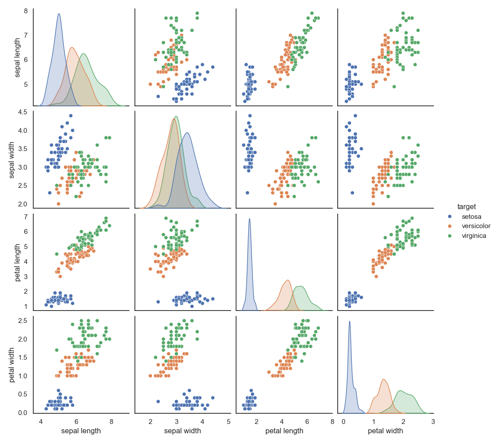

# Exploring Structure in Data: The Iris Dataset and PCA

## Background: A classic dataset

In 1936, the statistician and biologist Ronald Fisher published one of the most famous datasets in data analysis: the **Iris dataset**. The measurements were originally collected by botanist **Edgar Anderson**, who measured 150 iris flowers in the field. Fisher used the data as an example of **linear discriminant analysis (LDA)** — a supervised method for separating known groups.

Here, we will approach the same dataset with **Principal Component Analysis (PCA)** — an *unsupervised* method that reveals structure without using the species labels. This is a deliberately different question: can we discover the grouping on our own, just from the measurements?

The dataset contains measurements of 150 iris flowers belonging to three species:

*Iris setosa — Photo: Tia Monto*

*Iris versicolor — Photo: Charles de Mille-Isles*

*Iris virginica — Photo: Frank Mayfield*

For each flower, four variables (features) were measured (in cm):

* Sepal length
* Sepal width
* Petal length
* Petal width

This means each flower is described by **4 variables**, or equivalently, each sample lives in a **4-dimensional space**.

---

## First look at the data

Below you see a *pair plot* of the dataset, showing all pairwise relationships between variables. The diagonal shows the distribution of each individual variable, either as a density curve (KDE), revealing how the values of a single feature are spread (e.g. center, variability, skewness).

Take a few minutes to look at it carefully.

---

### Reflect:

* Can you already see separation between species?
* Which variables seem most important?
* Are some variables strongly correlated?

👉 You are currently looking at **many 2D projections of a 4D dataset**.
This is useful — but also limited.

---

## Could you just use the pairplot?

For the Iris dataset, with only 4 variables, the pairplot is manageable — and the species separation is already visible. So why bother with PCA?

The answer becomes clearer when you scale up. The number of panels in a pairplot grows as *N(N−1)/2*:

| Variables | Pairplot panels |
|----------:|----------------:|
|         4 |               6 |
|        13 |              78 |
|       100 |           4,950 |
|      1000 |         499,500 |

The Wine dataset in this application has 13 variables — that is already 78 panels to inspect. In spectroscopy or genomics, datasets routinely have hundreds or thousands of variables. A pairplot becomes impossible.

PCA solves this by finding the **single 2D projection that retains the most variance** — provably the best linear summary available. The scores plot is not just *a* 2D view of the data; it is the *optimal* one. And the explained variance percentage shown on the axis labels tells you exactly how much information was kept in that projection.

The **biplot** adds a second layer the pairplot cannot provide: the loading vectors show *why* the samples are arranged as they are — which original variables pull in which directions. This connects the compressed view back to the measurements you actually took.

> The pairplot shows you what you measured. The PCA scores plot shows you the structure hidden across all measurements simultaneously.

---

## The challenge

Working directly in 4 dimensions is difficult. Even with pair plots, we only ever see *two variables at a time*.

Your task is to use **Principal Component Analysis (PCA)** to:

> Reduce the dimensionality of the dataset while preserving as much structure as possible.

Think of PCA as:

* A way to **compress** the data
* A way to **rotate the coordinate system**
* A way to find **new axes that reveal patterns more clearly**

---

# Your task: Discover the structure using PCA

You will use the application **GoPCA** to explore the dataset.

Do not try to "get the right answer" immediately.
Instead, **experiment, observe, and reflect**.

---

## Step 1: Load the data and run PCA

* Load the Iris dataset into GoPCA (if you pressed the "Iris" button to view this tutorial file, the data is already loaded)
* Run PCA with default settings

### Look at the **Scores Plot (PC1 vs PC2)**

#### Questions:

* Do the species form clusters?
* Is any species clearly separated?
* How much of the data structure seems captured in 2D?

👉 Hint: One species is usually much easier to separate than the others.

---

## Step 2: Explore explained structure

Look at how much variation is captured by the first components.

#### Questions:

* How many principal components seem "enough"?
* Does 2D capture most of the structure, or do you need 3D?

👉 Try switching to a **3D Scores Plot**:

* Does separation improve?
* Is the added dimension useful?

---

## Step 3: Understand *why* the separation happens

Now open the **Loadings Plot**.

This plot tells you how the original variables contribute to the principal components.

#### Questions:

* Which variables influence PC1 the most?
* Which variables influence PC2?
* Are some variables pointing in similar directions (correlated)?

👉 Hint:

* Variables pointing in the same direction → positively correlated
* Opposite directions → negatively correlated
* Long arrows → strong influence

---

## Step 4: Combine both views (Biplot)

Open the **Biplot**, which shows:

* Samples (scores)
* Variables (loadings)

in the same plot.

#### Questions:

* Which variables "pull" the clusters apart?
* Why is one species clearly separated?
* Which measurements seem most important for distinguishing species?

👉 Hint:

* Look especially at **petal-related variables**

---

## Step 5: Use color and grouping

In GoPCA, set the **target column** to the species column to color samples by species. Then enable **Confidence Ellipses**.

#### Questions:

* How distinct are the clusters?
* Do ellipses overlap?
* Which species are hardest to distinguish?

👉 Try adjusting the confidence level (90%, 95%, 99%):

* What happens to the overlap as you increase the confidence level?

---

## Step 6: Investigate preprocessing (very important!)

Now repeat the analysis with different preprocessing settings.

In GoPCA, try switching between:

* **Mean Center Only** — subtracts the mean of each variable, but does not rescale
* **Standard Scale** — subtracts the mean *and* divides by the standard deviation, giving each variable unit variance

#### Questions:

* Does the PCA result change between the two settings?
* Which variables dominate when you use **Mean Center Only**?
* Why might **Standard Scale** be important here?

👉 Hint:

* All four variables are measured in cm, but petal measurements have much larger variance than sepal measurements. When you skip standardization, variables with larger variance will dominate the principal components — regardless of whether that variance is informative.

---

## Step 7: Push your understanding further

Try these explorations:

* **Focus only on two species** by filtering the dataset in GoCSV before loading into GoPCA

  * Are two species easier to separate than three?

* **Exclude one variable at a time** using GoCSV's column selection

  * Does separation get worse or better when you remove petal length?
  * What about sepal width?

* **Rotate the 3D plot interactively**

  * Do you see structure not visible in the 2D plot?

---

# What you should take away

After completing this exploration, you should be able to:

* Understand PCA as a **tool for dimensionality reduction**
* Interpret:

  * Scores plots
  * Loadings plots
  * Biplots
* Explain how PCA can:

  * Reveal hidden structure in unlabelled data
  * Compress high-dimensional data into fewer dimensions
* Recognize the importance of:

  * Preprocessing (mean centering vs. standardization)
  * Variable relationships and correlation

---

## Final reflection

Think about this:

> You started with 4 variables and many pairwise plots.
> With PCA, you reduced the dataset to 2–3 dimensions and *revealed its structure more clearly*.

* Did PCA make the data easier to understand?
* What information was preserved — and what might have been lost?
* Fisher used LDA on this same dataset. How do you think PCA and LDA would differ in what they reveal?
