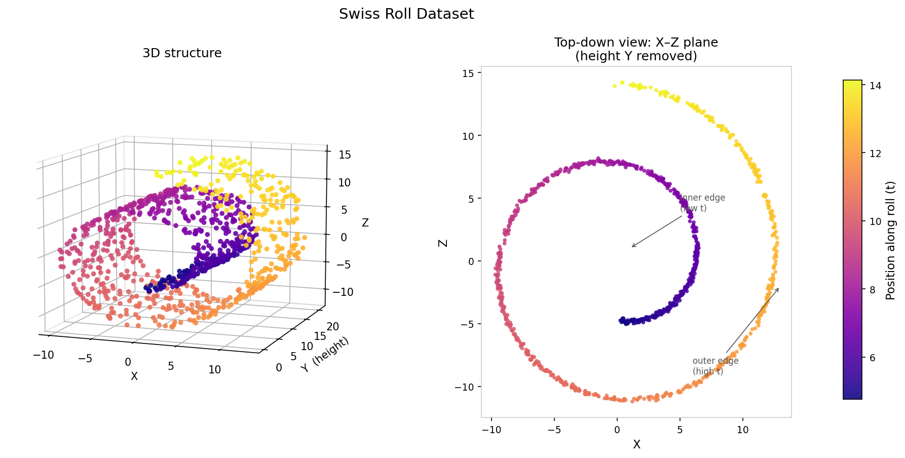

# Exploring Structure in Data: The Swiss Roll Dataset and Kernel PCA

## Background: Manifolds, geometry, and the limits of linear methods

The Swiss Roll is a **synthetic benchmark** — a dataset constructed mathematically rather than measured in the real world. Synthetic datasets play a special role in data science: they let us test what an algorithm *should* find, because we already know the true answer.

The dataset consists of **1,000 samples** in three dimensions:

* `X`, `Y`, `Z` — the 3D coordinates of each point
* `color #target` — position along the roll, used only for colouring plots (not included in the analysis)

The data is generated from two underlying parameters:

* *t* — controls position along the length of the roll (the "unrolled" coordinate, ranging from the inner edge to the outer edge)
* *h* — a random height offset, adding thickness to the sheet

The 3D coordinates follow from:

* x = t · cos(t)
* y = h
* z = t · sin(t)

The `color #target` column stores the raw value of *t* and is used only for colouring the scores plot — it plays no part in the analysis. When you load the dataset, this colouring is applied automatically.

The true structure is a **flat 2D sheet wound into a helix in 3D space**. This type of structure is called a **manifold** — a surface that is locally flat but globally curved. A piece of paper lying on a table is flat; roll it up and it becomes a manifold embedded in 3D. The Swiss Roll is exactly this: a flat 2D sheet with coordinates *t* and *h*, curled into a spiral shape.

The central question of this tutorial is:

> Can PCA find and unroll this manifold — or does it fail?

---

## From Corn to Swiss Roll: when the problem is not dimensionality

The previous datasets each introduced a new kind of challenge:

| Dataset | Variables | Challenge |
|---------|-----------|-----------|
| Iris | 4 | Visualising 4 dimensions at once |
| Wine | 13 | Mixed scales; 78 pairplot panels |
| Corn NIR | 700 | 244,650 panels; extreme collinearity; physical scatter artefacts |
| Swiss Roll | **3** | **None of the above** |

The Swiss Roll has only **three variables**. There is no dimensionality problem — you can plot the data directly in 3D and see the entire structure at once. The variables are simple coordinates, measured in identical units, with no scale differences requiring correction.

And yet linear PCA — which handled 700 highly correlated spectral variables with reasonable accuracy — fails completely on the Swiss Roll.

This is the Swiss Roll's lesson. The failure of PCA is not always a matter of having too many variables. It is a matter of the **shape** of the data.

For Corn, the dominant variation was a physical baseline artefact: a monotone tilt that PCA picked up instead of chemistry. The fix was SNV preprocessing — applied before PCA. For Swiss Roll, the problem is more fundamental. The structure you want to find is **curved in 3D space**, and no amount of preprocessing can fix that. A different kind of PCA is needed.

> The Swiss Roll confronts you with a 3-variable dataset where you can see the problem with your own eyes — and forces you to think clearly about what "structure" means and how to find it.

---

## Why this matters: curved structure in real data

The Swiss Roll is synthetic — designed to make the geometric problem as clear as possible. But curved, nonlinear structure appears in genuine scientific and industrial data, and it poses exactly the same challenge.

**Face recognition.** Images of a face change dramatically with pose and lighting, even though the underlying identity stays constant. The relationship between pixel values and the factors that matter — who the person is — is highly nonlinear. Linear PCA (historically called "Eigenfaces") groups faces by their dominant pixel variation, which is often lighting rather than identity. A kernel with an RBF or polynomial function can capture the nonlinear pixel correlations that define a specific person's features and is more robust to these confounding factors (Thompson, 2014).

**Image denoising.** When an image is corrupted by noise, the underlying clean image typically lives on a low-dimensional nonlinear manifold in pixel space. Linear PCA cannot cleanly separate noise from high-frequency image features because it treats the two as equally linear. Kernel PCA maps the noisy image into a feature space where the clean structure becomes more linearly accessible; projecting onto the leading kernel components and mapping back removes noise while better preserving fine detail (Mika et al., 1998).

**Industrial process monitoring.** Sensors on a manufacturing line record temperature, pressure, vibration, and flow simultaneously. The "normal" operating envelope is not a flat ellipse — it is often a curved cycle that shifts with production conditions. A linear PCA control chart imposes a flat boundary, which either misses real anomalies or triggers false alarms when the process follows its natural curve. Kernel PCA can model the nonlinear shape of normal operation; a deviation from the kernel manifold then flags a genuine problem more reliably (Botre et al., 2022).

**Genomics.** Gene expression profiles of cells undergoing differentiation trace curved trajectories in high-dimensional gene space. As a cell transitions from one type to another, the changes in individual gene activities combine in nonlinear ways — the trajectory bends rather than travelling in a straight line through expression space. Kernel PCA and related nonlinear methods can unfold these trajectories, separating stages of differentiation that appear as an overlapping cloud under linear projection.

In each case, the underlying structure is real and low-dimensional — but it is curved. A linear projection squashes it; a kernel method can follow it.

---

## First look at the data

The figure below shows two views of the same 1,000 data points, coloured by position along the roll (the `color #target` value):

**Left panel — 3D perspective**: the full shape in three dimensions. You can see the rolled sheet: a band of data wound into a spiral, with the height dimension (*Y*) giving it thickness. The colour gradient runs from dark purple (inner edge, low *t*) through orange to yellow (outer edge, high *t*) along the length of the roll.

**Right panel — top-down view (X–Z plane)**: the same data with the height axis (*Y*) removed entirely. This reveals the concentric spiral structure directly. The inner and outer arms of the spiral — dark purple and yellow — run side by side, separated only by the gap between adjacent turns.

Study both panels before running any analysis.

### Reflect:

* In the 3D view: trace the colour gradient from dark purple inward to yellow at the outer edge. Can you follow it continuously along the surface of the roll? *(Hint: run your finger along the surface — never lift it, never cut through the interior.)*
* In the top-down view: the inner edge (dark purple) and outer edge (yellow) are physically close in the X–Z plane — they are separated by only the width of one gap between spiral turns. How far apart are they if you instead trace along the surface of the sheet? *(Hint: think of a roll of paper. The first centimetre of paper and the last centimetre are neighbours when the roll is wound — but how far apart are they when you unroll it?)*
* If you could cut the roll along one edge and flatten it completely, what shape would you get? *(Hint: what is the shape of a single sheet of A4 paper before you roll it?)*

👉 A perfectly flattened Swiss Roll would be a rectangle: one axis is *t* (position along the roll, from low to high), the other is *h* (height *Y*). The top-down spiral view makes the core problem immediately visible: the inner and outer edges sit physically adjacent in 3D space, yet they are at opposite ends of the unrolled sheet. Any method that measures straight-line distances through 3D space will see them as neighbours — and fail to unroll the manifold.

---

## The challenge

The Swiss Roll is a **2D structure embedded in 3D space**. The challenge is not compression — it is **unrolling**: finding the coordinates that describe position on the flat sheet, rather than position in 3D space.

Linear PCA finds directions of maximum variance using straight-line projections through the data cloud. Your task in this tutorial is to understand:

> When and why does linear PCA fail — and what does Kernel PCA do differently?

---

# Your task: Explore the Swiss Roll using GoPCA

Work through the steps in order. The sequence matters: the first step deliberately demonstrates failure, so that the later steps make sense.

---

## Step 1: Load the data and see the 3D structure

Load the Swiss Roll dataset into GoPCA by clicking the **Swiss Roll** button.

The dataset loads automatically with the `color #target` column pre-selected as the colour variable. You do not need to set anything — GoPCA assigns this as the default colouring when the button is clicked.

Do not run PCA yet. Familiarise yourself with what is shown in the data panel.

#### Questions:

* How many rows (samples) and columns (variables) does the data table show?
* Only three numeric columns appear — `X`, `Y`, and `Z`. Why is `color #target` not visible in the table?
* Study the 3D figure above: what will "low colour values" (inner edge of the roll) and "high colour values" (outer edge) look like in the scores plot if PCA correctly unrolls the manifold?

👉 There are 1,000 samples and 3 numeric variables — a tiny dataset by modern standards. This makes the subsequent failure of linear PCA all the more striking.

---

## Step 2: Run linear PCA and diagnose the failure

Set:

* **PCA Method** → SVD

Leave all other settings at their defaults. 

Click **Go PCA** and look at the Visualization **Scores Plot** when it appears. Leave the colour variable as `color #target` (pre-selected automatically).

#### Questions:

* Does the colour gradient run smoothly from low values (inner edge) to high values (outer edge) across the plot?
* Or are low and high colour values mixed together — samples from opposite ends of the roll landing on top of each other?
* Does the scores plot resemble the flat rectangle you imagined — or is the colour pattern jumbled?

👉 The scores plot forms a **tilted oval or elliptical ring** — a classic artefact of applying a linear projection to curved data. The colour appears to flow continuously around the ring: dark navy (low *t*) sits at the left, sweeping through purple and pink along the top arc, while a separate branch of peach and salmon sweeps around the bottom arc, with cream/yellow (high *t*) appearing at both the upper-right and lower-right tips (assuming that you use the "Rocket" color palette). At first glance this looks like an ordered gradient — but it is deceptive. The colour is running in a **closed loop around the ring**, not in a straight line from one end of a rectangle to the other. A correctly unrolled Swiss Roll would place all the dark navy samples at one side and all the cream/yellow samples at the opposite side, with a clean gradient between them. Here, the high-*t* samples (cream/yellow, outer edge) have been **split into two separate clusters** — one in the upper-right and one in the lower-right of the plot — while the low-*t* samples (dark navy, inner edge) are bunched together on the left. A correctly unrolled roll would place all the cream/yellow samples together at one end of a rectangle and all the navy samples at the other. Instead, the outer edge of the roll has been torn apart and wrapped around both sides of the ring. The roll has been **squashed and folded**, not unrolled.

Now open the **Scree Plot**.

#### Questions:

* How much variance does PC1 explain?
* Does a high explained variance mean the structure has been correctly recovered?

👉 **This is the key diagnostic moment.** You should see PC1 explaining around 41% of the variance and PC2 around 30% — a total of roughly 71% for the first two components together. Notice also that there is **no clear elbow**: the variance does not drop sharply after PC1. This is itself a warning sign — it means PCA has not found one dominant direction that captures most of the structure. The variance is spread out because the spiral has roughly equal extent in every direction through 3D space.

But the deeper point is this: even 71% combined explained variance tells you nothing about whether the *manifold* has been correctly recovered. Variance is a property of the coordinate system — not of the geometry of the roll. The scores plot, coloured by *t*, is the only diagnostic that reveals the failure.

Compare this to Corn: there, PC1 explained 99% of variance, and the loading curve (monotone, never crossing zero) immediately revealed it was capturing a physical baseline artefact. Here, the scree plot looks unremarkable — no single dramatic number, no obvious red flag. The failure is entirely invisible until you look at the scores plot with a meaningful colour variable.

> The Swiss Roll teaches a habit that applies to every dataset: always inspect the scores plot with a meaningful grouping variable before concluding that PCA has succeeded.

---

## Step 3: Why linear PCA fails — and how Kernel PCA works

### The geometric problem

Linear PCA finds the direction of maximum variance using a **straight-line** projection. For the Swiss Roll, the direction of greatest straight-line variance runs diagonally through the roll — from one side of the spiral to the other — because the outer and inner edges span the largest physical extent in 3D.

Points that are far apart *along the surface of the manifold* (for example, at opposite ends of the unrolled sheet) may be physically close in 3D space, because the roll curves back towards itself. When linear PCA projects everything onto a flat plane, these points end up on top of each other. The roll has not been unrolled — it has been squashed.

**Analogy**: imagine a map of a mountain range, rolled into a tube. If you project the tube onto a flat surface from the side, nearby points on the map may be projected on top of each other. The only way to recover the true map is to unroll the tube — to follow the surface, not to cut through it.

### The kernel trick

Kernel PCA addresses this by replacing the linear covariance structure with a **kernel function** that measures similarity between data points. The key idea, introduced by Schölkopf, Smola & Müller (1997, 1998), is to perform PCA not in the original 3D space but in a transformed feature space **F** — implicitly, without ever computing the transformation explicitly.

The **RBF (Gaussian) kernel** used here is:

> k(x, y) = exp(−γ · ‖x − y‖²)

where:
* ‖x − y‖² is the squared Euclidean distance between points x and y in the original 3D space
* γ (gamma) is a free parameter controlling how quickly the kernel falls off with distance
* k(x, y) ranges from 0 (very dissimilar) to 1 (identical)

**Concrete example with γ = 0.01**: two points 3 units apart give k = exp(−0.01 · 9) ≈ 0.91 (very similar). Two points 10 units apart give k = exp(−0.01 · 100) ≈ 0.37 — this is the "1/e distance" at which similarity has fallen by a factor of e, roughly marking the edge of the kernel's effective neighbourhood. Two points 30 units apart give k = exp(−0.01 · 900) ≈ 0.000001 (negligible). The Swiss Roll coordinates span roughly 25 units in each dimension, so a kernel with γ = 0.01 gives meaningful similarity to points within about 10 units, while ignoring those that are much farther. With γ = 0.1 (ten times larger), the same points 10 units apart give k = exp(−10) ≈ 0.00005 — essentially zero. For the Swiss Roll, γ = 0.1 is far too local: almost every pair of non-neighbouring samples gets a kernel value near zero, the matrix is nearly empty, and PCA finds nothing.

### The kernel matrix

Instead of computing the p×p covariance matrix of the original variables (as linear PCA does), Kernel PCA computes an **n×n kernel matrix** **K**:

> K_ij = k(x_i, x_j) = exp(−γ · ‖x_i − x_j‖²)

For the Swiss Roll, this is a **1,000×1,000 matrix** where every entry encodes the RBF similarity between a pair of samples. The principal components are then extracted by eigendecomposing K (after centering), rather than the data covariance.

This has two important consequences:

**1. The number of components is not limited by the number of input variables.** Linear PCA on 3 variables can yield at most 3 components. Kernel PCA on 1,000 samples can yield up to 1,000 components, because the eigendecomposition is of the n×n kernel matrix. The implicit feature space **F** can be vastly larger — even infinite-dimensional for the RBF kernel.

**2. There are no loadings in the original variable space.** In linear PCA, each principal component is a direction in the original p-dimensional space: you can say "PC1 is 0.52 of variable X, 0.38 of variable Y, ...". In Kernel PCA, the principal components are directions in **F**. A direction in **F** is a linear combination of the feature-space images of the training points — there is no way to map this back to a simple weight per original variable. This is why the **Loadings Plot**, **Biplot**, and **Circle of Correlations** are unavailable when Kernel PCA is selected in GoPCA: those plots require loadings in the original space, and no such thing exists.

What *does* exist is the **scores** — the projections of each sample onto the kernel principal components. The scores plot remains available and is the primary output of Kernel PCA.

---

## Step 4: Apply Kernel PCA and compare to linear PCA

Change:

* **Column Preprocessing** → Variance Scale
* **PCA Method** → Kernel PCA
* **Kernel Type** → RBF
* **Gamma** → 0.01

Click **Go PCA** and open the **Scores Plot**.

#### Questions:

* Compare the colour pattern to the linear PCA result from Step 2. Is the colour gradient more organised?
* Can you see that low colour values (inner edge) and high colour values (outer edge) are somewhat more separated than before?
* Is the result a clean rectangular unrolling — or is there still some mixing?

👉 The result is a **clear improvement over linear PCA, but not a perfect unrolling**. The high-value samples (cream/yellow, outer edge of the roll) are pulled away from the mass and cluster more distinctly, and the colour gradient is noticeably more organised than the closed oval loop you saw in Step 2. But the scores plot does not show the clean flat rectangle you might expect from a truly unrolled manifold — considerable mixing remains in the middle range of colour values.

This is an honest and important result. The RBF kernel measures **straight-line Euclidean distance** in 3D. It cannot distinguish between two points that are *close in 3D space but on opposite layers of the spiral* and two points that are *close because they are genuine neighbours along the surface*. No choice of gamma fully resolves this: too small a gamma and adjacent layers are treated as similar (structure blurs together); too large a gamma and the kernel sees only immediate neighbours and the manifold fragments into disconnected islands.

A **perfect unrolling** of the Swiss Roll requires methods that compute *geodesic* distance — the path length along the manifold surface rather than the straight-line shortcut through 3D space. Methods such as **Isomap** or **LLE (Locally Linear Embedding)** were designed for exactly this. Kernel PCA with an RBF kernel is a general nonlinear method; it reveals curved structure better than linear PCA, but cannot follow the manifold surface the way geodesic methods can.

> This limitation is not a failure of Kernel PCA — it is a boundary condition. For many real datasets with milder curvature, Kernel PCA works very well. The Swiss Roll is a deliberately extreme case designed to test these limits.

**Preprocessing note**: when Kernel PCA is selected, GoPCA restricts column-wise preprocessing to **Variance Scale** or **None**. Mean centering is unavailable — and genuinely irrelevant — because the RBF kernel is *translation-invariant*: k(x_i, x_j) = exp(−γ · ‖x_i − x_j‖²), and subtracting the same mean from every point leaves ‖x_i − x_j‖ unchanged. The kernel matrix would be identical with or without data centering. (The internal double-centering of K, described in Schölkopf et al. 1998, is a separate step applied to the *kernel matrix* to remove the feature-space mean — it always runs regardless.)

Variance scaling, by contrast, *does* genuinely change the kernel: dividing each variable by its standard deviation changes the effective inter-sample distances and therefore all kernel values. For the Swiss Roll, X and Z span a much wider range than Y (because x = t·cos(t) and z = t·sin(t) have large amplitude while y is a bounded random height), so the unscaled distance metric is dominated by the X–Z plane. Variance scaling makes all three dimensions contribute equally — equivalent to applying a different effective gamma in each axis direction.

Try the analysis both ways: first with **None**, then switch to **Variance Scale** and click **Go PCA** again. At the same gamma value, the two results will differ noticeably. Note also that because preprocessing rescales the distances, the gamma that works well with one preprocessing choice may need adjustment when you switch to the other.

**Available plots**: the **Loadings Plot**, **Biplot**, **3D Biplot**, **Circle of Correlations**, and **Diagnostic Plot** are all unavailable for Kernel PCA — for the reasons explained in Step 3. The **Scores Plot**, **Scree Plot**, and **Kernel Matrix Heatmap** remain available.

---

## Step 5: Read the Kernel Matrix Heatmap

Open the **Kernel Matrix Heatmap**.

This plot is unique to Kernel PCA — it has no equivalent in linear PCA. It shows the n×n kernel matrix **K** as a colour grid: each cell (i, j) is coloured according to the value of k(x_i, x_j) — the RBF similarity between sample i and sample j. Bright colours indicate high similarity (close in 3D space); dark colours indicate low similarity (far apart).

#### Questions:

* Do you see patches of high similarity clustered together in some regions of the grid?
* Do any groups of samples appear clearly separated from the rest?
* How does the overall brightness of the heatmap relate to gamma?

Now change gamma to a much larger value — try **Gamma → 1.0** — and regenerate.

#### Questions:

* How does the heatmap change? Is the overall pattern brighter, darker, or more concentrated?
* Can you now see a thin bright diagonal strip? What does that mean?
* Does the scores plot still show colour organisation at this gamma?

Now try a much smaller gamma — **Gamma → 0.001** — and regenerate.

#### Questions:

* What does the heatmap look like now? Is there still meaningful variation between cells?
* Does the scores plot still show a smooth colour gradient?

👉 **Reading the Kernel Matrix Heatmap:**

* **Large gamma** (e.g. 1.0): the kernel decays so quickly with distance that only each point's immediate neighbours have non-negligible similarity. The heatmap shows a bright diagonal — each sample is similar only to itself and perhaps one or two direct neighbours — with an otherwise dark background. The kernel is too *local* — it cannot see global manifold structure. The scores plot fragments into isolated colour islands.

* **Good gamma** (e.g. 0.01 with variance scaling): the heatmap shows meaningful variation — some pairs are bright, some dark — reflecting the actual geometric relationships between samples. The kernel's effective neighbourhood radius matches the characteristic spacing of the (preprocessed) data. The scores plot shows the best colour separation.

* **Small gamma** (e.g. 0.001): the kernel decays so slowly that nearly all pairs have similar (high) kernel values. The heatmap becomes uniformly bright, conveying little information. The kernel is too *global* — it treats the whole dataset as one undifferentiated cloud. The scores plot loses structure.

> The Kernel Matrix Heatmap is your diagnostic for whether gamma is calibrated correctly: you want meaningful variation in the matrix — not uniform brightness, not a near-empty matrix with only a bright diagonal.

---

## Step 6: Explore the effect of the gamma parameter

With **Variance Scale** preprocessing active, work through this range of gamma values. For each value, regenerate and check both the **Scores Plot** and the **Kernel Matrix Heatmap**:

* **Gamma = 1.0**
* **Gamma = 0.5**
* **Gamma = 0.1**
* **Gamma = 0.05**
* **Gamma = 0.01**
* **Gamma = 0.005**
* **Gamma = 0.001**

#### Questions:

* Which gamma gives the cleanest colour gradient in the scores plot?
* Is the best result at the smallest gamma you tried — or somewhere in the middle of the range?
* At which gamma does the heatmap first show meaningful structure (neither uniformly bright nor nearly empty)?
* Can you describe what happens to both the heatmap and the scores plot as you move from γ = 1.0 down to γ = 0.001?

👉 **Lower gamma is not always better.** There is an optimal range, with two distinct failure modes on either side:

* **Too large** (e.g. γ = 1.0): the kernel decays so sharply with distance that each sample is only similar to its immediate neighbours. The kernel matrix has a bright diagonal and is nearly empty elsewhere. The scores plot loses structure — colours fragment and separate into isolated islands rather than a smooth gradient.

* **Too small** (e.g. γ = 0.001): the kernel decays so slowly that nearly all pairs of samples look similar. The kernel matrix becomes uniformly bright. PCA on this near-uniform matrix finds little useful structure, and the scores plot loses its colour organisation.

* **The sweet spot** (around γ = 0.01 with variance scaling for this dataset): the kernel's effective neighbourhood radius matches the characteristic spacing between samples on the manifold. The heatmap shows meaningful contrast, and the scores plot shows the best colour separation — high-value samples (cream/yellow, outer edge) pulled clearly away from the main cloud.

**A practical starting point: the median heuristic.** Rather than searching blindly, you can get a rough initial estimate from the data itself. Compute the median of all squared pairwise distances between samples and set γ = 1 / median(‖x_i − x_j‖²). This anchors the kernel's effective radius to the actual length scale of your (preprocessed) data. For the Swiss Roll the heuristic gives a value in the range 0.05–0.1, which is a useful starting point — but empirical exploration (as you have done here) shows that the actual optimum is around 0.01 for this dataset. The heuristic narrows the search range but does not replace it.

> Note that the optimal gamma shifts with preprocessing. The values here apply after variance scaling. Without preprocessing, the raw Swiss Roll coordinates span a much wider range and you would need to search a different range of gamma values. Always re-examine gamma when you change preprocessing.

---

## Step 7: Compare linear PCA and Kernel PCA directly

With your best gamma selected, switch back and forth between:

* **SVD** (linear PCA)
* **Kernel PCA** with **Kernel Type → RBF** and your best gamma from Step 6

Compare the **Scores Plot** each time.

#### Questions:

* Is the difference between the two methods subtle or dramatic?
* Which method reveals the 2D structure of the Swiss Roll?
* Look at the scree plot for linear PCA — high explained variance, wrong structure. What does this tell you about using explained variance as the sole measure of PCA quality?
* Can you describe in your own words, without jargon, why one method succeeds and the other does not?

👉 This comparison is the central lesson of the Swiss Roll. Linear PCA produces a **tilted oval ring** with colours running in a closed loop — the roll has been squashed flat rather than unrolled, and the two ends of the sheet are wrapped around opposite sides of the ring. Kernel PCA, at a well-chosen gamma, produces a noticeably different arrangement: the colours are less randomly mixed, and low and high values are somewhat more separated. The result is still not a clean flat rectangle, but the improvement is real.

The improvement from linear to kernel PCA is real but partial. The Swiss Roll is a deliberately extreme test case: its layers sit close together in Euclidean space, which limits how much any Euclidean-distance-based kernel can achieve. For data with milder curvature — or with a clear local neighbourhood structure that the RBF kernel can exploit — the improvement is often more dramatic.

The deeper lesson is not "kernel PCA is always better" but: **the right method depends on the geometry of your data, and explained variance alone does not tell you whether the structure has been found**. Always inspect the scores plot with a meaningful colour variable.

---

## Step 8: Limitations and real-world relevance

The Swiss Roll is a clean, noise-free example designed to make the comparison vivid. Real-world data is messier.

### Challenges of Kernel PCA in practice

* **Kernel choice**: the RBF kernel is the most versatile, but polynomial, sigmoid, and other kernels exist. There is no universal best choice.
* **Gamma tuning**: without knowing the true structure, gamma must be found by cross-validation, by examining the kernel matrix, or by domain knowledge about typical inter-sample distances.
* **Computational cost**: the kernel matrix is n×n — for 1,000 samples it is 1,000,000 entries. For 50,000 samples it would be 2.5 billion entries. Standard Kernel PCA becomes impractical for very large datasets without approximation methods.
* **No loadings**: you cannot directly interpret which original variables drive each component. The scores are interpretable; the components themselves are not.
* **Choosing the right number of components**: the Scree Plot is still available, but the eigenvalue decay pattern in kernel space is different from linear PCA and may not provide as clear an elbow.

### When Kernel PCA is the right tool

Real-world examples of curved manifold structure were introduced earlier in this tutorial. As a general guide, Kernel PCA tends to work well when (Thompson, 2014):

* **You have a lot of data**: enough samples to fill the manifold without large gaps or isolated outliers
* **The intrinsic dimensionality is low**: the data lives on a surface with only a few degrees of freedom
* **The data is evenly distributed on the manifold**: sparse or clustered regions make nonlinear methods less reliable

If these conditions are not met, a simpler linear method will often give better and more stable results. As Thompson (2014) puts it: *"I would always start with linear dimensionality reduction strategies to see if they're sufficient for your task and only pull out nonlinear dimensionality reduction when it turns out to be absolutely necessary."*

For data with genuine nonlinear structure, Kernel PCA — or related geodesic methods such as Isomap, LLE, UMAP, or t-SNE — can reveal structure that linear PCA cannot.

> The Swiss Roll is deliberately simple, so the failure of linear PCA is unambiguous. In real data, the choice between linear and nonlinear methods requires domain knowledge, exploratory visualisation, and exactly the kind of diagnostic comparison you practised in Step 7.

---

# What you should take away

After completing this exploration, you should be able to:

* Explain why linear PCA fails on the Swiss Roll — not because there are too many variables, but because the structure is curved
* Describe the **kernel trick**: replacing the data covariance matrix with an n×n kernel matrix of pairwise similarities, enabling PCA in a high-dimensional feature space without computing the transformation explicitly
* Interpret the **RBF kernel parameter gamma**: large gamma → local kernel (fragmented, near-empty matrix); small gamma → global kernel (all points similar, structure blurs); a good gamma matches the characteristic length scale of the data
* Read the **Kernel Matrix Heatmap** as a diagnostic for whether gamma is well-calibrated
* Explain why **loadings do not exist for Kernel PCA** (components live in the feature space, not in the original variable space) and what this means for interpretation
* Understand the **limitation of Euclidean-distance kernels** on the Swiss Roll: RBF kernel PCA improves on linear PCA but cannot perfectly unroll the manifold — perfect unrolling requires geodesic methods such as Isomap or LLE
* Recognise the **computational limitations** of kernel methods — the n×n kernel matrix becomes expensive for large datasets

---

## Final reflection

> You started with just 3 variables — a dataset you could plot directly and see completely. Yet linear PCA, which successfully compressed 700 correlated spectral variables into meaningful components, failed to extract the 2D structure from these 3 coordinates. Kernel PCA succeeded by asking a different question: not "in which direction does the most variance lie?" but "which samples are similar to which other samples, at what length scale?"

Think about these questions:

* What is the difference between a linear manifold (like the structure in Iris or Wine) and a nonlinear manifold (like the Swiss Roll)? Can you give an example of each from the datasets you have explored?
* For linear PCA, the scree plot and loadings together told you whether the analysis had found something meaningful. For Kernel PCA, what tools play those roles?
* The RBF kernel has no way to measure *path length along the manifold* — it only knows Euclidean distance in 3D. Why does it still show some improvement over linear PCA on the Swiss Roll, even though it cannot fully unroll it?
* Kernel PCA's components cannot be expressed as loadings on the original variables. Is this a fundamental limitation, or can you still draw useful conclusions from a kernel PCA analysis?
* Could you use Kernel PCA scores as input features for a predictive model — for example, a regressor predicting the `color #target` value of a new sample? What might be the advantage over using the raw X, Y, Z coordinates directly?

---

## References

Schölkopf, B., Smola, A., & Müller, K.-R. (1997). Kernel principal component analysis. In W. Gerstner, A. Germond, M. Hasler, & J.-D. Nicoud (Eds.), *Artificial Neural Networks — ICANN '97*, Lecture Notes in Computer Science, Vol. 1327, pp. 583–588. Springer.

Schölkopf, B., Smola, A., & Müller, K.-R. (1998). Nonlinear component analysis as a kernel eigenvalue problem. *Neural Computation*, 10(5), 1299–1319.

Mika, S., Schölkopf, B., Smola, A., Müller, K.-R., Scholz, M., & Rätsch, G. (1998). Kernel PCA and de-noising in feature spaces. In M. Kearns, S. Solla, & D. Cohn (Eds.), *Advances in Neural Information Processing Systems* (Vol. 11). MIT Press.

Botre, C., Bhonsle, D., Nemade, C., & Wagh, S. (2022). Comparing the performance of Kernel PCA Mix Chart with PCA Mix Chart for monitoring mixed quality characteristics. *PLOS ONE*, 17(9), e0274265. https://doi.org/10.1371/journal.pone.0274265

Thompson, D. (2014). *Nonlinear dimensionality reduction: Kernel PCA*. JPL-Caltech Virtual Summer School on Big Data Analytics. https://www.youtube.com/watch?v=HbDHohXPLnU
