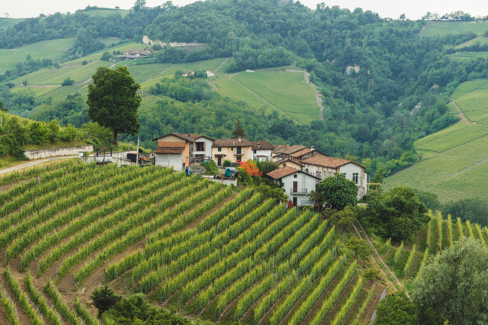

# Exploring Structure in Data: The Wine Dataset and PCA

## Background: Chemistry, cultivars, and classification

In 1991, Forina *et al.* published a dataset derived from a chemical analysis of wines produced in the same region of Italy but originating from three different grape cultivars. The data was contributed to the UCI Machine Learning Repository by Stefan Aeberhard (Aeberhard & Forina, 1992) and has since become a standard benchmark in multivariate statistics and machine learning.

The original purpose was **classification**: given a set of chemical measurements, can we identify which cultivar a wine belongs to? This is a supervised question — it uses the known cultivar labels to build a model.

Here, we will approach the same dataset with **Principal Component Analysis (PCA)** — an *unsupervised* method that ignores the labels entirely. The question becomes: can we discover the grouping structure from the chemistry alone?

The dataset contains **178 wine samples** belonging to three cultivar classes:

* *class_0* (59 samples)
* *class_1* (71 samples)
* *class_2* (48 samples)

For each wine, **13 continuous chemical variables** were measured:

* Alcohol
* Malic acid
* Ash
* Alcalinity of ash
* Magnesium
* Total phenols
* Flavanoids
* Nonflavanoid phenols
* Proanthocyanins
* Color intensity
* Hue
* OD280/OD315 of diluted wines
* Proline

Each wine is described by **13 variables** — each sample lives in a **13-dimensional space**, far beyond anything we can directly visualise.

*Vineyards in the Piedmont region of Italy — the origin of the wines in this dataset. Photo: Lulo*

---

## From Iris to Wine: why this dataset is harder

In the Iris tutorial, PCA reduced 4 variables to 2 components and captured **95.8% of the total variance**. The result was nearly complete — almost nothing was lost in the reduction.

Wine is a more realistic challenge. With 13 variables, several things change:

**The pairplot is no longer practical.** Recall from the Iris tutorial that a pairplot has *N(N−1)/2* panels. For 13 variables that is **78 panels** — exactly what was predicted in that table. The pairplot below is included so you can see this problem directly.

Take a moment to look at it. Notice the scale differences across the axis ranges — some variables range from 0 to 2, others from 0 to 1700.

> With 13 variables you can look at individual panels, but you cannot hold the full 13-dimensional picture in your head. PCA can.

**Less variance falls in the first two components.** For Wine, two components explain around 55% of the total variance rather than 96%. The 2D scores plot is still informative, but it is an incomplete summary — more of the story lives in components 3, 4, and beyond.

**Preprocessing becomes essential, not optional.** The 13 variables are measured on completely different scales. Proline ranges from roughly 300 to 1700; nonflavanoid phenols range from 0.1 to 0.7. PCA finds directions of maximum variance — so without rescaling, it will simply find the direction in which Proline varies most, regardless of whether that is chemically interesting. This is not a subtle effect. You will see it clearly in Step 1.

---

# Your task: Discover the structure using PCA

You will use **GoPCA** to explore the dataset. Work through the steps in order — the sequence is deliberate.

---

## Step 1: Run PCA *without* standardisation first

Load the Wine dataset. Set:

* **Number of Components** → **5**  (default)
* **Preprocessing** → **Mean Center Only** (default)
* **PCA Method** → SVD (default)

Click **Go PCA**.

#### Questions:

* Open the **Scores Plot**. Set **Color by** to `classes`. Do the three cultivar classes form clear clusters?
* Now open the **Loadings Plot** — which variable dominates, and by how much compared to the others?
* Open the **Scree Plot** — how much variance does PC1 alone explain?

👉 You should see that one variable — `proline` — has a much larger loading than all the others. Because proline ranges from 300 to 1700 while most other variables range from 0 to 10, it has a far larger numerical variance and pulls the first component almost entirely on its own. PCA is doing exactly what it is designed to do: it is finding the direction of maximum variance. The problem is that numerical scale is not the same as chemical importance.

---

## Step 2: Apply Standard Scale and compare

Now switch preprocessing to **Standard Scale** and click **Go PCA** again.

Standard Scale divides each variable by its standard deviation after centering, giving every variable unit variance. This puts all 13 variables on equal footing before PCA begins.

#### Questions:

* How does the scores plot change compared to Step 1?
* Do the three cultivar classes separate more clearly or less clearly?
* Open the Loadings Plot — are all 13 variables now contributing, rather than just one?

👉 With Standard Scale, the three cultivar classes separate clearly in the scores plot. Without it, proline was drowning out the other 12 variables. This is why standardisation is described as *essential* for datasets with mixed units — not a preference, but a requirement for meaningful results.

> Keep **Standard Scale** active for all remaining steps.

---

## Step 3: How complete is the 2D picture?

Open the **Scree Plot**.

#### Questions:

* How much variance do PC1 and PC2 explain together?
* How many components would you need to capture 85% of the variance?
* Compare this to the Iris dataset — what does the difference tell you?

👉 For Wine, the first two components explain roughly 55% of the variance. This is much less than Iris. It means the 2D scores plot is showing you *most of the cultivar separation*, but not the complete story — some structure is spread across components 3, 4, and beyond.

This is normal for real chemical data with 13 correlated variables. The 2D plot is still useful and informative — but you should be aware of what it is not showing.

---

## Step 4: Understand why the separation happens — Loadings and Circle of Correlations

GoPCA offers two complementary views of the variable structure. Open both and compare them.

### The Loadings Plot

The Loadings Plot shows the loading of each variable on **one component at a time** as a bar chart. Switch between PC1 and PC2 using the component selector. The dashed threshold lines (±0.3) help you identify which variables contribute meaningfully.

#### Questions:

* On PC1: which variables have large negative loadings? Which have large positive loadings?
* Do the same variables dominate PC2, or does a different group take over?
* Which variables have small loadings on both components — meaning they contribute little to either?

### The Circle of Correlations

Now open the **Circle of Correlations**. This plot shows all 13 variables simultaneously as arrows (vectors) in the PC1–PC2 plane. Two things to read:

* **Direction**: variables pointing in the same direction are positively correlated with each other; variables pointing in opposite directions are negatively correlated. Arrows pointing at 90° are uncorrelated.
* **Length**: an arrow reaching the outer dashed circle means that variable is *perfectly* explained by PC1 and PC2 alone — nothing of it is hidden in the remaining components. A short arrow means most of that variable's variance lives in PC3 or beyond.

#### Questions:

* Can you identify the **phenolic group** — `flavanoids`, `total_phenols`, `proanthocyanins`, `od280/od315_of_diluted_wines`, and `hue` — pointing in the same direction? What does this tell you about their mutual correlation?
* Where do `color_intensity`, `malic_acid`, and `alcalinity_of_ash` point relative to the phenolic group?
* Notice that **all arrows are short** — none reach the outer circle. Why? Recall the Scree Plot from Step 3: PC1 and PC2 together explain only ~55% of the total variance. That means no variable is fully captured in this 2D view — all 13 variables have variance hidden in PC3 and beyond. The short arrows are not a problem; they are an honest representation of how much the 2D projection is leaving out.

> **Loadings Plot vs Circle of Correlations — when to use which:**
> Use the Loadings Plot when you want to read precise loading values for a specific component. Use the Circle of Correlations when you want to see the full pattern of variable relationships and understand which variables are driving the same direction of variation simultaneously across two components.

---

## Step 5: Combine both views — the Biplot

Open the **Biplot**.

The biplot places samples (scores) and variables (loadings) in the same plot. Loading arrows point in the direction of increasing variable value; longer arrows indicate stronger influence on those components.

#### Questions:

* Which loading arrows point toward the class_1 cluster?
* Which arrows point toward the class_2 cluster?
* Do any variables separate class_0 from the other two?
* Where do `proline` and `alcohol` point relative to the cultivar clusters?

👉 You should be able to read a chemical story directly from the biplot:
- The phenolic group pulls toward one cultivar cluster — wines in that class are richer in phenolic compounds
- `color_intensity` and `malic_acid` pull toward another cluster
- `proline` and `alcohol` pull toward the third

The biplot makes the *why* visible. The scores plot shows *that* the classes separate; the biplot shows *what drives the separation*.

---

## Step 6: How well separated are the classes?

Enable **Confidence Ellipses** (95%) on the Scores Plot.

#### Questions:

* Which two cultivar classes overlap most?
* Which class is best separated from the other two?
* What does overlapping ellipses tell you about the difficulty of classification?

Try adjusting the confidence level to 90% and 99%:

* At 99%, do the ellipses for the overlapping classes merge completely?
* What does this mean for a classifier trying to distinguish those two cultivars?

---

## Step 7: The 3D scores plot

Switch to the **3D Scores Plot** (PC1 vs PC2 vs PC3).

#### Questions:

* Does the separation between the overlapping cultivar classes improve in 3D?
* Recall that PC1 + PC2 explained ~55% of the variance. How much does PC3 add?
* Does rotating the 3D plot reveal structure that was hidden in the 2D view?

👉 Because only 55% of the variance is in the first two components for Wine, the third component often contains meaningful additional structure. This contrasts with Iris, where a third component added almost nothing.

---

# What you should take away

After completing this exploration, you should be able to:

* Explain why standardisation is essential for datasets with mixed measurement units — and demonstrate the difference it makes
* Interpret a scree plot and understand what it means when explained variance is spread across many components
* Read a loadings plot to identify groups of correlated variables
* Use a biplot to connect the separation of groups to specific chemical variables
* Recognise the limits of a 2D PCA summary when explained variance is substantially below 100%

---

## Final reflection

> You started with 13 variables. A pairplot gave you 78 panels — informative but unmanageable. PCA gave you a single optimal 2D projection, with a quantified measure of how much was preserved.

Think about these questions:

* The Iris scores plot captured 95.8% of variance in 2D. The Wine scores plot captures around 55%. Is the Wine PCA result less useful — or is it doing something more impressive given the complexity of the data?
* Without standardisation, proline dominated everything. Yet proline may not be the most chemically interesting variable for distinguishing cultivars. What does this tell you about the relationship between numerical variance and scientific importance?
* The phenolic variables cluster together in the loadings. What does it mean, chemically, that these variables point in the same direction?
* Could you use PCA scores as input features for a supervised classifier? What might be the advantage over using the raw 13 variables directly?

---

## Reference

Aeberhard, S., & Forina, M. (1992). *Wine* [Dataset]. UCI Machine Learning Repository.
https://doi.org/10.24432/C5PC7J
