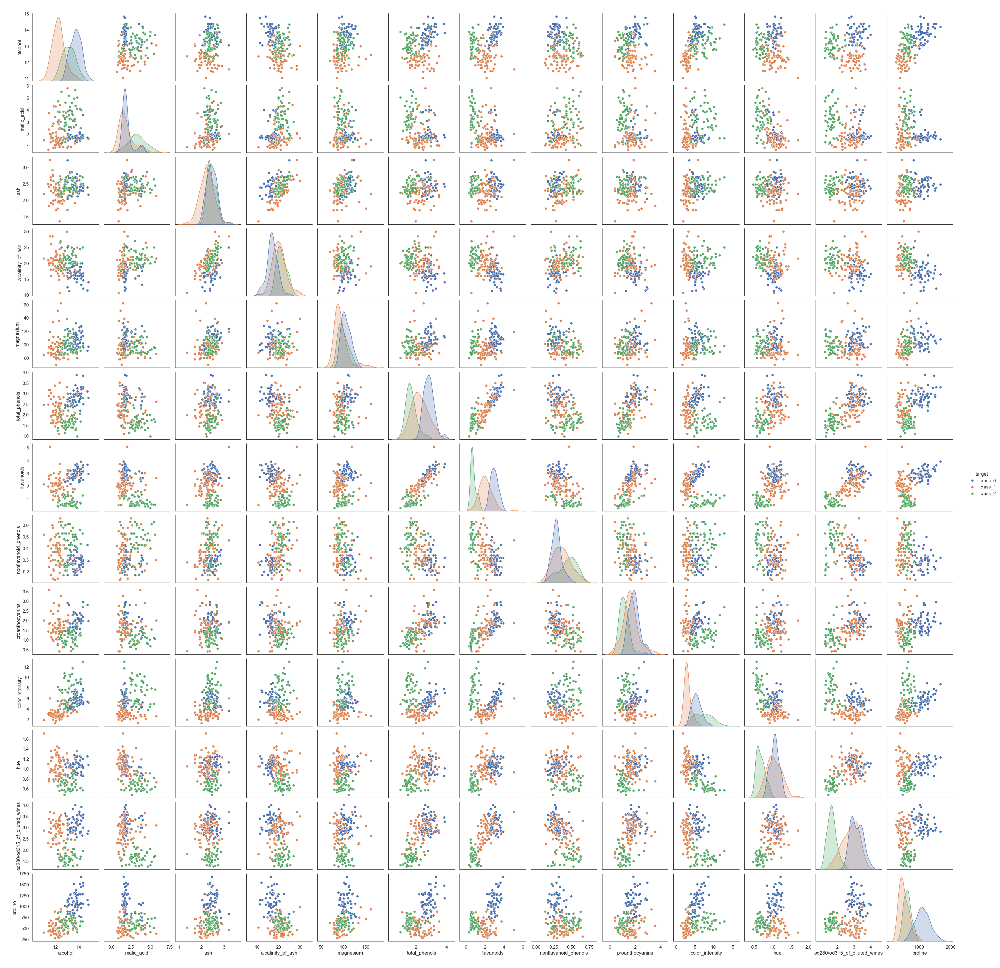

# Exploring Structure in Data: The Wine Dataset and PCA

## Background: Chemistry, cultivars, and classification

In 1991, Forina *et al.* published a dataset derived from a chemical analysis of wines produced in the same region of Italy but originating from three different grape cultivars. The data was contributed to the UCI Machine Learning Repository by Stefan Aeberhard (Aeberhard & Forina, 1992) and has since become a standard benchmark in multivariate statistics and machine learning.

The original purpose was **classification**: given a set of chemical measurements, can we identify which cultivar a wine belongs to? This is a supervised question — it uses the known cultivar labels to build a model.

Here, we will approach the same dataset with **Principal Component Analysis (PCA)** — an *unsupervised* method that ignores the labels entirely. The question becomes: can we discover the grouping structure from the chemistry alone?

The dataset contains **178 wine samples** belonging to three cultivar classes:

* *class_0* (59 samples)
* *class_1* (71 samples)
* *class_2* (48 samples)

For each wine, **13 continuous chemical variables** were measured:

* Alcohol
* Malic acid
* Ash
* Alcalinity of ash
* Magnesium
* Total phenols
* Flavanoids
* Nonflavanoid phenols
* Proanthocyanins
* Color intensity
* Hue
* OD280/OD315 of diluted wines
* Proline

This means each wine is described by **13 variables**, or equivalently, each sample lives in a **13-dimensional space** — far beyond anything we can directly visualise.

---

## First look at the data

Below is a *pair plot* of the dataset, showing all pairwise relationships between variables. The diagonal shows the distribution of each individual variable, either as a density curve (KDE), revealing how the values of a single feature are spread (e.g. center, variability, skewness).

Take a few minutes to look at it carefully.

---

### Reflect:

* Can you already see clusters corresponding to the three cultivars?
* Are some variables strongly correlated?
* Look at the axis ranges — do all variables operate on the same scale?

👉 You are currently looking at **many 2D projections of a 13-dimensional dataset**.
Even with 13 variables, you can only ever see two at a time. And the scale differences are immediately striking.

---

## The challenge

Working directly in 13 dimensions is impossible to visualise. Even pair plots become crowded and hard to interpret.

Your task is to use **Principal Component Analysis (PCA)** to:

> Reduce the dimensionality of the dataset while preserving as much structure as possible.

Think of PCA as:

* A way to **compress** the data
* A way to **rotate the coordinate system**
* A way to find **new axes that reveal patterns more clearly**

This dataset has an additional challenge compared to Iris: the 13 variables are measured on **very different scales**. Proline ranges from roughly 300 to 1700; nonflavanoid phenols range from 0.1 to 0.7. PCA is sensitive to scale — and this will matter.

---

# Your task: Discover the structure using PCA

You will use the application **GoPCA** to explore the dataset.

Do not try to "get the right answer" immediately.
Instead, **experiment, observe, and reflect**.

---

## Step 1: Load the data and run PCA

* Load the Wine dataset into GoPCA
* Run PCA with default settings

### Look at the **Scores Plot (PC1 vs PC2)**

#### Questions:

* Do the three cultivars form clusters?
* Are they well separated in 2D?
* Did PCA recover the cultivar grouping *without using the class labels*?

👉 Hint: Set the **target column** to `classes` in GoPCA to colour the samples by cultivar — this reveals the grouping that PCA found on its own.

---

## Step 2: Explore explained structure

Look at how much variation is captured by the first components.

#### Questions:

* How much variance is explained by PC1 alone?
* How much by PC1 + PC2 together?
* How many principal components seem "enough"?

👉 Try switching to a **3D Scores Plot**:

* Does the separation between cultivars improve?
* Is the third dimension adding meaningful information?

---

## Step 3: Understand *why* the separation happens

Now open the **Loadings Plot**.

This plot tells you how the original variables contribute to the principal components.

#### Questions:

* Which variables influence PC1 the most?
* Which variables influence PC2?
* Are some variables pointing in similar directions?

👉 Hint:

* Variables pointing in the same direction → positively correlated
* Opposite directions → negatively correlated
* Long arrows → strong influence on that component

👉 Pay particular attention to the **phenolic group**:

* `total_phenols`, `flavanoids`, `proanthocyanins`, `hue`, `od280/od315_of_diluted_wines`

These variables often cluster together in the loadings — because they measure related aspects of the same underlying chemistry.

---

## Step 4: Combine both views (Biplot)

Open the **Biplot**, which shows:

* Samples (scores)
* Variables (loadings)

in the same plot.

#### Questions:

* Which variables "pull" the cultivar clusters apart?
* Why are the classes separated the way they are?
* Which chemical measurements seem most important for distinguishing cultivars?

👉 Hint:

* Look at which loading arrows point toward each cultivar cluster
* Compare the direction of `proline` with the direction of the phenolic variables — are they telling the same story, or different stories?

---

## Step 5: Use color and grouping

In GoPCA, make sure the **target column** is set to `classes` to colour samples by cultivar. Then enable **Confidence Ellipses**.

#### Questions:

* How distinct are the three cultivar clusters?
* Do the ellipses overlap?
* Which two cultivars are hardest to distinguish?

👉 Try adjusting the confidence level (90%, 95%, 99%):

* What happens to the overlap as you increase the confidence level?

---

## Step 6: Investigate preprocessing (very important!)

Now repeat the analysis with different preprocessing settings.

In GoPCA, try switching between:

* **Mean Center Only** — subtracts the mean of each variable, but does not rescale
* **Standard Scale** — subtracts the mean *and* divides by the standard deviation, giving each variable unit variance

#### Questions:

* Does the PCA result change between the two settings?
* Which variables dominate when you use **Mean Center Only**?
* Why is **Standard Scale** particularly important for this dataset?

👉 Hint:

* Variables like `proline` (range ~300–1700) have much larger numerical values than `nonflavanoid_phenols` (range ~0.1–0.7). Without standardisation, variables with larger variance will dominate the principal components — regardless of whether that variance is chemically meaningful.
* Unlike Iris, where all four variables were measured in cm and had broadly similar scales, the Wine variables are on completely different measurement scales. This makes standardisation not just recommended, but essential.

---

## Step 7: Push your understanding further

Try these explorations:

* **Focus on two cultivars at a time** by filtering the dataset in GoCSV before loading into GoPCA

  * Are two cultivars easier to separate than three?
  * Which pair is hardest to distinguish?

* **Exclude one variable at a time** using GoCSV's column selection

  * What happens to the scores plot when you remove `proline`?
  * What about removing all phenolic variables at once?

* **Rotate the 3D plot interactively**

  * Do you see structure not visible in the 2D plot?

---

# What you should take away

After completing this exploration, you should be able to:

* Understand PCA as a **tool for dimensionality reduction**
* Interpret:

  * Scores plots
  * Loadings plots
  * Biplots
* Explain how PCA can:

  * Reveal hidden structure in unlabelled data
  * Compress high-dimensional data into fewer dimensions
* Recognise the critical importance of:

  * Preprocessing — especially standardisation when variables have different scales
  * Variable correlation — how related variables cluster in the loadings

---

## Final reflection

Think about this:

> You started with 13 variables and a nearly unreadable pair plot.
> With PCA, you reduced the dataset to 2–3 dimensions and *revealed the cultivar structure clearly*.

* Did PCA make the dataset easier to understand?
* What information was preserved — and what might have been lost?
* Why is standardisation essential here, but less critical for the Iris dataset?
* The original purpose of this dataset was supervised classification. Could you use PCA as a preprocessing step before classification? What might be the advantage?

---

## Reference

Aeberhard, S., & Forina, M. (1992). *Wine* [Dataset]. UCI Machine Learning Repository.
https://doi.org/10.24432/C5PC7J
