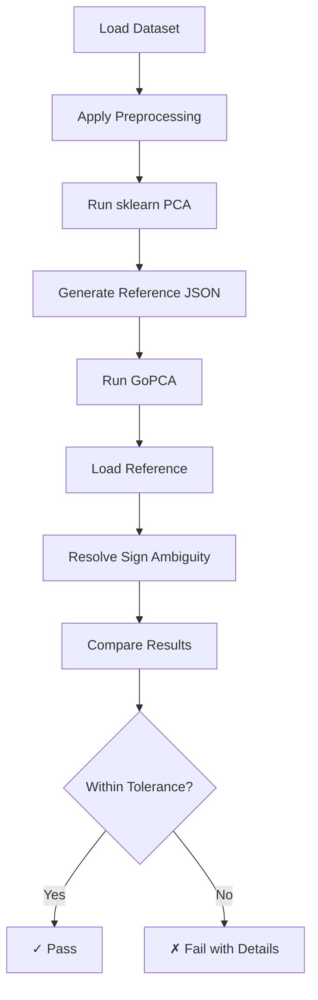

# PCA Validation Methodology

## Overview

This document describes the validation methodology used to ensure GoPCA's implementations are mathematically correct and consistent with industry-standard implementations, particularly scikit-learn.

## Validation Framework Architecture

### 1. Reference Data Generation

Python scripts in `testdata/validation/` generate reference results using scikit-learn:

- **`generate_reference_pca.py`**: Standard PCA validation
- **`generate_kernel_pca_reference.py`**: Kernel PCA validation  
- **`generate_temporal_pca_reference.py`**: SSA/Temporal PCA validation

Each script:
1. Loads standard datasets (iris, wine, corn)
2. Applies various preprocessing methods
3. Runs PCA using sklearn
4. Validates mathematical properties
5. Saves results as JSON with comprehensive metadata

### 2. Go Validation Tests

The `internal/core/sklearn_validation_test.go` file implements:

- **Reference loading**: Parses sklearn JSON results
- **Comparison utilities**: Handles numerical tolerances
- **Sign ambiguity resolution**: Addresses eigenvector sign indeterminacy
- **Property validation**: Verifies mathematical correctness

### 3. CI/CD Integration

GitHub Actions workflow automatically:
1. Sets up Python environment
2. Generates fresh reference data
3. Runs validation tests
4. Reports discrepancies

## Mathematical Properties Validated

### 1. Orthogonality of Loadings

**Property**: V^T × V = I (loadings are orthonormal)

**Reference**: Jolliffe & Cadima (2016), *Philosophical Transactions of the Royal Society A*

**Test**: Calculate ||V^T × V - I||_F (Frobenius norm), expect < 1e-10

### 2. Eigenvalue Ordering

**Property**: λ₁ ≥ λ₂ ≥ ... ≥ λₚ (descending order)

**Reference**: Golub & Van Loan (2013), *Matrix Computations*

**Test**: Verify monotonic decrease of singular values

### 3. Variance Preservation

**Property**: Σ(explained_variance_ratio) = 1.0

**Test**: Sum of all explained variance ratios equals 1.0 (within 1e-10)

### 4. Mahalanobis Distance Relationship

**Property**: D² = Σ(score²/eigenvalue)

**Reference**: Brereton (2015), *Journal of Chemometrics*

**Test**: Calculate Mahalanobis distance for each sample, verify finite and consistent

### 5. Reconstruction Accuracy

**Property**: X ≈ T × P^T + μ (where T=scores, P=loadings, μ=mean)

**Test**: RMSE of reconstruction < 1e-6 for full component reconstruction

## Tolerance Strategy

### Base Tolerances

| Metric | Well-conditioned | Ill-conditioned | Near-singular |
|--------|------------------|-----------------|---------------|
| Variance | 1e-6 | 1e-4 | 1e-2 |
| Singular Values | 1e-8 | 1e-6 | 1e-4 |
| Orthogonality | 1e-10 | 1e-8 | 1e-6 |

### Condition Number Thresholds

- **Well-conditioned**: κ < 10⁶
- **Ill-conditioned**: 10⁶ ≤ κ < 10¹²
- **Near-singular**: κ ≥ 10¹²

Where κ = σ_max / σ_min (ratio of largest to smallest singular value)

### Relative vs Absolute Tolerance

For values with magnitude > 1.0:
```
relative_error = |a - b| / max(|a|, |b|)
```

For values with magnitude ≤ 1.0:
```
absolute_error = |a - b|
```

## Sign Ambiguity Handling

### The Problem

Eigenvectors are determined up to sign. Both v and -v are valid eigenvectors for the same eigenvalue. This creates ambiguity when comparing implementations.

### The Solution

The `resolveSignAmbiguity` function:

1. For each component (column) in the loading/score matrix
2. Calculate sum of absolute differences for both signs
3. Choose the sign that minimizes total difference
4. Apply sign correction before comparison

```go
func resolveSignAmbiguity(gopca, sklearn [][]float64) [][]float64 {
    // For each component, determine optimal sign
    for j := 0; j < nCols; j++ {
        sumDiffPositive := Σ|gopca[i][j] - sklearn[i][j]|
        sumDiffNegative := Σ|-gopca[i][j] - sklearn[i][j]|
        
        if sumDiffNegative < sumDiffPositive {
            // Flip sign for this component
        }
    }
}
```

## Algorithm Differences

### SVD vs Eigendecomposition

sklearn can use either method. Expected differences:

- **Numerical precision**: Up to 1e-14 difference in eigenvalues
- **Sign conventions**: Different but mathematically equivalent
- **Ordering**: Both produce descending eigenvalues

### NIPALS vs Direct Methods

NIPALS (Nonlinear Iterative Partial Least Squares):

- **Iterative**: May have slight convergence differences
- **Missing data**: Can handle missing values (when implemented)
- **Tolerance**: Default 1e-8 convergence criterion

## Platform-Specific Considerations

### Floating-Point Differences

Different platforms may have subtle differences:

- **x86 vs ARM**: Different FPU implementations
- **Compiler optimizations**: May affect precision
- **BLAS libraries**: Platform-specific optimizations

Mitigation: Use platform-aware tolerances (2x base tolerance for cross-platform)

### Large Dataset Handling

For datasets > 10,000 samples:

- Generate subset for validation (first 1000 samples)
- Use checksums for full dataset verification
- Consider memory constraints in CI/CD

## Test Data Characteristics

### Iris Dataset
- **Size**: 150 × 4
- **Condition**: ~230 (well-conditioned)
- **Use**: Basic validation, all methods

### Wine Dataset
- **Size**: 178 × 13
- **Condition**: ~10⁷ (moderately ill-conditioned)
- **Use**: Preprocessing effects, numerical stability

### Corn Dataset
- **Size**: 80 × 700
- **Condition**: ~10⁸ (ill-conditioned, wide)
- **Use**: High-dimensional data, spectroscopic applications

## Validation Workflow



## Continuous Validation

### In Development

```bash
# Generate references locally
cd testdata/validation
python generate_reference_pca.py

# Run validation tests
go test ./internal/core -run TestValidate -v
```

### In CI/CD

Automatically runs on:
- Every PR to main/develop
- Nightly builds
- Release candidates

### Monitoring

Track metrics over time:
- Maximum tolerance violations
- Condition numbers of test data
- Platform-specific differences

## Future Enhancements

1. **Sparse PCA validation**: Add reference implementations
2. **Incremental PCA**: Streaming validation
3. **Robust PCA**: Outlier-resistant methods
4. **Cross-validation**: Multiple reference implementations (R, MATLAB)
5. **Performance benchmarks**: Speed comparisons with sklearn

## References

1. Brereton, R. G. (2015). The Mahalanobis distance and its relationship to principal component scores. *Journal of Chemometrics*, 29(3), 143-145.

2. Bro, R., & Smilde, A. K. (2014). Principal component analysis. *Analytical Methods*, 6(9), 2812-2831.

3. Golub, G. H., & Van Loan, C. F. (2013). *Matrix computations* (4th ed.). Johns Hopkins University Press.

4. Jolliffe, I. T., & Cadima, J. (2016). Principal component analysis: a review and recent developments. *Philosophical Transactions of the Royal Society A*, 374(2065).

5. Schölkopf, B., Smola, A., & Müller, K. R. (1998). Nonlinear component analysis as a kernel eigenvalue problem. *Neural Computation*, 10(5), 1299-1319.

## Appendix: Common Validation Failures

### Issue: Large variance differences
**Cause**: Preprocessing mismatch
**Solution**: Verify mean-centering and scaling match reference

### Issue: Sign flips not resolved
**Cause**: Component permutation
**Solution**: Check component ordering before sign resolution

### Issue: Orthogonality violation
**Cause**: Numerical instability in ill-conditioned data
**Solution**: Increase tolerance for high condition numbers

### Issue: Platform-specific failures
**Cause**: Floating-point implementation differences
**Solution**: Use platform-aware tolerances